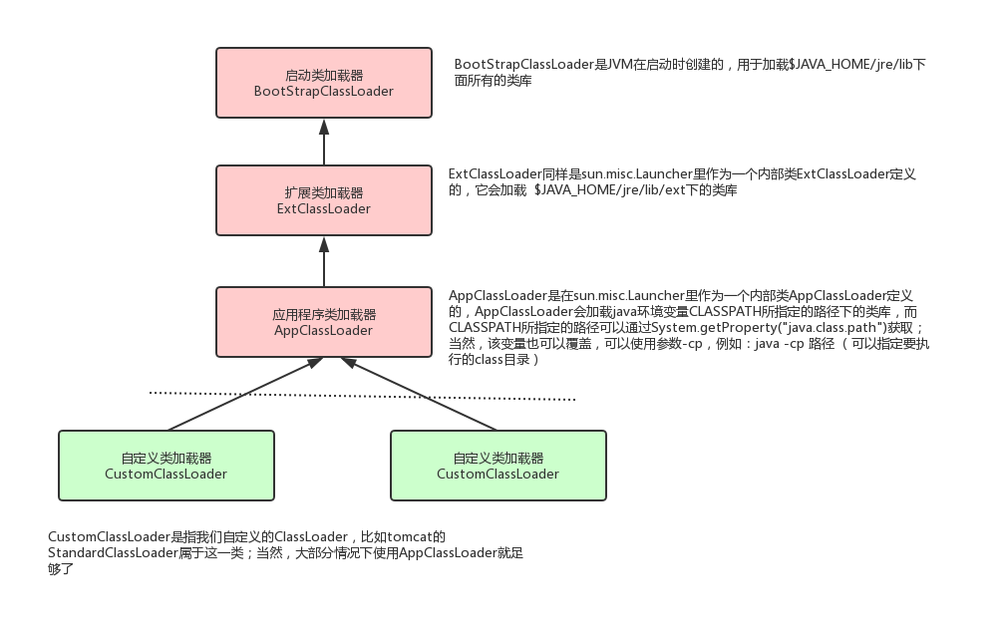
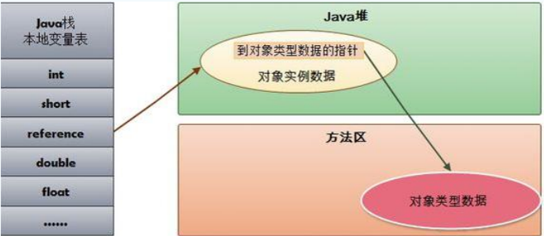
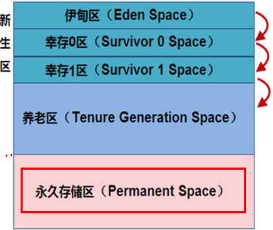
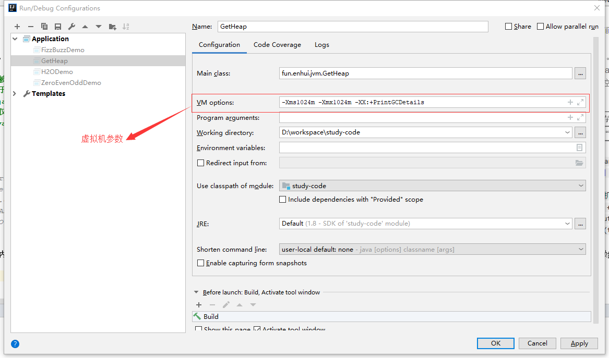
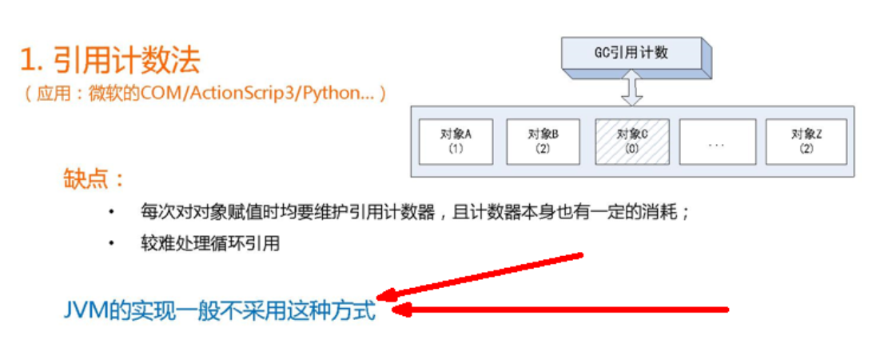
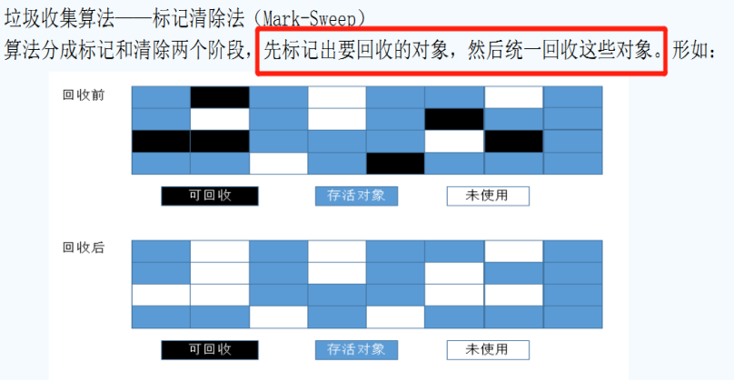
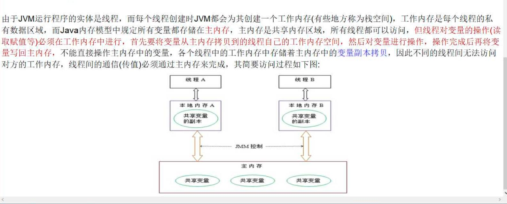

# JVM快速入门

## JVM架构图
灰色部分是线程私有的，占用内存很小，没有GC情况        
橘色部分是线程共享的，存在GC情况       

## 类装载器

### 什么是类装载器
负责加载class文件，class文件在 **文件开头有特定的文件标识** ，将class文件字节码内容加载到内存中，
并将这些内容转换成方法区中的运行时数据结构并且ClassLoader只负责class文件的加载，
至于它是否可以运行，则由Execution Engine决定       

### 类加载器种类
- 虚拟机自带的加载器     
1. 启动类加载器（Bootstrap）C++写的，加载jdk自带的类，$JAVAHOME/jre/lib/rt.jar        
2. 扩展类加载器（Extension）Java写的,加载扩展的类，$JAVAHOME/jre/lib/ext/*.jar       
3. 应用程序类加载器（AppClassLoader）Java写的，也叫系统类加载器，加载当前应用的classpath的所有类          
- 用户自定义加载器          
1. Java.lang.ClassLoader的子类，用户可以定制类的加载方式        
> **例子** MyObject是自定义的类     
`MyObject obj = new MyObject();     
System.out.println(obj.getClass().getClassLoader().getParent().getParent());        
System.out.println(obj.getClass().getClassLoader().getParent());        
System.out.println(obj.getClass().getClassLoader());`       
输出结果为：   // sun.misc.Launcher是一个java虚拟机的入口应用        
null        启动类加载器，在java中输出为null        
sun.misc.Launcher$ExtClassLoader@1540e19d    扩展类加载器     
sun.misc.Launcher$AppClassLoader@18b4aac2    应用程序类加载器       

### 双亲委派机制 
当一个类收到了类加载请求，他首先不会尝试自己去加载这个类，而是把这个请求委派给父类去完成，
每一个层次类加载器都是如此，因此所有的加载请求都应该传送到启动类加载器中，
只有当父类加载器反馈自己无法完成这个请求的时候（在它的加载路径下没有找到所需加载的Class），
子类加载器才会尝试自己去加载。         

采用双亲委派的一个好处是比如加载位于 rt.jar 包中的类 java.lang.Object，
不管是哪个加载器加载这个类，最终都是委托给顶层的启动类加载器进行加载，
这样就保证了使用不同的类加载器最终得到的都是同样一个 Object对象。        

## 本地方法接口 Native Interface
本地接口的作用是融合不同的编程语言为 Java 所用，
它的初衷是融合 C/C++程序，Java 诞生的时候是 C/C++横行的时候，要想立足，必须有调用 C/C++程序，
于是就在内存中专门开辟了一块区域处理标记为native的代码，
它的具体做法是 Native Method Stack中登记 native方法，
在Execution Engine 执行时加载native libraies。         

目前该方法使用的越来越少了，除非是与硬件有关的应用，
比如通过Java程序驱动打印机或者Java系统管理生产设备，在企业级应用中已经比较少见。
因为现在的异构领域间的通信很发达，比如可以使用 Socket通信，也可以使用Web Service等等，不多做介绍。

## 本地方法栈 Native Method Stack
它的具体做法是 Native Method Stack中登记 native方法，
  在Execution Engine 执行时加载native libraies。
  
## PC寄存器(程序计数器)
每个线程都有一个程序计数器，是线程私有的,就是一个指针，
指向方法区中的方法字节码（用来存储指向下一条指令的地址,也即将要执行的指令代码），
由执行引擎读取下一条指令，是一个非常小的内存空间，几乎可以忽略不记。  

这块内存区域很小，它是当前线程所执行的字节码的行号指示器，
字节码解释器通过改变这个计数器的值来选取下一条需要执行的字节码指令。
  
如果执行的是一个Native方法，那这个计数器是空的。
 
 用以完成分支、循环、跳转、异常处理、线程恢复等基础功能。
 不会发生内存溢出(OutOfMemory=OOM)错误
 
## 方法区
供各线程共享的运行时内存区域。 **它存储了每一个类的结构信息** ，     
例如运行时常量池（Runtime Constant Pool）、字段和方法数据、构造函数和普通方法的字节码内容。
方法区是一个规范，在不同虚拟机里实现是不一样的，最典型的就是永久代(PermGen space)和元空间(Metaspace)。    
但是  **实例变量存在堆内存中,和方法区无关**

## 栈 Stack
**栈管运行，堆管存储**   

### 栈是什么
栈也叫栈内存，主管Java程序的运行，是在线程创建时创建，它的生命期是跟随线程的生命期，
线程结束栈内存也就释放，对于栈来说不存在垃圾回收问题，只要线程一结束该栈就Over，生命周期和线程一致，
是线程私有的。8种基本类型的变量+对象的引用变量+实例方法都是在函数的栈内存中分配。

### 栈存储什么
**java方法=栈帧**
1. 本地变量（Local Variables）:输入参数和输出参数以及方法内的变量；
2. 栈操作（Operand Stack）:记录出栈、入栈的操作；
3. 栈帧数据（Frame Data）:包括类文件、方法等等。

### 栈运行原理   
栈中的数据都是以栈帧（Stack Frame）的格式存在，栈帧是一个内存区块，是一个数据集，是一个有关方法(Method)和运行期数据的数据集.   
> 每个方法执行的同时都会创建一个栈帧，用于存储局部变量表、操作数栈、动态链接、方法出口等信息，
每一个方法从调用直至执行完毕的过程，就对应着一个栈帧在虚拟机中入栈到出栈的过程。
栈的大小和具体JVM的实现有关，通常在256K~756K之间,约等于1Mb左右。

    
>图示在一个栈中有两个栈帧：       
栈帧 2是最先被调用的方法，先入栈，然后方法 2 又调用了方法1，栈帧 1处于栈顶的位置，     
帧 2 处于栈底，执行完毕后，依次弹出栈帧 1和栈帧 2，线程结束，栈释放。 

### java.lang.StackOverflowError 栈溢出是错误
Exception in thread "main" java.lang.StackOverflowError 栈溢出是错误，不是异常           

### 栈+堆+方法区的交互关系
         
HotSpot（日常使用jdk的JVM）是使用指针的方式来访问对象：
Java堆中会存放访问**类元数据**(即Class对象)的地址，
reference存储的就直接是对象的地址

## 堆 Heap

### 堆的分类
一个JVM实例只存在一个堆内存，堆内存的大小是可以调节的。
类加载器读取了类文件后，需要把类、方法、常变量放到堆内存中，保存所有引用类型的真实信息，
以方便执行器执行，物理概念上分为新生区、老年区;堆内存逻辑概念上分为三部分：
- java7以前 **新生区、老年区、永久区**         
- java8     **新生区、老年区、元空间**         
    
 

### GC内存回收的大致过程
新生区是类的诞生、成长、消亡的区域，
一个类在这里产生，应用，最后被垃圾回收器收集，结束生命。
新生区又分为两部分： 伊甸区（Eden space）和幸存者区（Survivor space），
所有的类都是在伊甸区被new出来的。
幸存区有两个： 0区（Survivor 0 space）和1区（Survivor 1 space）。
当伊甸园的空间用完时，程序又需要创建对象，JVM的垃圾回收器将对伊甸园区进行垃圾回收(Minor GC)，
将伊甸园区中的不再被其他对象所引用的对象进行销毁。
然后将伊甸园中的剩余对象移动到幸存 0区。
若幸存 0区也满了，再对该区进行垃圾回收，然后移动到 1 区。
那如果1 区也满了呢？再移动到养老区。
若养老区也满了，那么这个时候将产生MajorGC（FullGC），进行养老区的内存清理。
若养老区执行了Full GC之后发现依然无法进行对象的保存，
就会产生OOM异常“OutOfMemoryError”。

> 如果出现java.lang.OutOfMemoryError: Java heap space异常，说明Java虚拟机的堆内存不够。原因有二：
（1）Java虚拟机的堆内存设置不够，可以通过参数-Xms、-Xmx来调整。
（2）代码中创建了大量大对象，并且长时间不能被垃圾收集器收集（存在被引用）。

### MinorGC的过程
        
-  MinorGC的过程（复制->清空->互换） 
1. eden、SurvivorFrom 复制到 SurvivorTo，年龄+1             
首先，当Eden区满的时候会触发第一次GC,把还活着的对象拷贝到SurvivorFrom区，
当Eden区再次触发GC的时候会扫描Eden区和From区域,对这两个区域进行垃圾回收，
经过这次回收后还存活的对象,则直接复制到To区域
（如果有对象的年龄已经达到了老年的标准，则复制到老年代区），同时把这些对象的年龄+1
2. 清空 eden、SurvivorFrom                 
然后，清空Eden和SurvivorFrom中的对象，也即复制之后有交换，谁空谁是to
3. SurvivorTo和 SurvivorFrom 互换                
最后，SurvivorTo和SurvivorFrom互换，原SurvivorTo成为下一次GC时的SurvivorFrom区。
部分对象会在From和To区域中复制来复制去,如此交换15次(由JVM参数MaxTenuringThreshold决定,这个参数默认是15),
最终如果还是存活,就存入到老年代

### 永久代（java8改为元空间）
          
实际而言，方法区（Method Area）和堆一样，是各个线程共享的内存区域，
它用于存储虚拟机加载的：类信息+普通常量+静态常量+编译器编译后的代码等等，
**虽然JVM规范将方法区描述为堆的一个逻辑部分，但它却还有一个别名叫做Non-Heap(非堆)，目的就是要和堆分开。**       
对于HotSpot虚拟机，很多开发者习惯将方法区称之为“永久代(Parmanent Gen)” ，
但严格本质上说两者不同，或者说使用永久代来实现方法区而已，
永久代是方法区(相当于是一个接口interface)的一个实现，jdk1.7的版本中，已经将原本放在永久代的字符串常量池移到堆中。

### 堆参数调整
- **Java7**
        
- **Java8**     
JDK 1.8之后将最初的永久代取消了，由元空间取代。
          
> 在Java8中，永久代已经被移除，被一个称为元空间的区域所取代。元空间的本质和永久代类似。             
  元空间与永久代之间最大的区别在于：             
  永久带使用的JVM的堆内存，但是java8以后的 元空间并不在虚拟机中而是使用本机物理内存。             
  因此，默认情况下，元空间的大小仅受本地内存限制。类的元数据放入 native memory, 
  字符串池和类的静态变量放入 java 堆中，这样可以加载多少类的元数据就不再由MaxPermSize 控制,
  而由系统的实际可用空间来控制。   
  
         
使用程序查询参数        
`public static void main(String[] args){                
 long maxMemory = Runtime.getRuntime().maxMemory() ;//返回 Java 虚拟机试图使用的最大内存量。                          
 long totalMemory = Runtime.getRuntime().totalMemory() ;//返回 Java 虚拟机中的内存总量。               
 System.out.println("-Xmx:MAX_MEMORY = " + maxMemory + "（字节）、" + (maxMemory / (double)1024 / 1024) + "MB");      
 System.out.println("-Xms:TOTAL_MEMORY = " + totalMemory + "（字节）、" + (totalMemory / (double)1024 / 1024) + "MB");        
 }
`   
**发现默认的情况下分配的内存是总内存的“1 / 4”、而初始化的内存为“1 / 64”**
- Idea中，调整参数的方式见下图

- 参数修改后重新查看，可在下图验证堆内存结构

- 内存溢出的过程

## GC介绍
JVM在进行GC时，并非每次都对三个内存区域一起回收，大部分时候回收的都是指新生代。
因此GC按照回收的区域又分了两种类型，一种是普通GC（minor GC），一种是全局GC（major GC or Full GC）
- Minor GC和Full GC的区别
1. 普通GC（minor GC）：只针对新生代区域的GC,指发生在新生代的垃圾收集动作，因为大多数Java对象存活率都不高，所以Minor GC非常频繁，一般回收速度也比较快。 
2. 全局GC（major GC or Full GC）：指发生在老年代的垃圾收集动作，出现了Major GC，经常会伴随至少一次的Minor GC（但并不是绝对的）。Major GC的速度一般要比Minor GC慢上10倍以上 

### GC分代收集算法
1. 次数上频繁回收新生代
2. 次数上较少回收老年代
3. 基本不动元空间

### GC4大算法
- 引用计数法     
- 复制算法（Copying）
- 标记清除（Mark-Sweep）
- 标记压缩（Mark-Compact）

### 引用计数法
        

### 复制算法（Copying）
- **年轻代中使用的是Minor GC，这种GC算法采用的是复制算法**
- **原理** 
    
> Minor GC会把Eden中的所有活的对象都移到Survivor区域中，如果Survivor区中放不下，那么剩下的活的对象就被移到Old  generation中，也即一旦收集后，Eden是就变成空的了。
  当对象在 Eden ( 包括一个 Survivor 区域，这里假设是 from 区域 ) 出生后，在经过一次 Minor GC 后，如果对象还存活，并且能够被另外一块 Survivor 区域所容纳( 上面已经假设为 from 区域，这里应为 to 区域，即 to 区域有足够的内存空间来存储 Eden 和 from 区域中存活的对象 )，则使用复制算法将这些仍然还存活的对象复制到另外一块 Survivor 区域 ( 即 to 区域 ) 中，然后清理所使用过的 Eden 以及 Survivor 区域 ( 即 from 区域 )，并且将这些对象的年龄设置为1，以后对象在 Survivor 区每熬过一次 Minor GC，就将对象的年龄 + 1，当对象的年龄达到某个值时 ( 默认是 15 岁，通过-XX:MaxTenuringThreshold 来设定参数)，这些对象就会成为老年代。
 
-XX:MaxTenuringThreshold — 设置对象在新生代中存活的次数  
- **演示**        
     
- **缺点**
1. 它浪费了一半的内存 
2. 如果对象的存活率很高，我们可以极端一点，假设是100%存活，那么我们需要将所有对象都复制一遍，并将所有引用地址重置一遍。复制这一工作所花费的时间，在对象存活率达到一定程度时，将会变的不可忽视。 所以从以上描述不难看出，复制算法要想使用，最起码对象的存活率要非常低才行，而且最重要的是，我们必须要克服50%内存的浪费。

### 标记清除（Mark-Sweep）
- **老年代一般是由标记清除或者是标记清除和标记压缩（标记整理）的混合实现**
- **原理** 
       
> 用通俗的话解释一下标记清除算法，就是当程序运行期间，若可以使用的内存被耗尽的时候，GC线程就会被触发并将程序暂停，随后将要回收的对象标记一遍，最终统一回收这些对象，完成标记清理工作接下来便让应用程序恢复运行。      
  主要进行两项工作，第一项则是标记，第二项则是清除。         
    标记：从引用根节点开始标记遍历所有的GC Roots， 先标记出要回收的对象。     
    清除：遍历整个堆，把标记的对象清除。      
    缺点：此算法需要暂停整个应用(效率低)，会产生内存碎片      
    
### 标记压缩（Mark-Compact）
- **老年代一般是由标记清除或者是标记清除和标记压缩（标记整理）的混合实现**
- **原理** 
  
> 在整理压缩阶段，不再对标记的对像做回收，而是通过所有存活对像都向一端移动，然后直接清除边界以外的内存。
  可以看到，标记的存活对象将会被整理，按照内存地址依次排列，而未被标记的内存会被清理掉。如此一来，当我们需要给新对象分配内存时，JVM只需要持有一个内存的起始地址即可，这比维护一个空闲列表显然少了许多开销。 
  标记/整理算法不仅可以弥补标记/清除算法当中，内存区域分散的缺点，也消除了复制算法当中，内存减半的高额代价     

- **缺点**        
标记/整理算法唯一的缺点就是效率不高，不仅要标记所有存活对象，还要整理所有存活对象的引用地址。
从效率上来说，标记/整理算法要低于复制算法。

## JMM内存模型
 
     

