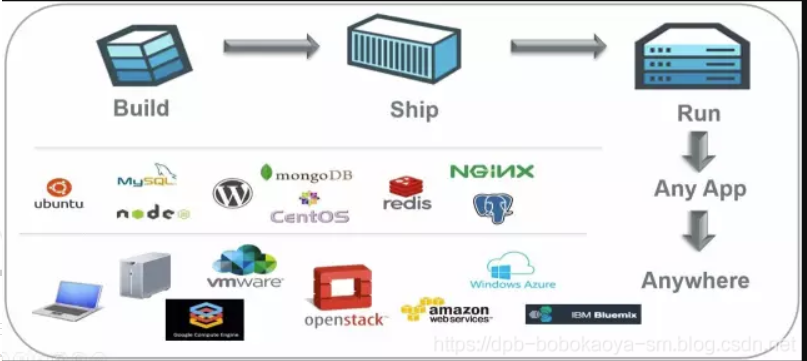
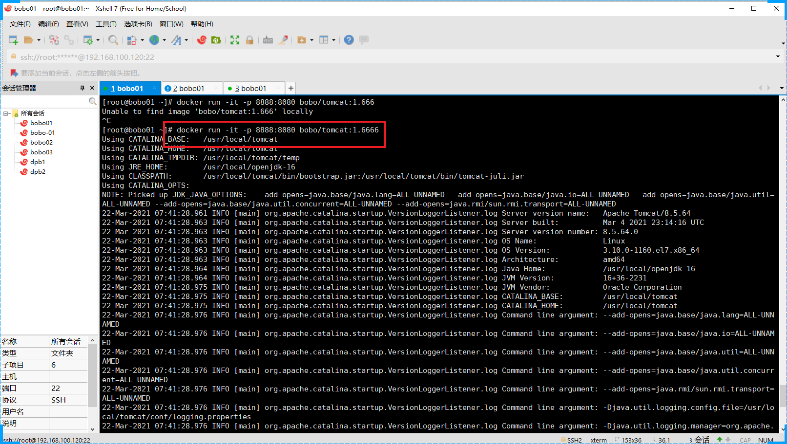
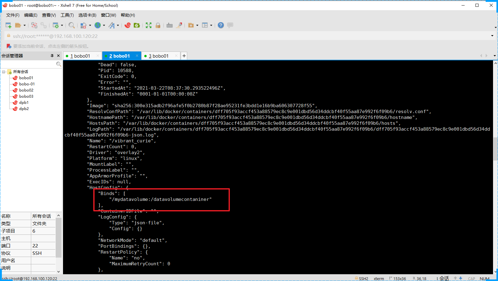
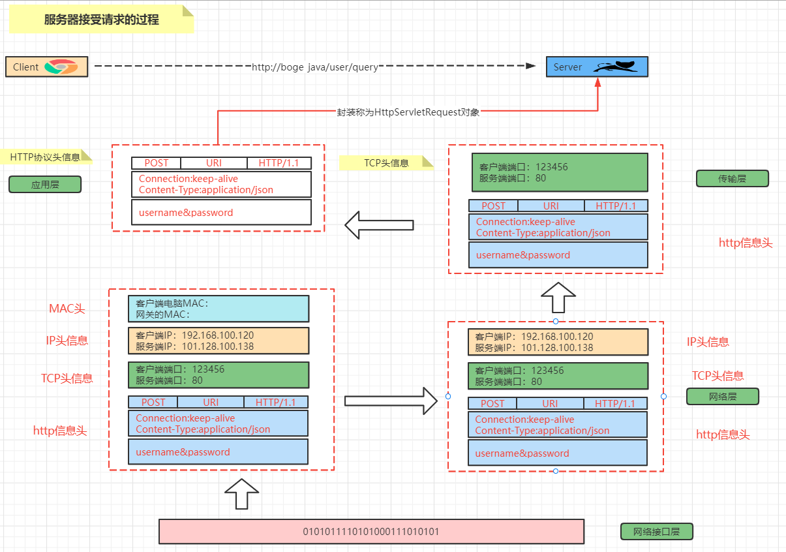
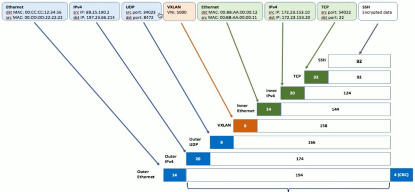

Docker

# 一、Docker基础篇

## 1.Docker的介绍与安装


### 1.1 什么是Docker

​		Docker是基于**Go**语言实现的云开源项目。
  Docker的主要目标是Build，Ship and Run Any App,Anywhere，也就是通过对应用组件的封装、分发、部署、运行等生命周期的管理，使用户的APP（可以是一个WEB应用或数据库应用等等）及其运行环境能够做到一次封装，到处运行。




​       Linux 容器技术的出现就解决了这样一个问题，而 Docker 就是在它的基础上发展过来的。将应用运行在 Docker 容器上面，而 Docker 容器在任何操作系统上都是一致的，这就实现了跨平台、跨服务器。只需要一次配置好环境，换到别的机子上就可以一键部署好，大大简化了操作

> 解决了运行环境和配置问题软件容器，方便做持续集成并有助于整体发布的容器虚拟化技术


### 1.2 Docker能干什么？

#### 1.2.1以前的虚拟化技术

  虚拟机（virtual machine）就是带环境安装的一种解决方案。

  它可以在一种操作系统里面运行另一种操作系统，比如在Windows 系统里面运行Linux 系统。应用程序对此毫无感知，因为虚拟机看上去跟真实系统一模一样，而对于底层系统来说，虚拟机就是一个普通文件，不需要了就删掉，对其他部分毫无影响。这类虚拟机完美的运行了另一套系统，能够使应用程序，操作系统和硬件三者之间的逻辑不变。


虚拟机的缺点：

1. 资源占用多
2. 冗余步骤多
3. 启动慢


#### 1.2.2 容器虚拟化技术

  由于前面虚拟机存在这些缺点，Linux 发展出了另一种虚拟化技术：Linux 容器（Linux Containers，缩写为 LXC）。
  Linux 容器不是模拟一个完整的操作系统，而是对进程进行隔离。有了容器，就可以将软件运行所需的所有资源打包到一个隔离的容器中。容器与虚拟机不同，不需要捆绑一整套操作系统，只需要软件工作所需的库资源和设置。系统因此而变得高效轻量并保证部署在任何环境中的软件都能始终如一地运行。


比较了 Docker 和传统虚拟化方式的不同之处：

1. 传统虚拟机技术是虚拟出一套硬件后，在其上运行一个完整操作系统，在该系统上再运行所需应用进程；
2. 而容器内的应用进程直接运行于宿主的内核，容器内没有自己的内核，而且也没有进行硬件虚拟。因此容器要比传统虚拟机更为轻便。
3. 每个容器之间互相隔离，每个容器有自己的文件系统 ，容器之间进程不会相互影响，能区分计算资源。


#### 1.2.3 实际的运行

  Docker作为开发人员需要掌握，作为`运维人员`必须掌握。
一次构建，随处运行

1. 更快速的应用交付和部署
2. 更便捷的升级和扩缩容
3. 更简单的系统运维
4. 更高效的计算资源利用

### 1.3 相关资源

官网: http://www.docker.com

仓库: https://hub.docker.com

### 1.4 Docker安装

#### 1.4.1 Docker安装的前提环境


CentOS Docker 安装
Docker支持以下的CentOS版本：
CentOS 7 (64-bit) 8
CentOS 6.5 (64-bit) 或更高的版本

前提条件
目前，CentOS 仅发行版本中的内核支持 Docker。
Docker 运行在 CentOS 7 上，要求系统为64位、系统内核版本为 3.10 以上。
Docker 运行在 CentOS-6.5 或更高的版本的 CentOS 上，要求系统为64位、系统内核版本为 2.6.32-431 或者更高版本。
查看自己的内核
uname命令用于打印当前系统相关信息（内核版本号、硬件架构、主机名称和操作系统类型等）。


#### 1.4.2 Vagrant虚拟机环境

&emsp;&emsp;Docker安装在虚拟机上，我们可以通过VMWare来安装，但是通过VMWare安装大家经常会碰到网络ip连接问题，为了减少额外的环境因素影响，Docker内容的讲解我们会通过VirtualBox结合Vagrant来安装虚拟机

VirtualBox官网：https://www.virtualbox.org/

Vagrant官网：https://www.vagrantup.com/

Vagrant镜像仓库：https://app.vagrantup.com/boxes/search


安装VirtualBox和Vagrant，傻瓜式安装。安装完成后需要重启计算机。

在cmd命令窗口输入`vagrant` 命令弹出如下内容表示 `vagrant` 安装成功


通过Vagrant安装虚拟机：

* 创建一个空的目录，cmd切换到该目录中，然后执行`vagrant init centos/7` 会创建Vagrantfile文件
* 执行`vagrant up` 第一次执行的时候会远程下相关的镜像文件，并启动虚拟机。
* 连接虚拟机通过`vagrant ssh` 连接，默认的账号密码是： vagrant vagrant


**网络配置**：

找到对应的Vagrantfile文件


查看当前主机给虚拟机分配的网关的网段：


所以修改后的ip为：192.168.56.10


重启测试：需要提供私钥


私钥地址：


#### 1.4.3 Docker安装

参考官方文档安装：https://docs.docker.com/engine/install/centos/

卸载原有的环境：

```shell
 sudo yum remove docker \
                  docker-client \
                  docker-client-latest \
                  docker-common \
                  docker-latest \
                  docker-latest-logrotate \
                  docker-logrotate \
                  docker-engine
```

安装对应的依赖环境和镜像地址

```shell
 sudo yum install -y yum-utils
 sudo yum-config-manager \
    --add-repo \
    https://download.docker.com/linux/centos/docker-ce.repo
```


安装过慢设置镜像

```shell
sudo yum-config-manager \
    --add-repo \
    http://mirrors.aliyun.com/docker-ce/linux/centos/docker-ce.repo

```


直接安装docker CE

```shenll
sudo yum install -y docker-ce docker-ce-cli containerd.io
```


表示安装成功

启动docker服务

```shell
sudo systemctl start docker
```

查看docker的版本

```shell
sudo docker version
```


补充：通过官方的镜像地址下载docker会比较慢，

配置阿里云的镜像地址：

```shell
yum-config-manager --add-repo http://mirrors.aliyun.com/docker-ce/linux/centos/docker-ce.repo
```

yum更新下即可：

```shell
yum makecache fast
```


开机启动docker

```shell
sudo systemctl enable docker
```


### 1.5 Docker的基本组成


#### 1.5.1 镜像(image)

  Docker 镜像（Image）就是一个只读的模板。镜像可以用来创建 Docker 容器，一个镜像可以创建很多容器。

| docker | 面向对象 |
| :----- | :------- |
| 容器   | 对象     |
| 镜像   | 类       |

#### 1.5.2 容器(container)

  Docker 利用容器（Container）独立运行的一个或一组应用。容器是用镜像创建的运行实例。它可以被启动、开始、停止、删除。每个容器都是相互隔离的、保证安全的平台。可以把容器看做是一个简易版的 Linux 环境（包括root用户权限、进程空间、用户空间和网络空间等）和运行在其中的应用程序。容器的定义和镜像几乎一模一样，也是一堆层的统一视角，唯一区别在于容器的最上面那一层是可读可写的。

#### 1.5.3 仓库(repository)

  仓库（Repository）是集中存放镜像文件的场所。
  仓库(Repository)和仓库注册服务器（Registry）是有区别的。仓库注册服务器上往往存放着多个仓库，每个仓库中又包含了多个镜像，每个镜像有不同的标签（tag）。
  仓库分为公开仓库（Public）和私有仓库（Private）两种形式。
  最大的公开仓库是 Docker Hub(https://hub.docker.com/)，存放了数量庞大的镜像供用户下载。国内的公开仓库包括阿里云 、网易云 等

#### 1.5.4 总结

  image 文件生成的容器实例，本身也是一个文件，称为镜像文件。
  一个容器运行一种服务，当我们需要的时候，就可以通过docker客户端创建一个对应的运行实例，也就是我们的容器
  至于仓储，就是放了一堆镜像的地方，我们可以把镜像发布到仓储中，需要的时候从仓储中拉下来就可以了。


hello-world案例演示：


### 1.6 阿里云镜像加速

默认访问的仓库是在国外所以访问速度是没法保证的。为了更好的体验，我们可以配置阿里云的镜像加速

http://dev.aliyun.com/search.html


按照官网提示，执行对应的操作即可

```shell
[root@bobo01 ~]# sudo mkdir -p /etc/docker
[root@bobo01 ~]# cd /etc/docker/
[root@bobo01 docker]# ll
总用量 4
-rw-------. 1 root root 244 3月  22 11:39 key.json
[root@bobo01 docker]# vim daemon.json
[root@bobo01 docker]# sudo systemctl daemon-reload
[root@bobo01 docker]# sudo systemctl restart docker
[root@bobo01 docker]# ll
总用量 8
-rw-r--r--. 1 root root  67 3月  22 11:48 daemon.json
-rw-------. 1 root root 244 3月  22 11:39 key.json
[root@bobo01 docker]# cat daemon.json 
{
  "registry-mirrors": ["https://v9j5rufo.mirror.aliyuncs.com"]
}
[root@bobo01 docker]# 

```


### 1.7 Docker卸载

```shell
systemctl stop docker
yum -y remov docker-ce
rm -rf /var/lib/docker
# 重启服务
sudo systemctl restart docker
```


## 2.Docker的常用命令

### 2.1 帮助命令

| 命令           | 说明                                       |
| -------------- | ------------------------------------------ |
| docker version | 查看docker的版本信息                       |
| docker info    | 查看docker详细的信息                       |
| docker --help  | docker的帮助命令，可以查看到相关的其他命令 |

docker version


docker info


docker --help


### 2.2 镜像命令

| 镜像命令               | 说明                     |
| ---------------------- | ------------------------ |
| docker images          | 列出本地主机上的镜像     |
| docker search 镜像名称 | 从 docker hub 上搜索镜像 |
| docker pull 镜像名称   | 从docker hub 上下载镜像  |
| docker rmi 镜像名称    | 删除本地镜像             |

#### 2.2.1 docker images


镜像表格信息说明

| 选项       | 说明             |
| ---------- | ---------------- |
| REPOSITORY | 表示镜像的仓库源 |
| TAG        | 镜像的标签       |
| IMAGE ID   | 镜像ID           |
| CREATED    | 镜像创建时间     |
| SIZE       | 镜像大小         |

| 参数       | 说明               |
| ---------- | ------------------ |
| -a         | 列出本地所有的镜像 |
| -q         | 只显示镜像ID       |
| --digests  | 显示镜像的摘要信息 |
| --no-trunc | 显示完整的镜像信息 |

```shell
[root@bobo01 ~]# docker images
REPOSITORY    TAG       IMAGE ID       CREATED       SIZE
hello-world   latest    d1165f221234   2 weeks ago   13.3kB
[root@bobo01 ~]# 
[root@bobo01 ~]# docker images -a
REPOSITORY    TAG       IMAGE ID       CREATED       SIZE
hello-world   latest    d1165f221234   2 weeks ago   13.3kB
[root@bobo01 ~]# docker images -q
d1165f221234
[root@bobo01 ~]# docker images -qa
d1165f221234
[root@bobo01 ~]# docker images --digests
REPOSITORY    TAG       DIGEST                                                                    IMAGE ID       CREATED       SIZE
hello-world   latest    sha256:308866a43596e83578c7dfa15e27a73011bdd402185a84c5cd7f32a88b501a24   d1165f221234   2 weeks ago   13.3kB
[root@bobo01 ~]# docker images --no-trunc
REPOSITORY    TAG       IMAGE ID                                                                  CREATED       SIZE
hello-world   latest    sha256:d1165f2212346b2bab48cb01c1e39ee8ad1be46b87873d9ca7a4e434980a7726   2 weeks ago   13.3kB

```

#### 2.2.2 docker search

​      docker hub是Docker的在线仓库，我们可以通过docker search 在上面搜索我们需要的镜像


| 参数名称   | 描述                                      |
| ---------- | ----------------------------------------- |
| --no-trunc | 显示完整的描述信息                        |
| --limit    | 分页显示                                  |
| -f         | 过滤条件  docker search -f STARS=5 tomcat |


#### 2.2.3 Docker pull

​     从Docker hub 上下载镜像文件


等待下载完成即可


#### 2.2.4 Docker rmi

| 删除方式 | 命令                               |
| -------- | ---------------------------------- |
| 删除单个 | docker rmi -f 镜像ID               |
| 删除多个 | docker rmi -f 镜像1:TAG 镜像2:TAG  |
| 删除全部 | docker rmi -f $(docker images -qa) |

-f 表示强制删除


### 2.3 容器命令


 有镜像才能创建容器。


#### 2.3.1 创建并启动容器

创建并启动一个容器的命令

```shell
docker run [OPTIONS] IMAGE [COMMAND]
```

OPTIONS中的一些参数

| options | 说明                                                         |
| ------- | :----------------------------------------------------------- |
| -\-name | "容器新名字": 为容器指定一个名称                             |
| -d      | 后台运行容器，并返回容器ID，也即启动守护式容器               |
| `-i`    | `以交互模式运行容器，通常与 -t 同时使用`                     |
| `-t`    | `为容器重新分配一个伪输入终端，通常与 -i 同时使用`           |
| -P:     | 随机端口映射                                                 |
| -p      | 指定端口映射，有以下四种格式 ip:hostPort:containerPort<br>ip::containerPort<br>`hostPort:containerPort`<br>containerPort<br> |

交互式的容器

```shell
docker run -it centos /bin/bash
```


#### 2.3.2 列举运行的容器

​     我们要查看当前正在运行的容器有哪些，可以通过ps 命令来查看

```shell
docker ps [OPTIONS]
```

OPTONS可用的参数

| OPTIONS    | 说明                                      |
| ---------- | ----------------------------------------- |
| -a         | 列出当前所有正在运行的容器+历史上运行过的 |
| -l         | 显示最近创建的容器。                      |
| -n         | 显示最近n个创建的容器。                   |
| -q         | 静默模式，只显示容器编号。                |
| --no-trunc | 不截断输出。                              |


#### 2.3.3 退出容器命令

​     我们启动了一个容器后，如何退出容器

| 退出方式 | 说明           |
| -------- | -------------- |
| exit     | 容器停止退出   |
| ctrl+p+q | 容器不停止退出 |


#### 2.3.4 启动容器

```shell
docker start 容器ID或者容器名称
```


#### 2.3.5 重启容器

```shell
docker restart 容器id或者名称
```


#### 2.3.6 停止容器

```shell
docker stop 容器ID或者名称
```

还可以通过强制停止方式处理

```shell
docker kill 容器ID或者名称
```


#### 2.3.7 删除容器

​      有时候容器使用完成就没有作用了，我们想要删除掉容器，这时可以通过rm命令

```shell
docker rm 容器ID
docker rm -f $(docker ps -qa)
docker ps -a -q | xargs docker rm
```


### 2.4 其他命令

#### 2.4.1 守护式容器

```shell
docker run -d 容器名称
```


我们通过 docker ps -a 可以看到刚刚启动的容器已经退出了


​      为了让守护式容器能够一直执行，我们可以在启动容器后在后台运行一个循环的脚本

```shell
docker run -d centos /bin/bash -c 'while true;do echo hello bobo;sleep 2;done'
```


查看我们运行的日志

```shell
docker logs -t -f --tail 3 容器ID
```


查看容器中运行的进程

```shell
docker top 容器ID
```


#### 2.4.2 查看容器细节

我们想要查看容器的细节可以通过inspect命令

```shell
docker inspect 容器ID
```


#### 2.4.3 进入运行的容器


| 进入方式 | 说明                                         |
| -------- | -------------------------------------------- |
| exec     | 在容器中打开新的终端,并且可以启动新的进程    |
| attach   | 直接进入容器启动命令的终端，不会启动新的进程 |


#### 2.4.4 文件复制

​      我们有时需要从容器中拷贝内容到宿主机中

```shell
docker cp 容器ID:容器内路径  目的地路径
```


## 3.Docker镜像文件介绍

### 3.1 镜像是什么

首先我们来看看镜像到底是什么？虽然前面有介绍过`镜像`和`容器`,但也不是特别的深入。

> 镜像是一种轻量级、可执行的独立软件包，用来打包软件运行环境和基于运行环境开发的软件，它包含运行某个软件所需的所有内容，包括代码、运行时、库、环境变量和配置文件。


#### 3.1.1 UnionFS

  UnionFS（联合文件系统）: Union文件系统（UnionFS）是一种分层、轻量级并且高性能的文件系统，它支持对文件系统的修改作为一次提交来一层层的叠加，同时可以将不同目录挂载到同一个虚拟文件系统下(unite several directories into a single virtual filesystem)。Union 文件系统是 Docker 镜像的基础。镜像可以通过分层来进行继承，基于基础镜像（没有父镜像），可以制作各种具体的应用镜像。


`特性`：一次同时加载多个文件系统，但从外面看起来，只能看到一个文件系统，联合加载会把各层文件系统叠加起来，这样最终的文件系统会包含所有底层的文件和目录


#### 3.1.2 镜像加载原理

Docker镜像加载原理：

  Docker的镜像实际上由一层一层的文件系统组成，这种层级的文件系统UnionFS。
  Bootfs(boot file system)主要包含Bootloader和Kernel, Bootloader主要是引导加载Kernel, Linux刚启动时会加载Bootfs文件系统，在Docker镜像的最底层是bootfs。这一层与我们典型的Linux/Unix系统是一样的，包含Boot加载器和内核。当boot加载完成之后整个内核就都在内存中了，此时内存的使用权已由bootfs转交给内核，此时系统也会卸载bootfs。
  Rootfs (root file system) ，在Bootfs之上。包含的就是典型 Linux 系统中的 /dev, /proc, /bin, /etc 等标准目录和文件。Rootfs就是各种不同的操作系统发行版，比如Ubuntu，Centos等等。

#### 3.1.3 分层的镜像

  其实我们前面在 pull 文件的时候比如 Tomcat，在pull界面我们就可以看到下载的文件是一层层的。


#### 3.1.4 分层结构的特点

  其实我们也会考虑docker为什么会才用这种分层的结果，它有什么好处呢？最大的一个好处就是共享资源
  比如：有多个镜像都从相同的 base 镜像构建而来，那么宿主机只需在磁盘上保存一份base镜像，同时内存中也只需加载一份 base 镜像，就可以为所有容器服务了。而且镜像的每一层都可以被共享。


### 3.2 镜像的特点

​     大家需要注意，Docker镜像都是只读的，当容器启动时，一个新的可写层被加载到镜像的顶部，这一层通常被称为容器层,容器层之下的都叫镜像层。

### 3.3 镜像操作

 我们现在已经掌握了从docker hub上获取相关镜像，然后运行容器，并作出我们自己的处理，但有时候我们需要将我们自己的容器制作为对应的镜像，以便后面继续使用，这时我们就需要用到docker commit ...命令了，这节我们就通过案例来介绍下 docker commit ...命令的使用

```shell
docker commit -m="要提交的描述信息" -a="作者" 容器ID 要创建的目标镜像名:[标签名]
```

**操作案例**
  我们通过tomcat镜像来创建容器后操作处理,然后将容器制作为新的镜像然后我们通过新的镜像来制作容器来演示这个效果，有点绕，我们直接通过案例来说。


#### 3.3.1 下载tomcat镜像


#### 3.3.2 创建容器并启动

```shell
docker run -it -p 8888:8080 tomcat
```

参数

| 参数 | 说明                    |
| ---- | ----------------------- |
| -p   | 主机端口:docker容器端口 |
| -P   | 随机分配端口            |
| -i   | 交互                    |
| -t   | 终端                    |


404


#### 3.3.3 修改容器

​     我们发现启动的容器中没有要访问的资源，那么我们自己创建对应的资源即可

```shell
docker exec -it 容器ID /bin/bash
```


#### 3.3.4 创建镜像

​     我们现在的容器和下载的有区别了，我们可以在这个基础上来创建新的镜像

```shell
docker commit -a='bobo' -m='add index.html' 容器ID bobo/tomcat:1.666
```


#### 3.3.5 启动新的镜像

​     现在我们可以通过我们自己新创建的镜像文件来创建并启动容器了

```shell
docker run -it -p 8888:8080 bobo/tomcat:1.6666
```




## 4.Docker数据卷

### 4.1 数据卷

​      前面我们介绍了镜像和容器，通过镜像我们可以启动多个容器，但是我们发现当我们的容器停止获取删除后，我们在容器中的应用的一些数据也丢失了，这时为了解决容器的数据持久化，我们需要通过容器数据卷来解决这个问题

#### 4.1.1 数据卷是什么

  Docker容器产生的数据，如果不通过docker commit生成新的镜像，使得数据做为镜像的一部分保存下来，那么当容器删除后，数据自然也就没有了。为了能保存数据在docker中我们使用卷。简单来说，容器卷就相当于Redis中持久化方式的RDB和AOF。

#### 4.1.2 解决了什么问题

  卷就是目录或文件，存在于一个或多个容器中，由docker挂载到容器，但不属于联合文件系统，因此能够绕过Union File System提供一些用于持续存储或共享数据的特性：
  卷的设计目的就是数据的持久化，完全独立于容器的生存周期，因此Docker不会在容器删除时删除其挂载的数据卷

特点：

1. 数据卷可在容器之间共享或重用数据

2. 卷中的更改可以直接生效

3. 数据卷中的更改不会包含在镜像的更新中

4. 数据卷的生命周期一直持续到没有容器使用它为止

> 持久化，容器间继承和共享数据


#### 4.1.3 数据卷使用


##### 4.1.3.1 直接添加

运行一个centos容器

```shell
docker run -it -v /宿主机绝对路径:/容器内目录 镜像名
```


在宿主机的根目录下会多出对应的文件夹


然后在容器的根目录下也会出现对应的文件夹


通过inspect命令可以查询容器的详情




数据共享的操作

宿主机添加对应的文件


容器中查看


容器中可以同步看到，然后在容器中修改数据


停止掉容器后，数据依然存在


权限控制：不允许在容器中修改


修改权限

```shell
docker run -it -v /宿主机绝对路径:/容器目录:ro 镜像名
```


##### 4.1.3.2 DockerFiler添加

​      宿主机跟目录下创建一个mydocker，并在该目录下创建一个文件，内容如下

```shell
# volume test

FROM centos

VOLUME ["/dataVolumeContainer1","/dataVolumeContainer2"]

CMD echo "finished,--------success1"

CMD /bin/bash

```

根据这个DockerFile构建我们的镜像文件

```shell
docker build -f dockerFile1 -t bobo/centos .
```

-f DockerFile文件的路径

-t 标签  

. 当前路径


根据新创建的镜像文件创建一个容器，启动后我们可以看到在容器中创建的有对应的目录


这两个目录和宿主机的映射目录在哪呢？这时我们可以通过 inspect命令查看


验证就只需要在宿主机中创建文件，然后再到容器对应的文件夹中查看即可


### 4.2 数据卷容器

命名的容器挂载数据卷，其他容器通过挂载这个容器实现数据共享，挂载数据的容器，称之为数据卷容器。

#### 4.2.1 启动一个父容器

```shell
docker run -it --name dc01 bobo/centos
```


#### 4.2.2 创建两个子容器

```shell
docker run -it --name dc02 --volumes-from dc01 bobo/centos
docker run -it --name dc03 --volumes-from dc01 bobo/centos
```


创建了两个子容器后，首先都可以看到dc01中的共享资源。第二个在dc01中修改了共享资源文件后，在两个容器中也是可见的。


注意，删除dc01后，dc02和dc03之间数据还是共享的


注意：容器之间配置信息的传递，数据卷的生命周期一直持续到没有容器使用它为止。		

## 5 DockerFile

 DockerFile是用来构建Docker镜像的`构建文件`，是由一系列`命令`和`参数`构成的`脚本`。


```shell
FROM scratch
ADD centos-7-x86_64-docker.tar.xz /

LABEL \
    org.label-schema.schema-version="1.0" \
    org.label-schema.name="CentOS Base Image" \
    org.label-schema.vendor="CentOS" \
    org.label-schema.license="GPLv2" \
    org.label-schema.build-date="20201113" \
    org.opencontainers.image.title="CentOS Base Image" \
    org.opencontainers.image.vendor="CentOS" \
    org.opencontainers.image.licenses="GPL-2.0-only" \
    org.opencontainers.image.created="2020-11-13 00:00:00+00:00"

CMD ["/bin/bash"]
```


#### 5.1 DockerFile介绍

##### 5.1.1. 构建过程

​       Dockerfile中的指令需要满足如下的规则


##### 5.1.2 执行流程

  docker执行一个Dockerfile脚本的流程大致如下：

1. docker从基础镜像运行一个容器
2. 执行一条指令并对容器作出修改
3. 执行类似docker commit的操作提交一个新的镜像层
4. docker再基于刚提交的镜像运行一个新的容器
5. 执行dockerfile中的下一条指令直到所有指令都执行完成

从应用软件的角度来看，Dockerfile、Docker镜像与Docker容器分别代表软件的三个不同阶段，

- Dockerfile是软件的原材料
- Docker镜像是软件的交付品
- Docker容器则可以认为是软件的运行态。

Dockerfile面向开发，Docker镜像成为交付标准，Docker容器则涉及部署与运维，三者缺一不可，合力充当Docker体系的基石。


1. Dockerfile，需要定义一个Dockerfile，Dockerfile定义了进程需要的一切东西。Dockerfile涉及的内容包括执行代码或者是文件、环境变量、依赖包、运行时环境、动态链接库、操作系统的发行版、服务进程和内核进程(当应用进程需要和系统服务和内核进程打交道，这时需要考虑如何设计namespace的权限控制)等等;
2. Docker镜像，在用Dockerfile定义一个文件之后，docker build时会产生一个Docker镜像，当运行 Docker镜像时，会真正开始提供服务;
3. Docker容器，容器是直接提供服务的。


| 指令       | 说明                                                         |
| ---------- | :----------------------------------------------------------- |
| FROM       | 基础镜像，当前新镜像是基于哪个镜像的,有继承的意味            |
| MAINTAINER | 镜像维护者的姓名和邮箱地址                                   |
| RUN        | 容器构建时需要运行的命令                                     |
| EXPOSE     | 当前容器对外暴露的端口                                       |
| WORKDIR    | 指定在创建容器后，终端默认登录的进来工作目录，一个落脚点     |
| ENV        | 用来在构建镜像过程中设置环境变量                             |
| ADD        | 将宿主机目录下的文件拷贝进镜像且ADD命令会自动处理URL和解压tar压缩包 |
| COPY       | 类似ADD，拷贝文件和目录到镜像中。<br>将从构建上下文目录中<源路径>的文件/目录复制到新的一层的镜像内的<目标路径>位置 <br> COPY src dest <br>COPY ["src","dest"] |
| VOLUME     | 容器数据卷，用于数据保存和持久化工作                         |
| CMD        | 指定一个容器启动时要运行的命令<br>Dockerfile中可以有多个CMD指令，但只有最后一个生效，CMD会被docker run之后的参数替换 |
| ENTRYPOINT | 指定一个容器启动时要运行的命令<br>ENTRYPOINT的目的和CMD一样，都是在指定容器启动程序及参数 |
| ONBUILD    | 当构建一个被继承的Dockerfile时运行命令,父镜像在被子继承后父镜像的onbuild被触发 |


```shell
RUN set -eux; \
	nativeLines="$(catalina.sh configtest 2>&1)"; \
	nativeLines="$(echo "$nativeLines" | grep 'Apache Tomcat Native')"; \
	nativeLines="$(echo "$nativeLines" | sort -u)"; \
	if ! echo "$nativeLines" | grep -E 'INFO: Loaded( APR based)? Apache Tomcat Native library' >&2; then \
		echo >&2 "$nativeLines"; \
		exit 1; \
	fi

EXPOSE 8080
CMD ["catalina.sh", "run"]

docker run -it -p 7777:8080 tomcat  ls -l

RUN set -eux; \
	nativeLines="$(catalina.sh configtest 2>&1)"; \
	nativeLines="$(echo "$nativeLines" | grep 'Apache Tomcat Native')"; \
	nativeLines="$(echo "$nativeLines" | sort -u)"; \
	if ! echo "$nativeLines" | grep -E 'INFO: Loaded( APR based)? Apache Tomcat Native library' >&2; then \
		echo >&2 "$nativeLines"; \
		exit 1; \
	fi

EXPOSE 8080
CMD ["catalina.sh", "run"]
CMD ls -l
```


DockerFile命令

| BUILD         | BOTH    | RUN        |
| ------------- | ------- | ---------- |
| FROM          | WORKDIR | CMD        |
| MAINTAINER    | USER    | ENV        |
| COPY          |         | EXPOSE     |
| ADD           |         | VOLUME     |
| RUN           |         | ENTRYPOINT |
| ONBUILD       |         |            |
| .dockerignore |         |            |


### 5.2 DockerFile案例

#### 5.2.1 Base镜像
&emsp;&emsp;Docker Hub中99%的镜像都是通过在base镜像中安装和配置需要的软件构建出来的，如下


`scratch`相对于java中的`Object`
#### 5.2.2 自定义镜像mycentos
&emsp;&emsp;我们从官方pull下来的`centos`镜像是mini版的，所以不带有`vim`这些基础命令，那我们就来自定义一个镜像，功能比官方下载的强大点，同时运用下各个指令。

##### 5.2.2.1 编写
&emsp;&emsp;首先我们来编写对应的Dockerfile文件。内容如下

```bash
FROM centos
MAINTAINER bobo<dengpbs@163.com>

ENV MYPATH /usr/local
WORKDIR $MYPATH

RUN yum -y install vim

EXPOSE 80

CMD echo $MYPATH
CMD echo "success--------------ok"
CMD /bin/bash

```

##### 5.2.2.2 构建
&emsp;&emsp;然后将脚本构建成对应的镜像文件。

```bash
docker build -f dockerfile名称 -t 新建的镜像名:TAG .
```


查看镜像


##### 5.2.2.3 运行
&emsp;&emsp;运行镜像文件。

```bash
docker run -it 新镜像名称:TAG
```


运行容器后，落脚点是 `/usr/local` 因为我们配置了`WORKDIR`
##### 5.2.2.4 镜像历史
&emsp;&emsp;查看一个镜像文件的变更历史可以使用如下命令:

```bash
docker history 镜像名
```


在本例中我们用到了 `FROM` `MAINTAINER` `RUN` `EXPOSE` `ENV` `WORKDIR` 命令
#### 5.2.3.CMD/ENTRYPOINT案例
&emsp;&emsp;接下来我们通过案例来看看`CMD`和`ENTRYPOINT`两个命令的区别，这两个命令的作用都是`指定一个容器启动时要运行的命令`
##### 5.2.3.1 CMD
&emsp;&emsp;Dockerfile中可以有多个CMD指令，但只有最后一个生效，CMD会被docker run之后的参数替换掉，我们通过tomcat的案例来介绍。
正常情况如下

```bash
docker run -it -p 8888:8080 tomcat
```


但是当我们在 执行命令后添加参数的话，如下


原因是我们先看Tomact对应的 Dockerfile文件


然而我们的run命令 把Dockerfile中的最后的CMD命令覆盖了~~
##### 5.2.3.2 ENTRYPOINT
&emsp;&emsp;有别于`CMD`命令，`ENTRYPOINT`命令是在 `docker run` 之后的参数会被当做参数传递给 ENTRYPOINT，之后形成新的组合命令。我们通过`curl`指令来介绍这个案例。
Dockerfile文件如下:

```bash
FROM centos

RUN yum install -y curl

ENTRYPOINT [ "curl", "-s", "http://www.baidu.com" ]
```
构建


正常run


加`-i`参数 查看响应报文头


通过这个例子 可以看到`ENTRYPOINT`不会覆盖，而是组合成了一个新的命令。
#### 5.2.4.自定义Tomcat
&emsp;&emsp;最后我们通过自定义一个`tomcat`镜像来介绍下`ADD`和`COPY`这两个命令的区别。
##### 5.2.4.1 创建个tomcat目录

##### 5.2.4.2 添加一个文件
&emsp;&emsp;在当前目录下创建一个 `hello.txt`文件，作用是`COPY`到容器中


##### 5.2.4.3 拷贝相关软件
&emsp;&emsp;准备对应的`jdk`和`tomcat`的压缩文件。


##### 5.2.4.4 创建Dockerfile文件
&emsp;&emsp;创建对应的Dockerfile文件，如下：
```bash
FROM         centos
MAINTAINER    bobo<dengpbs@163.com>
#把宿主机当前上下文的hello.txt拷贝到容器/usr/local/路径下
COPY readme.txt /usr/local/helloincontainer.txt
#把java与tomcat添加到容器中
ADD jdk-8u73-linux-x64.tar.gz /usr/local/
ADD apache-tomcat-8.5.71.tar.gz /usr/local/
#安装vim编辑器
RUN yum -y install vim
#设置工作访问时候的WORKDIR路径，登录落脚点
ENV MYPATH /usr/local
WORKDIR $MYPATH
#配置java与tomcat环境变量
ENV JAVA_HOME /usr/local/jdk1.8.0_73
ENV CLASSPATH $JAVA_HOME/lib/dt.jar:$JAVA_HOME/lib/tools.jar
ENV CATALINA_HOME /usr/local/apache-tomcat-8.5.71
ENV CATALINA_BASE /usr/local/apache-tomcat-8.5.71
ENV PATH $PATH:$JAVA_HOME/bin:$CATALINA_HOME/lib:$CATALINA_HOME/bin
#容器运行时监听的端口
EXPOSE  8080
#启动时运行tomcat
# ENTRYPOINT ["/usr/local/apache-tomcat-8.0.47/bin/startup.sh" ]
# CMD ["/usr/local/apache-tomcat-8.0.47/bin/catalina.sh","run"]
CMD /usr/local/apache-tomcat-8.5.71/bin/startup.sh && tail -F /usr/local/apache-tomcat-8.0.47/bin/logs/catalina.out

```

##### 5.2.4.5 构建

```bash
docker build -f dockerfile -t bobotomcat .
```


构建成功。
##### 5.2.4.6 run
&emsp;&emsp;构建成功后，我们就可以运行了，命令如下:

```bash
docker run -it -p 9080:8080 --name mytomcat8.5 -v /root/dockerfile/tomcat/test:/usr/local/apache-tomcat-8.5.71/webapps/test -v /root/dockerfile/tomcat/tomcatlogs/:/usr/local/apache-tomcat-8.5.71/logs --privileged=true mytomcat8.5

```

注意：我们在启动的时候指定了相关的 `数据卷`


##### 5.2.4.7 验证


##### 5.2.4.8 部署web项目
&emsp;&emsp;既然我们已经部署好了我们自己的tomcat容器，而且也设置了对应的数据卷，那么我们来实际部署一个web案例来看看
###### 5.2.4.8.1 web.xml文件
&emsp;&emsp;我们在test目录下创建`WEB-INF`目录，然后创建`web.xml`文件，


```xml
<?xml version="1.0" encoding="UTF-8"?>

<web-app xmlns:xsi="http://www.w3.org/2001/XMLSchema-instance"

  xmlns="http://java.sun.com/xml/ns/javaee"

  xsi:schemaLocation="http://java.sun.com/xml/ns/javaee http://java.sun.com/xml/ns/javaee/web-app_2_5.xsd"

  id="WebApp_ID" version="2.5">

  

  <display-name>test</display-name>

 

</web-app>

```

###### 5.2.4.8.2 index.jsp文件
&emsp;&emsp;然后创建一个简单的jsp文件即可

```html
<%@ page language="java" contentType="text/html; charset=UTF-8" pageEncoding="UTF-8"%>

<!DOCTYPE html PUBLIC "-//W3C//DTD HTML 4.01 Transitional//EN" "http://www.w3.org/TR/html4/loose.dtd">

<html>

  <head>

    <meta http-equiv="Content-Type" content="text/html; charset=UTF-8">

    <title>Insert title here</title>

  </head>

  <body>

    -----------welcome------------

    <%="i am in docker tomcat self "%>

    <br>

    <br>

    <% System.out.println("=============docker tomcat self");%>

  </body>

</html>
```

###### 5.2.4.8.3 重启容器访问即可


## 6.Docker常用软件安装

### 6.1. MySQL的安装

search命令查询

```shell
docker search mysql
```


然后下载对应的mysql镜像


构建容器

```shell
docker run -p 12345:3306 --name mysql -v /root/mysql/conf:/etc/mysql/conf.d -v /root/mysql/logs:/logs -v /root/mysql/data:/var/lib/mysql -e MYSQL_ROOT_PASSWORD=123456 -d mysql:5.6

```

进入容器中查看


我们也可以在Windows平台中通过MySQL数据库客户端来连接容器中的数据库


### 6.2. Redis的安装

搜索Redis


下载对应镜像文件


创建并启动容器

```shell
docker run -p 6379:6379 -v /root/myredis/data:/data -v /root/myredis/conf/redis.conf:/usr/local/etc/redis/redis.conf  -d redis:4.0 redis-server /usr/local/etc/redis/redis.conf --appendonly yes
```


连接命令

```shell
[root@localhost tomcat]# docker exec -it 4f0 redis-cli
127.0.0.1:6379> keys *
(empty list or set)
127.0.0.1:6379> set name bobo
OK
127.0.0.1:6379> set age 18
OK
127.0.0.1:6379> get name
"bobo"
127.0.0.1:6379> get age

```


redis的配置文件

```xml
port 6379
tcp-backlog 511
timeout 0
tcp-keepalive 300
supervised no
pidfile /var/run/redis_6379.pid


loglevel notice
logfile ""

databases 16

save 120 1
save 300 10
save 60 10000

stop-writes-on-bgsave-error yes
rdbcompression yes

rdbchecksum yes
dbfilename dump.rdb

dir ./
slave-serve-stale-data yes

slave-read-only yes
repl-diskless-sync no
repl-diskless-sync-delay 5
repl-disable-tcp-nodelay no

slave-priority 100


appendonly no
appendfilename "appendonly.aof"

appendfsync everysec
no-appendfsync-on-rewrite no
 
auto-aof-rewrite-percentage 100
auto-aof-rewrite-min-size 64mb


lua-time-limit 5000
slowlog-log-slower-than 10000
slowlog-max-len 128

notify-keyspace-events ""

hash-max-ziplist-entries 512
hash-max-ziplist-value 64

list-max-ziplist-size -2
list-compress-depth 0

set-max-intset-entries 512

zset-max-ziplist-entries 128
zset-max-ziplist-value 64

hll-sparse-max-bytes 3000
activerehashing yes

client-output-buffer-limit normal 0 0 0
client-output-buffer-limit slave 256mb 64mb 60
client-output-buffer-limit pubsub 32mb 8mb 60

hz 10
aof-rewrite-incremental-fsync yes
```

测试连接


# 二、Docker高级篇


## 1.Docker网络介绍

​      Docker是基于Linux Kernel的namespace，CGroups,UnionFileSystem等技术封装成的一种自定义容器格式，从而提供了一套虚拟运行环境。

> namespace: 用来做隔离的，比如 pid[进程]、net【网络】、mnt【挂载点】
>
> CGroups：Controller Groups 用来做资源限制，比如内存和CPU等
>
> Union File Systems：用来做Image和Container分层


### 1.1 计算机网络模型

Docker网络官网：https://docs.docker.com/network/。

**OSI**：开放系统互联参考模型(Open System Interconnect)

**TCP/IP**:传输控制协议/网际协议(Transmission Control/Internet Protocol),是指能够在多个不同网络间实现信息传输的协议簇。TCP/IP协议不仅仅指的是TCP 和IP两个协议，而是指一个由FTP、SMTP、TCP、UDP、IP等协议构成的协议簇， 只是因为在TCP/IP协议中TCP协议和IP协议最具代表性，所以被称为TCP/IP协议。

分层思想：分层的基本想法是每一层都在它的下层提供的服务基础上提供更高级的增值服务，而最高层提供能运行分布式应用程序的服务


客户端发送请求：


服务端接受请求：



### 1.2 Liunx中网卡

#### 1.2.1 查看网卡信息

查看网卡的命令:ip a

```shell
[vagrant@localhost ~]$ ip a
1: lo: <LOOPBACK,UP,LOWER_UP> mtu 65536 qdisc noqueue state UNKNOWN group default qlen 1000
    link/loopback 00:00:00:00:00:00 brd 00:00:00:00:00:00
    inet 127.0.0.1/8 scope host lo
       valid_lft forever preferred_lft forever
    inet6 ::1/128 scope host 
       valid_lft forever preferred_lft forever
2: eth0: <BROADCAST,MULTICAST,UP,LOWER_UP> mtu 1500 qdisc pfifo_fast state UP group default qlen 1000
    link/ether 52:54:00:4d:77:d3 brd ff:ff:ff:ff:ff:ff
    inet 10.0.2.15/24 brd 10.0.2.255 scope global noprefixroute dynamic eth0
       valid_lft 85987sec preferred_lft 85987sec
    inet6 fe80::5054:ff:fe4d:77d3/64 scope link 
       valid_lft forever preferred_lft forever
3: eth1: <BROADCAST,MULTICAST,UP,LOWER_UP> mtu 1500 qdisc pfifo_fast state UP group default qlen 1000
    link/ether 08:00:27:6e:31:45 brd ff:ff:ff:ff:ff:ff
    inet 192.168.56.10/24 brd 192.168.56.255 scope global noprefixroute eth1
       valid_lft forever preferred_lft forever
    inet6 fe80::a00:27ff:fe6e:3145/64 scope link 
       valid_lft forever preferred_lft forever
4: docker0: <NO-CARRIER,BROADCAST,MULTICAST,UP> mtu 1500 qdisc noqueue state DOWN group default 
    link/ether 02:42:bf:79:9f:de brd ff:ff:ff:ff:ff:ff
    inet 172.17.0.1/16 brd 172.17.255.255 scope global docker0
       valid_lft forever preferred_lft forever
```

通过ip a 可以看到当前的centos中有的4个网卡信息作用分别是

| 名称    | 作用                                                         |
| ------- | ------------------------------------------------------------ |
| lo      | 本地网卡【lo 是 loopback 的缩写，也就是环回的意思，linux系统默认会有一块名为 lo 的环回网络接口】 |
| eth0    | 连接网络的网卡                                               |
| eth1    | 和宿主机通信的网卡                                           |
| docker0 | docker的网卡                                                 |

ip link show:

```shell
[vagrant@localhost ~]$ ip link show
1: lo: <LOOPBACK,UP,LOWER_UP> mtu 65536 qdisc noqueue state UNKNOWN mode DEFAULT group default qlen 1000
    link/loopback 00:00:00:00:00:00 brd 00:00:00:00:00:00
2: eth0: <BROADCAST,MULTICAST,UP,LOWER_UP> mtu 1500 qdisc pfifo_fast state UP mode DEFAULT group default qlen 1000
    link/ether 52:54:00:4d:77:d3 brd ff:ff:ff:ff:ff:ff
3: eth1: <BROADCAST,MULTICAST,UP,LOWER_UP> mtu 1500 qdisc pfifo_fast state UP mode DEFAULT group default qlen 1000
    link/ether 08:00:27:6e:31:45 brd ff:ff:ff:ff:ff:ff
4: docker0: <NO-CARRIER,BROADCAST,MULTICAST,UP> mtu 1500 qdisc noqueue state DOWN mode DEFAULT group default 
    link/ether 02:42:bf:79:9f:de brd ff:ff:ff:ff:ff:ff
```

以文件的形式查看网卡：ls /sys/class/net

```shell
[vagrant@localhost ~]$ ls /sys/class/net
docker0  eth0  eth1  lo
```


#### 1.2.2 配置文件

在Linux中网卡对应的其实就是文件，所以找到对应的网卡文件即可，存放的路径

```shell
[vagrant@localhost network-scripts]$ cd /etc/sysconfig/network-scripts/
[vagrant@localhost network-scripts]$ ls
ifcfg-eth0   ifdown-eth   ifdown-ppp       ifdown-tunnel  ifup-ippp   ifup-post    ifup-TeamPort      network-functions-ipv6
ifcfg-eth1   ifdown-ippp  ifdown-routes    ifup           ifup-ipv6   ifup-ppp     ifup-tunnel
ifcfg-lo     ifdown-ipv6  ifdown-sit       ifup-aliases   ifup-isdn   ifup-routes  ifup-wireless
ifdown       ifdown-isdn  ifdown-Team      ifup-bnep      ifup-plip   ifup-sit     init.ipv6-global
ifdown-bnep  ifdown-post  ifdown-TeamPort  ifup-eth       ifup-plusb  ifup-Team    network-functions
```


#### 1.2.3 网卡操作

网卡中增加ip地址

```shell
[root@localhost ~]# ip addr add 192.168.100.120/24 dev eth0
[root@localhost ~]# ip a
1: lo: <LOOPBACK,UP,LOWER_UP> mtu 65536 qdisc noqueue state UNKNOWN group default qlen 1000
    link/loopback 00:00:00:00:00:00 brd 00:00:00:00:00:00
    inet 127.0.0.1/8 scope host lo
       valid_lft forever preferred_lft forever
    inet6 ::1/128 scope host 
       valid_lft forever preferred_lft forever
2: eth0: <BROADCAST,MULTICAST,UP,LOWER_UP> mtu 1500 qdisc pfifo_fast state UP group default qlen 1000
    link/ether 52:54:00:4d:77:d3 brd ff:ff:ff:ff:ff:ff
    inet 10.0.2.15/24 brd 10.0.2.255 scope global noprefixroute dynamic eth0
       valid_lft 84918sec preferred_lft 84918sec
    inet 192.168.100.120/24 scope global eth0  #### 增加了一个IP地址
       valid_lft forever preferred_lft forever
    inet6 fe80::5054:ff:fe4d:77d3/64 scope link 
       valid_lft forever preferred_lft forever
3: eth1: <BROADCAST,MULTICAST,UP,LOWER_UP> mtu 1500 qdisc pfifo_fast state UP group default qlen 1000
    link/ether 08:00:27:6e:31:45 brd ff:ff:ff:ff:ff:ff
    inet 192.168.56.10/24 brd 192.168.56.255 scope global noprefixroute eth1
       valid_lft forever preferred_lft forever
    inet6 fe80::a00:27ff:fe6e:3145/64 scope link 
       valid_lft forever preferred_lft forever
4: docker0: <NO-CARRIER,BROADCAST,MULTICAST,UP> mtu 1500 qdisc noqueue state DOWN group default 
    link/ether 02:42:bf:79:9f:de brd ff:ff:ff:ff:ff:ff
    inet 172.17.0.1/16 brd 172.17.255.255 scope global docker0
       valid_lft forever preferred_lft forever

```

删除IP地址: ip addr delete 192.168.100.120/24 dev eth0

```shell
[root@localhost ~]# ip addr delete 192.168.100.120/24 dev eth0
[root@localhost ~]# ip a
1: lo: <LOOPBACK,UP,LOWER_UP> mtu 65536 qdisc noqueue state UNKNOWN group default qlen 1000
    link/loopback 00:00:00:00:00:00 brd 00:00:00:00:00:00
    inet 127.0.0.1/8 scope host lo
       valid_lft forever preferred_lft forever
    inet6 ::1/128 scope host 
       valid_lft forever preferred_lft forever
2: eth0: <BROADCAST,MULTICAST,UP,LOWER_UP> mtu 1500 qdisc pfifo_fast state UP group default qlen 1000
    link/ether 52:54:00:4d:77:d3 brd ff:ff:ff:ff:ff:ff
    inet 10.0.2.15/24 brd 10.0.2.255 scope global noprefixroute dynamic eth0
       valid_lft 84847sec preferred_lft 84847sec
    inet6 fe80::5054:ff:fe4d:77d3/64 scope link 
       valid_lft forever preferred_lft forever
3: eth1: <BROADCAST,MULTICAST,UP,LOWER_UP> mtu 1500 qdisc pfifo_fast state UP group default qlen 1000
    link/ether 08:00:27:6e:31:45 brd ff:ff:ff:ff:ff:ff
    inet 192.168.56.10/24 brd 192.168.56.255 scope global noprefixroute eth1
       valid_lft forever preferred_lft forever
    inet6 fe80::a00:27ff:fe6e:3145/64 scope link 
       valid_lft forever preferred_lft forever
4: docker0: <NO-CARRIER,BROADCAST,MULTICAST,UP> mtu 1500 qdisc noqueue state DOWN group default 
    lik/ether 02:42:bf:79:9f:de brd ff:ff:ff:ff:ff:ff
    inet 172.17.0.1/16 brd 172.17.255.255 scope global docker0
       valid_lft forever preferred_lft forever
```


#### 1.2.4 网卡信息解析

状态：UP/DOWN/UNKOWN等

link/ether：MAC地址

inet：绑定的IP地址


### 1.3 Network Namespace

​		Network Namespace 是实现网络虚拟化的重要功能，它能创建多个隔离的网络空间，它们有独自的网络栈信息。不管是虚拟机还是容器，运行的时候仿佛自己就在独立的网络中。

#### 1.3.1 Network Namespce 实战

添加一个namespace

```shell
ip netns add ns1
```

查看当前具有的namespace

```shell
ip netns list
```


```shell
[root@localhost ~]# ip netns add ns1
[root@localhost ~]# ip netns list
ns1
```

删除namespace

```shell
ip netns delete ns1
```

```shell
[root@localhost ~]# ip netns add ns1
[root@localhost ~]# ip netns list
ns1
[root@localhost ~]# ip netns delete ns1
[root@localhost ~]# ip netns list
[root@localhost ~]# 
```

查看namespace【ns1】的网卡情况

```shell
ip netns exec ns1 ip a
```

```shell
[root@localhost ~]# ip netns exec ns1 ip a
1: lo: <LOOPBACK> mtu 65536 qdisc noop state DOWN group default qlen 1000
    link/loopback 00:00:00:00:00:00 brd 00:00:00:00:00:00
```


启动网络状态

```shell
ip netns exec ns1 ifup lo
```


```shell
[root@localhost ~]# ip netns exec ns1 ip link show
1: lo: <LOOPBACK> mtu 65536 qdisc noop state DOWN mode DEFAULT group default qlen 1000
    link/loopback 00:00:00:00:00:00 brd 00:00:00:00:00:00
[root@localhost ~]# ip netns exec ns1 ifup lo
[root@localhost ~]# ip netns exec ns1 ip a
1: lo: <LOOPBACK,UP,LOWER_UP> mtu 65536 qdisc noqueue state UNKNOWN group default qlen 1000
    link/loopback 00:00:00:00:00:00 brd 00:00:00:00:00:00
    inet 127.0.0.1/8 scope host lo
       valid_lft forever preferred_lft forever
    inet6 ::1/128 scope host 
       valid_lft forever preferred_lft forever
[root@localhost ~]# 
```

关掉网络状态

```shell
[root@localhost ~]# ip netns exec ns1 ifdown lo
[root@localhost ~]# ip netns exec ns1 ip a
1: lo: <LOOPBACK> mtu 65536 qdisc noqueue state DOWN group default qlen 1000
    link/loopback 00:00:00:00:00:00 brd 00:00:00:00:00:00
```

还可以通过 link 来设置状态

```shell
[root@localhost ~]# ip netns exec ns1 ip link set lo up
[root@localhost ~]# ip netns exec ns1 ip a
1: lo: <LOOPBACK,UP,LOWER_UP> mtu 65536 qdisc noqueue state UNKNOWN group default qlen 1000
    link/loopback 00:00:00:00:00:00 brd 00:00:00:00:00:00
    inet 127.0.0.1/8 scope host lo
       valid_lft forever preferred_lft forever
    inet6 ::1/128 scope host 
       valid_lft forever preferred_lft forever
[root@localhost ~]# ip netns exec ns1 ip link set lo down
[root@localhost ~]# ip netns exec ns1 ip a
1: lo: <LOOPBACK> mtu 65536 qdisc noqueue state DOWN group default qlen 1000
    link/loopback 00:00:00:00:00:00 brd 00:00:00:00:00:00
    inet 127.0.0.1/8 scope host lo
       valid_lft forever preferred_lft forever
[root@localhost ~]# 

```

再次添加一个namespace【ns2】

```shell
[root@localhost ~]# ip netns add ns2
[root@localhost ~]# ip netns list 
ns2
ns1
```

现在要实现两个namespace的通信


要实现两个network namespace的通信，我们需要实现到的技术是：

veth pair：Virtual Ethernet Pair，是一个成对的端口，可以实现上述功能


创建一对link，也就是接下来要通过veth pair连接的link

```shell
ip link add veth-ns1 type veth peer name veth-ns2
```

然后在宿主机中就会多出一对网卡信息


然后将创建好的 veth-ns1交给namespace1，把veth-ns2交给namespace2

```shell
ip link set veth-ns1 netns ns1
ip link set veth-ns2 netns ns2
```


再查看ns1和ns2中的link情况

```shell
[root@localhost ~]# ip netns exec ns1 ip link
1: lo: <LOOPBACK,UP,LOWER_UP> mtu 65536 qdisc noqueue state UNKNOWN mode DEFAULT group default qlen 1000
    link/loopback 00:00:00:00:00:00 brd 00:00:00:00:00:00
6: veth-ns1@if5: <BROADCAST,MULTICAST> mtu 1500 qdisc noop state DOWN mode DEFAULT group default qlen 1000
    link/ether 7e:bb:ee:13:a2:9a brd ff:ff:ff:ff:ff:ff link-netnsid 1
[root@localhost ~]# ip netns exec ns2 ip link
1: lo: <LOOPBACK,UP,LOWER_UP> mtu 65536 qdisc noqueue state UNKNOWN mode DEFAULT group default qlen 1000
    link/loopback 00:00:00:00:00:00 brd 00:00:00:00:00:00
5: veth-ns2@if6: <BROADCAST,MULTICAST> mtu 1500 qdisc noop state DOWN mode DEFAULT group default qlen 1000
    link/ether 7e:f8:18:5a:ef:1f brd ff:ff:ff:ff:ff:ff link-netnsid 0
```

此时veth-ns1和veth-ns2还没有ip地址，显然通信还缺少点条件

```shell
ip netns exec ns1 ip addr add 192.168.0.11/24 dev veth-ns1
ip netns exec ns2 ip addr add 192.168.0.12/24 dev veth-ns2
```


再次查看，发现state是DOWN.所以我们需要启用对应的网卡

```shell
[root@localhost ~]# ip netns exec ns1 ip link set veth-ns1 up
[root@localhost ~]# ip netns exec ns2 ip link set veth-ns2 up
```

然后查看状态


然后就可以相互之间ping通了

```shell
ip netns exec ns1 ping 192.168.0.12 ip netns exec ns2 ping 192.168.0.11 
```


#### 1.3.2 Container的NameSpace

​	按照上面的描述，实际上每个container，都会有自己的network namespace，并且是独立的，我们可以进入到容器中进行验证

创建两个Tomcat容器

> docker run -d --name tomcat01 -p 8081:8080 tomcat
>
> docker run -d --name tomcat02 -p 8082:8080 tomcat 

进入到两个容器中，查看ip

> docker exec -it tomcat01 ip a
>
> docker exec -it tomcat02 ip a

相互ping是可以ping通的


问题：此时tomcat01和tomcat02属于两个network namespace，是如何能够ping通的？ 有些小伙伴可能会想，不就跟上面的namespace实战一样吗？注意这里并没有veth-pair技术 

### 1.4 深入分析container网络-Bridge

#### 1.4.1 Docker默认Bridge

首先我们通过`ip a`可以查看当前宿主机的网络情况

```shell
[root@localhost tomcat]# ip a
1: lo: <LOOPBACK,UP,LOWER_UP> mtu 65536 qdisc noqueue state UNKNOWN group default qlen 1000
    link/loopback 00:00:00:00:00:00 brd 00:00:00:00:00:00
    inet 127.0.0.1/8 scope host lo
       valid_lft forever preferred_lft forever
    inet6 ::1/128 scope host 
       valid_lft forever preferred_lft forever
2: eth0: <BROADCAST,MULTICAST,UP,LOWER_UP> mtu 1500 qdisc pfifo_fast state UP group default qlen 1000
    link/ether 52:54:00:4d:77:d3 brd ff:ff:ff:ff:ff:ff
    inet 10.0.2.15/24 brd 10.0.2.255 scope global noprefixroute dynamic eth0
       valid_lft 66199sec preferred_lft 66199sec
    inet6 fe80::5054:ff:fe4d:77d3/64 scope link 
       valid_lft forever preferred_lft forever
3: eth1: <BROADCAST,MULTICAST,UP,LOWER_UP> mtu 1500 qdisc pfifo_fast state UP group default qlen 1000
    link/ether 08:00:27:6e:31:45 brd ff:ff:ff:ff:ff:ff
    inet 192.168.56.10/24 brd 192.168.56.255 scope global noprefixroute eth1
       valid_lft forever preferred_lft forever
    inet6 fe80::a00:27ff:fe6e:3145/64 scope link 
       valid_lft forever preferred_lft forever
4: docker0: <BROADCAST,MULTICAST,UP,LOWER_UP> mtu 1500 qdisc noqueue state UP group default 
    link/ether 02:42:52:d4:0a:9f brd ff:ff:ff:ff:ff:ff
    inet 172.17.0.1/16 brd 172.17.255.255 scope global docker0
       valid_lft forever preferred_lft forever
    inet6 fe80::42:52ff:fed4:a9f/64 scope link 
       valid_lft forever preferred_lft forever
24: veth78a90d0@if23: <BROADCAST,MULTICAST,UP,LOWER_UP> mtu 1500 qdisc noqueue master docker0 state UP group default 
    link/ether 7e:6b:8c:bf:7e:30 brd ff:ff:ff:ff:ff:ff link-netnsid 2
    inet6 fe80::7c6b:8cff:febf:7e30/64 scope link 
       valid_lft forever preferred_lft forever
26: vetha2bfbf4@if25: <BROADCAST,MULTICAST,UP,LOWER_UP> mtu 1500 qdisc noqueue master docker0 state UP group default 
    link/ether ce:2f:ed:e5:61:32 brd ff:ff:ff:ff:ff:ff link-netnsid 3
    inet6 fe80::cc2f:edff:fee5:6132/64 scope link 
       valid_lft forever preferred_lft forever
```

然后查看 tomcat01中的网络： docker exec -it tomcat01 ip a可以发现

```shell
[root@localhost tomcat]# docker exec -it tomcat01 ip a
1: lo: <LOOPBACK,UP,LOWER_UP> mtu 65536 qdisc noqueue state UNKNOWN group default qlen 1000
    link/loopback 00:00:00:00:00:00 brd 00:00:00:00:00:00
    inet 127.0.0.1/8 scope host lo
       valid_lft forever preferred_lft forever
23: eth0@if24: <BROADCAST,MULTICAST,UP,LOWER_UP> mtu 1500 qdisc noqueue state UP group default 
    link/ether 02:42:ac:11:00:02 brd ff:ff:ff:ff:ff:ff link-netnsid 0
    inet 172.17.0.2/16 brd 172.17.255.255 scope global eth0
       valid_lft forever preferred_lft forever
```

我们发现在宿主机中是可以ping通Tomcat01的网络的。

```shell
[root@localhost tomcat]# ping 172.17.0.2
PING 172.17.0.2 (172.17.0.2) 56(84) bytes of data.
64 bytes from 172.17.0.2: icmp_seq=1 ttl=64 time=0.038 ms
64 bytes from 172.17.0.2: icmp_seq=2 ttl=64 time=0.038 ms
^C
--- 172.17.0.2 ping statistics ---
2 packets transmitted, 2 received, 0% packet loss, time 999ms
rtt min/avg/max/mdev = 0.038/0.038/0.038/0.000 ms
```

既然可以ping通，而且centos和tomcat01又属于两个不同的NetWork NameSpace，他们是怎么连接的？看图


其实在tomcat01中有一个eth0和centos的docker0中有一个veth是成对的，类似于之前实战中的veth-ns1和veth-ns2,要确认也很简单

```shell
yum install bridge-utils
brctl show
```

执行

```shell
[root@localhost tomcat]# brctl show
bridge name	bridge id		STP enabled	interfaces
docker0		8000.024252d40a9f	no		veth78a90d0
							            vetha2bfbf4
```

对比 ip a 情况


那么画图说明：


这种网络连接方法我们称之为Bridge，其实也可以通过命令查看docker中的网络模式：docker network ls , bridge也是docker中默认的网络模式

```shell
[root@localhost tomcat]# docker network ls 
NETWORK ID     NAME      DRIVER    SCOPE
92242fc0f805   bridge    bridge    local
96b999d7fcc2   host      host      local
17b86f9caa33   none      null      local
```


不妨检查一下bridge：docker network inspect bridge

```json
"Containers": {
            "4b3500fed6b99c00b3ed1ae46bd6bc33040c77efdab343175363f32fbcf42e63": {
                "Name": "tomcat01",
                "EndpointID": "40fc0925fcb59c9bb002779580107ab9601640188bf157fa57b1c2de9478053a",
                "MacAddress": "02:42:ac:11:00:02",
                "IPv4Address": "172.17.0.2/16",
                "IPv6Address": ""
            },
            "92d2ff3e9be523099ac4b45058c5bf4652a77a27b7053a9115ea565ab43f9ab0": {
                "Name": "tomcat02",
                "EndpointID": "1d6c3bd73e3727dd368edf3cc74d2f01b5c458223f844d6188486cb26ea255bc",
                "MacAddress": "02:42:ac:11:00:03",
                "IPv4Address": "172.17.0.3/16",
                "IPv6Address": ""
            }
        }
```


在tomcat01容器中是可以访问互联网的，顺便把这张图画一下咯，NAT是通过iptables实现的


#### 1.4.2 自定义NetWork

创建一个network，类型为 Bridge

```shell
docker network create tomcat-net
或者
docker network create tomcat-net --subnet=172.18.0.0/24 tomcat-net
```

查看已有的NetWork: docker network ls

```shell
[root@localhost ~]# docker network create tomcat-net
43915cba1f9204751b48896d7d28b83b4b6cf35f06fac6ff158ced5fb9ddb5b3
[root@localhost ~]# docker network ls
NETWORK ID     NAME         DRIVER    SCOPE
b5c9cfbc0410   bridge       bridge    local
96b999d7fcc2   host         host      local
17b86f9caa33   none         null      local
43915cba1f92   tomcat-net   bridge    local
```

查看tomcat-net详情信息：docker network inspect tomcat-net

```shell
[root@localhost ~]# docker network inspect tomcat-net
[
    {
        "Name": "tomcat-net",
        "Id": "43915cba1f9204751b48896d7d28b83b4b6cf35f06fac6ff158ced5fb9ddb5b3",
        "Created": "2021-10-11T12:10:19.543766962Z",
        "Scope": "local",
        "Driver": "bridge",
        "EnableIPv6": false,
        "IPAM": {
            "Driver": "default",
            "Options": {},
            "Config": [
                {
                    "Subnet": "172.18.0.0/16",
                    "Gateway": "172.18.0.1"
                }
            ]
        },
        "Internal": false,
        "Attachable": false,
        "Ingress": false,
        "ConfigFrom": {
            "Network": ""
        },
        "ConfigOnly": false,
        "Containers": {},
        "Options": {},
        "Labels": {}
    }
]

```

删除network：docker network rm tomcat-net

创建tomcat容器，并指定使用tomcat-net

```shell
[root@localhost ~]# docker run -d --name custom-net-tomcat --network tomcat-net tomcat-ip:1.0
264b3901f8f12fd7f4cc69810be6a24de48f82402b1e5b0df364bd1ee72d8f0e
```

查看custom-net-tomcat的网络信息:截取了关键信息

```shell
12: br-43915cba1f92: <BROADCAST,MULTICAST,UP,LOWER_UP> mtu 1500 qdisc noqueue state UP group default 
    link/ether 02:42:71:a6:67:c7 brd ff:ff:ff:ff:ff:ff
    inet 172.18.0.1/16 brd 172.18.255.255 scope global br-43915cba1f92
       valid_lft forever preferred_lft forever
    inet6 fe80::42:71ff:fea6:67c7/64 scope link 
       valid_lft forever preferred_lft forever
14: veth282a555@if13: <BROADCAST,MULTICAST,UP,LOWER_UP> mtu 1500 qdisc noqueue master br-43915cba1f92 state UP group default 
    link/ether 3a:3d:83:15:3f:ed brd ff:ff:ff:ff:ff:ff link-netnsid 3
    inet6 fe80::383d:83ff:fe15:3fed/64 scope link 
       valid_lft forever preferred_lft forever
```

查看网卡接口信息

```shell
[root@localhost ~]# brctl show
bridge name	              bridge id		STP   enabled	  interfaces
br-43915cba1f92		8000.024271a667c7	no		          veth282a555
docker0		        8000.02423964f095	no		          veth4526c0c
							                              vethaa2f6f4
							                              vethc6ad4c2

```

此时在custom-net-tomcat容器中ping一些tomcat01发现是ping不通的

```shell
[root@localhost ~]# docker exec -it custom-net-tomcat ping 172.17.0.2
PING 172.17.0.2 (172.17.0.2) 56(84) bytes of data.
^C
--- 172.17.0.2 ping statistics ---
3 packets transmitted, 0 received, 100% packet loss, time 2000ms
```

此时如果tomcat01容器能够连接上tomcat-net上应该就可以了

```shell
docker network connect tomcat-net tomcat01
```

```shell
[root@localhost ~]# docker exec -it tomcat01 ping custom-net-tomcat
PING custom-net-tomcat (172.18.0.2) 56(84) bytes of data.
64 bytes from custom-net-tomcat.tomcat-net (172.18.0.2): icmp_seq=1 ttl=64 time=0.138 ms
^C
--- custom-net-tomcat ping statistics ---
1 packets transmitted, 1 received, 0% packet loss, time 0ms
rtt min/avg/max/mdev = 0.138/0.138/0.138/0.000 ms
[root@localhost ~]# docker exec -it custom-net-tomcat ping tomcat01
PING tomcat01 (172.18.0.3) 56(84) bytes of data.
64 bytes from tomcat01.tomcat-net (172.18.0.3): icmp_seq=1 ttl=64 time=0.031 ms
```


### 1.5 深入分析 Container网络-Host&None

#### 1.5.1 Host

​     Host模式下,容器将共享主机的网络堆栈,并且主机的所有接口都可供容器使用.容器的主机名将与主机系统上的主机名匹配

创建一个容器，并指定网络为host

```shell
docker run -d --name my-tomcat-host --network host tomcat-ip:1.0
```

查看ip地址

```shell
docker exec -it my-tomcat-host ip a
```


检查host网络

```shell
docker network inspect host
```

```json
"Containers": {
            "f495a6892d422e61daab01e3fcfa4abb515753e5f9390af44c93cae376ca7464": {
                "Name": "my-tomcat-host",
                "EndpointID": "77012b1ac5d15bde3105d2eb2fe0e58a5ef78fb44a88dc8b655d373d36cde5da",
                "MacAddress": "",
                "IPv4Address": "",
                "IPv6Address": ""
            }
        }
```


#### 1.5.2 None

​        None模式不会为容器配置任何IP,也不能访问外部网络以及其他容器.它具有环回地址,可用于运行批处理作业.

创建一个tomcat容器，并指定网络为none

```shell
docker run -d --name my-tomcat-none --network none tomcat-ip:1.0
```

查看ip地址

```shell
docker exec -it my-tomcat-none
```


检查none网络

```shell
docker network inspect none
```


```json
        "Containers": {
            "c957b61dae93fbb9275acf73c370e5df1aaf44a986579ee43ab751f790220807": {
                "Name": "my-tomcat-none",
                "EndpointID": "16bf30fb7328ceb433b55574dc071bf346efa58e2eb92b6f40d7a902ddc94293",
                "MacAddress": "",
                "IPv4Address": "",
                "IPv6Address": ""
            }
        }
```


### 1.6 端口映射

创建一个tomcat容器，名称为port-tomcat

```shell
docker run -d --name port-tomcat tomcat-ip:1.0
```

思考如何访问tomcat的服务

```shell
docker exec -it port-tomcat bash
curl localhost:8080
```

如果要载centos7上访问呢

```shell
docker exec -it port-tomcat ip a
curl 172.17.0.4:8080
```

如果我们需要在centos中通过localhost来访问呢?这时我们就需要将port-tomcat中的8080端口映射到centos上了

```shell
docker rm -f port-tomcat
docker run -d --name port-tomcat -p 8090:8080 tomcat-ip:1.0
curl localhost:8090
```

centos7是运行在win10上的虚拟机，如果想要在win10上通过ip:port方式访问呢？

```xml
#此时需要centos和win网络在同一个网段，所以在Vagrantfile文件中

#这种方式等同于桥接网络。也可以给该网络指定使用物理机哪一块网卡，比如
#config.vm.network"public_network",:bridge=>'en1: Wi-Fi (AirPort)' 
config.vm.network"public_network"

centos7: ip a	--->192.168.8.118 
win10:浏览器访问		192.168.8.118:9080
```


### 1.7 多机之间通信

具体深入介绍会在 Docker Swarm 中详聊，本节简单介绍。

在同一台centos7机器上，发现无论怎么折腾，我们一定有办法让两个container通信。 那如果是在两台centos7机器上呢？画个图


VXLAN技术实现：Virtual Extensible LAN(虚拟可扩展局域网)。



## 2.Docker实战

### 2.1 MySQL高可用集群搭建

​     MySQL集群搭建在实际项目中还是非常必须的，我们通过PXC【Percona XtraDB Cluster】来实现强一致性数据库集群搭建。

#### 2.1.1 MySQL集群搭建

1> 拉去镜像

```shell
docker pull percona/percona-xtradb-cluster:5.7.21
```

2> 复制pxc镜像【重命名】

```she
docker tag percona/percona-xtradb-cluster:5.7.21 pxc
```

3>删除原来的镜像

```shell
docker rmi percona/percona-xtradb-cluster:5.7.21
```

4>创建单独的网段，给MySQL数据库集群使用

```shell
docker network create --subnet=172.20.0.0/24 pxc-net
docker network inpsect pxc-net # 查看详情
docker network rm pxc-net # 删除网段
```

5> 创建和删除volume

```shell
docker volume create --name v1 # 创建 volume
docker volume rm v1 # 删除volume
docker volume inspect v1 # 查看详情
```


6> 搭建pxc集群

准备三个数据卷

```shell
docker volume create --name v1 
docker volume create --name v2 
docker volume create --name v3
```

运行3个PXC容器

[CLUSTER_NAME PXC集群名字] 

[XTRABACKUP_PASSWORD数据库同步需要用到的密码] 

创建第一个节点

```shell
docker run -d -p 3301:3306 -v v1:/var/lib/mysql -e MYSQL_ROOT_PASSWORD=123456 -e CLUSTER_NAME=PXC -e EXTRABACKUP_PASSWROD=123456 --privileged --name=node1 --net=pxc-net --ip 172.22.0.2 pxc
```

创建第二个和第三个节点: 注意 `-e CLUSTER_JOIN=node1`

```shell
docker run -d -p 3302:3306 -v v2:/var/lib/mysql -e MYSQL_ROOT_PASSWORD=123456 -e CLUSTER_NAME=PXC -e EXTRABACKUP_PASSWROD=123456 -e CLUSTER_JOIN=node1 --privileged --name=node2 --net=pxc-net --ip 172.22.0.3 pxc
```

```shell
docker run -d -p 3303:3306 -v v3:/var/lib/mysql -e MYSQL_ROOT_PASSWORD=123456 -e CLUSTER_NAME=PXC -e EXTRABACKUP_PASSWROD=123456 -e CLUSTER_JOIN=node1 --privileged --name=node3 --net=pxc-net --ip 172.22.0.4 pxc

```


#### 2.1.2 负载均衡服务搭建


1>拉去镜像

```shell
docker pull haproxy
```

2>创建haproxy的配置文件。

```shell
touch /tmp/haproxy/haproxy.cfg
```

配置文件中的内容

```json
global
	#工作目录，这边要和创建容器指定的目录对应
	# chroot /usr/local/etc/haproxy
	#日志文件
	log 127.0.0.1 local5 info
	#守护进程运行
	daemon

defaults
	log	global
	mode	http
	#日志格式
	option	httplog
	#日志中不记录负载均衡的心跳检测记录
	option	dontlognull
 	#连接超时（毫秒）
	timeout connect 5000
 	#客户端超时（毫秒）
	timeout client  50000
	#服务器超时（毫秒）
 	timeout server  50000

    #监控界面	
    listen  admin_stats
	#监控界面的访问的IP和端口
	bind  0.0.0.0:8888
	#访问协议
 	mode        http
	#URI相对地址
 	stats uri   /dbs_monitor
	#统计报告格式
 	stats realm     Global\ statistics
	#登陆帐户信息
 	stats auth  admin:admin
	#数据库负载均衡
	listen  proxy-mysql
	#访问的IP和端口，haproxy开发的端口为3306
 	#假如有人访问haproxy的3306端口，则将请求转发给下面的数据库实例
	bind  0.0.0.0:3306  
 	#网络协议
	mode  tcp
	#负载均衡算法（轮询算法）
	#轮询算法：roundrobin
	#权重算法：static-rr
	#最少连接算法：leastconn
	#请求源IP算法：source 
 	balance  roundrobin
	#日志格式
 	option  tcplog
	#在MySQL中创建一个没有权限的haproxy用户，密码为空。
	#Haproxy使用这个账户对MySQL数据库心跳检测
 	option  mysql-check user haproxy
	server  MySQL_1 172.22.0.2:3306 check weight 1 maxconn 2000  
 	server  MySQL_2 172.22.0.3:3306 check weight 1 maxconn 2000  
	server  MySQL_3 172.22.0.4:3306 check weight 1 maxconn 2000 
	#使用keepalive检测死链
 	option  tcpka
```

3>创建haproxy容器

```shell
docker run  -d -p 8888:8888 -p 3306:3306 -v /tmp/haproxy:/usr/local/etc/haproxy --name haproxy01 --privileged --net=pxc-net haproxy
```


4>在MySQL数据库上创建用户，用于心跳检测

```sql
CREATE USER 'haproxy'@'%' IDENTIFIED BY '';
```

5>win浏览器访问

```txt
http://centos_ip:8888/dbs_monitor
用户名密码都是:admin
```

6>客户端连接工具连接

```txt
ip:centos_ip
port:3306
user:root
password:123456
```


### 2.2 SpringBoot项目部署

咱们一个实际的项目部署情况应该是这样的。


接下来我们就在MySQL集群环境的基础上来完成一个SpringBoot项目的集群部署操作。网络地址分配为：


1> 创建对应的网络

```shell
docker network create --subnet=172.24.0.0/24 sbm-net
```

2>创建SpringBoot项目

   通过SpringBoot项目整合MyBatis实现CRUD操作，

属性文件中配置的jdbc信息为

```properties
# jdbc的相关配置信息
spring.datasource.driverClassName=com.mysql.cj.jdbc.Driver
spring.datasource.url=jdbc:mysql://192.168.56.10:3306/haproxy-test?serverTimezone=UTC&useUnicode=true&characterEncoding=utf-8&useSSL=true
spring.datasource.username=root
spring.datasource.password=123456
# 连接池
spring.datasource.type=com.alibaba.druid.pool.DruidDataSource
# mybatis给package设置别名
mybatis.type-aliases-package=com.bobo.pojo
#指定映射文件的位置
mybatis.mapper-locations=classpath:mapper/*.xml
```

3>对应的项目打成jar包，并上传到centos7中目录放在 /tmp/springboot/ 下 然后创建Dockerfile文件

```shell
yum install -y lrzsz
```


```dockerfile
FROM openjdk:8
MAINTAINER bobo
LABEL name="springboot-mybatis" version="1.0" author="bobo"
COPY springboot-mybatis-demo-0.0.1-SNAPSHOT.jar springboot-mybatis.jar
CMD ["java","-jar","springboot-mybatis.jar"]
```

4>基于Dockerfile构建镜像

```shell
	docker build -t sbm-image .
```

5>基于image创建container

```shell
docker run -d --name sb01 -p 8081:8080 --net=sbm-net --ip 172.24.0.11 sbm-image
```

6>查看启动日志docker logs sb01

7>浏览器访问测试

http://192.168.56.10:8081/user/query

8>创建多个容器

```shell
docker run -d --name sb01 -p 8081:8080 --net=pro-net --ip 172.24.0.11 sbm-image
docker run -d --name sb02 -p 8082:8080 --net=pro-net --ip 172.24.0.12 sbm-image
docker run -d --name sb03 -p 8083:8080 --net=pro-net --ip 172.24.0.13 sbm-image
```


9>Nginx安装

  我们通过Nginx来实现负载均衡服务

在centos的/tmp/nginx下新建nginx.conf文件，并进行相应的配置

```shell
user nginx;
worker_processes  1;
events {
    worker_connections  1024;
}
http {
    include       /etc/nginx/mime.types;
    default_type  application/octet-stream;
    sendfile        on;
    keepalive_timeout  65; 

   
    server {
        listen 80;
        location / {
         proxy_pass http://balance;
        }
    }
    
    upstream balance{  
        server 172.24.0.11:8080;
        server 172.24.0.12:8080;
        server 172.24.0.13:8080;
    }
    include /etc/nginx/conf.d/*.conf;
}
```

创建容器

```shell
docker run -d --name my-nginx -p 80:80 -v /tmp/nginx/nginx.conf:/etc/nginx/nginx.conf --network=pxc-net --ip 172.24.0.10 nginx
```

搞定~


## 3.DockerCompose

​     

### 3.1 DockerCompose介绍

​     Compose 是用于定义和运行多容器 Docker 应用程序的工具。通过 Compose，您可以使用 YML 文件来配置应用程序需要的所有服务。然后，使用一个命令，就可以从 YML 文件配置中创建并启动所有服务。

​    一键启动所有的服务

DockerCompose的使用步骤

* 创建对应的DockerFile文件
* 创建yml文件，在yml文件中编排我们的服务
* 通过`docker-compose up`命令 一键运行我们的容器

### 3.2 Compose安装

官网地址：https://docs.docker.com/compose

```shell
sudo curl -L "https://github.com/docker/compose/releases/download/1.29.2/docker-compose-$(uname -s)-$(uname -m)" -o /usr/local/bin/docker-compose
```

速度比较慢的话使用下面的地址：

```shell
curl -L https://get.daocloud.io/docker/compose/releases/download/1.25.0/docker-compose-`uname -s`-`uname -m` > /usr/local/bin/docker-compose

```

修改文件夹权限

```shell
chmod +x /usr/local/bin/docker-compose
```

建立软连接

```shell
ln -s /usr/local/bin/docker-compose /usr/bin/docker-compose
```

校验是否安装成功

```shell
docker-compose --version
```


### 3.3 Compose初体验

通过官方案例来演示：https://docs.docker.com/compose/gettingstarted/

创建对应的目录

```shell
 mkdir composetest
 cd composetest
```

创建Python文件 app.py

```python
import time

import redis
from flask import Flask

app = Flask(__name__)
cache = redis.Redis(host='redis', port=6379)

def get_hit_count():
    retries = 5
    while True:
        try:
            return cache.incr('hits')
        except redis.exceptions.ConnectionError as exc:
            if retries == 0:
                raise exc
            retries -= 1
            time.sleep(0.5)

@app.route('/')
def hello():
    count = get_hit_count()
    return 'Hello World! I have been seen {} times.\n'.format(count)
```

在同级目录下创建`requirements.txt`文件

```txt
flask
redis
```

然后创建对应的Dockerfile文件

```dockerfile
# syntax=docker/dockerfile:1
FROM python:3.7-alpine
WORKDIR /code
ENV FLASK_APP=app.py
ENV FLASK_RUN_HOST=0.0.0.0
RUN apk add --no-cache gcc musl-dev linux-headers
COPY requirements.txt requirements.txt
RUN pip install -r requirements.txt
EXPOSE 5000
COPY ../../常用组件/Docker/msb-notes .
CMD ["flask", "run"]
```

然后创建核心的 yml文件`docker-compose.yml`

```yml
version: "3.9"
services:
  web:
    build: .
    ports:
      - "5000:5000"
  redis:
    image: "redis:alpine"
```

最终通过`docker-compose up`命令来启动容器

```shell
docker-compose up
```


启动时间比较久，耐心等待即可

测试访问：


如果要退出服务 `Ctrl+c` 或者 `docker-compose down` 


### 3.4 Compose配置规则

docker-compse.yml核心

官网地址：https://docs.docker.com/compose/compose-file/compose-file-v3/

```yml
version: '' # 版本
servers:  # 服务
  服务1: web
     # 服务的配置
     build
     network
     images
  服务2: redis
  服务3:
  服务4:
  ...
# 其他配置 网络，全局的规则 数据卷
volumes:
configs:
networks:
```


### 3.5 Compose一键部署实战

#### 3.5.1 一键部署WP博客

1> 创建my_wordpress目录

```shell
mkdir my_wordpress
```

2>创建yml文件docker-compose.yml

```yml
version: "3.9"
    
services:
  db:
    image: mysql:5.7
    volumes:
      - db_data:/var/lib/mysql
    restart: always
    environment:
      MYSQL_ROOT_PASSWORD: somewordpress
      MYSQL_DATABASE: wordpress
      MYSQL_USER: wordpress
      MYSQL_PASSWORD: wordpress
    
  wordpress:
    depends_on:
      - db
    image: wordpress:latest
    volumes:
      - wordpress_data:/var/www/html
    ports:
      - "8000:80"
    restart: always
    environment:
      WORDPRESS_DB_HOST: db:3306
      WORDPRESS_DB_USER: wordpress
      WORDPRESS_DB_PASSWORD: wordpress
      WORDPRESS_DB_NAME: wordpress
volumes:
  db_data: {}
  wordpress_data: {}
```

3>通过up命令启动

```shell
docker-compose up -d
```


#### 3.5.2 部署一个SpringBoot项目

   我们自己通过Java项目实现访问计数的功能

```txt
FROM java:8
COPY my-counter-views-0.0.1-SNAPSHOT.jar app.jar
EXPOSE 8080
CMD ["java","-jar","app.jar"]
```

yml

```yml
version: '3.9'
services:
  myapp:
    build: .
    image: myapp
    depends_on:
      - redis
    ports:
      - "8080:8080"
  redis:
    image: "library/redis:alpine"
```


### 3.6 Compose常见操作

(1)查看版本

​	docker-compose version

(2)根据yml创建service

​	docker-compose up

​	指定yaml：docker-compose  up -f xxx.yaml

​	后台运行：docker-compose up -d

(3)查看启动成功的service

​	docker-compose ps

​	也可以使用docker ps

(4)查看images

​	docker-compose images

(5)停止/启动service

​	docker-compose stop/start 

(6)删除service[同时会删除掉network和volume]

​	docker-compose down

(7)进入到某个service

​	docker-compose exec redis sh


### 3.7 scale扩缩容

```shell
docker-compose up --scale web=5 -d
```


小结：docker-compose

工程-->服务-->容器

```yml
version:
services:
  服务1:
  服务2:
  服务3:
```


## 4.Harbor

   镜像私服仓库

### 4.1 Docker hub

官网地址：hub.docker.com

(1)在docker机器上登录 

docker login 

(2)输入用户名和密码 


(3)docker push q279583842q/tomcat-ip 

[注意镜像名称要和docker id一致，不然push不成功] 

(4)给image重命名，并删除掉原来的 

docker tag tomcat-ip q279583842q/tomcat-ip 

docker rmi -f tomcat-ip 

(5)再次推送，刷新hub.docker.com后台，发现成功 


(6)别人下载，并且运行 

docker pull q279583842q/tomcat-ip 

docker run -d --name user01 -p 6661:8080 q279583842q/tomcat-ip


服务上传和下载比较耗时


### 4.2 阿里云Docker Registry

仓库地址：https://cr.console.aliyun.com/cn-hangzhou/instances/repositories

登录阿里云，进入到镜像服务，创建命名空间


创建镜像仓库


将镜像推送到阿里云镜像仓库

```shell
$ docker login --username=dpb2****83842 registry.cn-hangzhou.aliyuncs.com
$ docker tag [ImageId] registry.cn-hangzhou.aliyuncs.com/deng66/dpb-tomcat:[镜像版本号]
$ docker push registry.cn-hangzhou.aliyuncs.com/deng66/dpb-tomcat:[镜像版本号]
```


我们pull镜像的步骤

```shell
$ docker pull registry.cn-hangzhou.aliyuncs.com/deng66/dpb-tomcat:[镜像版本号]
```


### 4.3 私服Harbor


#### 4.3.1 Harbor简介

​       Docker容器应用的开发和运行离不开可靠的镜像管理，虽然Docker官方也提供了公共的镜像仓库，但是从安全和效率等方面考虑，部署我们私有环境内的Registry也是非常必要的。Harbor是由VMware公司开源的企业级的Docker Registry管理项目，它包括权限管理(RBAC)、LDAP、日志审核、管理界面、自我注册、镜像复制和中文支持等功能。


#### 4.3.2 功能介绍

| 组件               | 功能                                      |
| ------------------ | ----------------------------------------- |
| harbor-adminserver | 配置管理中心                              |
| harbor-db          | Mysql数据库                               |
| harbor-jobservice  | 负责镜像复制                              |
| harbor-log         | 记录操作日志                              |
| harbor-ui          | Web管理页面和API                          |
| nginx              | 前端代理，负责前端页面和镜像上传/下载转发 |
| redis              | 会话                                      |
| registry           | 镜像存储                                  |

#### 4.3.3 Harbor安装

官网安装教程：https://goharbor.io/docs/2.3.0/install-config/

首先需要下载对于的安装文件：https://github.com/goharbor/harbor/releases

因为比较大，从官网下载很慢，所以会在附近中直接给大家提供，使用最新的2.3.3版本

1> 上传解压安装文件

```shell
cd /usr/local/
```


2>修改配置文件

把 harbor.yml.tmpl 修改为 harbor.yml 文件

```yml
hostname: 192.168.56.15
http:
 port: 80
https:
  port: 443
  certificate: /data/cert/192.168.56.15.crt 
  private_key: /data/cert/192.168.56.15.key
external_url: https://192.168.56.15
harbor_admin_password: Harbor12345
database:
  password: root123
  max_idle_conns: 50
  max_open_conns: 100
data_volume: /data/harbor
clair:
  updaters_interval: 12
jobservice:
  max_job_workers: 10
notification:
  webhook_job_max_retry: 10
chart:
  absolute_url: disabled
log:
  level: info
  local:
    rotate_count: 50
    rotate_size: 200M
    location: /data/harbor/logs
_version: 1.10.0
proxy:
  http_proxy:
  https_proxy:
  no_proxy:
  components:
    - core
    - jobservice
    - clair

```


3>.harbor配置 https 访问

参考文档：

https://goharbor.io/docs/1.10/install-config/configure-https/

https://goharbor.io/docs/1.10/install-config/troubleshoot-installation/#https

​        默认情况下，Harbor不附带证书。可以在没有安全性的情况下部署Harbor，以便您可以通过HTTP连接到它。但是，只有在没有外部网络连接的空白测试或开发环境中，才可以使用HTTP。在没有空隙的环境中使用HTTP会使您遭受中间人攻击。在生产环境中，请始终使用HTTPS。如果启用Content Trust with Notary来正确签名所有图像，则必须使用HTTPS。

要配置HTTPS，必须创建SSL证书。您可以使用由受信任的第三方CA签名的证书，也可以使用自签名证书


**生成证书颁发机构证书**

在生产环境中，您应该从CA获得证书。在测试或开发环境中，您可以生成自己的CA。要生成CA证书，请运行以下命令。

**生成CA证书私钥**。

```shell
openssl genrsa -out ca.key 4096
```

**生成CA证书**

调整`-subj`选项中的值以反映您的组织。如果使用FQDN连接Harbor主机，则必须将其指定为通用名称（`CN`）属性。

```shell
openssl req -x509 -new -nodes -sha512 -days 3650 \
 -subj "/C=CN/ST=Beijing/L=Beijing/O=example/OU=Personal/CN=harbor.od.com" \
 -key ca.key \
 -out ca.crt
```

如果是ip访问， 将 `harbor.od.com` 改成 ip地址


**生成服务器证书**


证书通常包含一个`.crt`文件和一个`.key`文件


**生成私钥**

```shell
openssl genrsa -out harbor.od.com.key 4096
```

**生成证书签名请求（CSR）**

```shell
openssl req -sha512 -new \
    -subj "/C=CN/ST=Beijing/L=Beijing/O=example/OU=Personal/CN=harbor.od.com" \
    -key harbor.od.com.key \
    -out harbor.od.com.csr
```

如果是ip访问， 将 `harbor.od.com` 改成 ip地址

**生成一个x509 v3扩展文件**

无论您使用FQDN还是IP地址连接到Harbor主机，都必须创建此文件，以便可以为您的Harbor主机生成符合主题备用名称（SAN）和x509 v3的证书扩展要求。替换`DNS`条目以反映您的域

```shell
cat > v3.ext <<-EOF
authorityKeyIdentifier=keyid,issuer
basicConstraints=CA:FALSE
keyUsage = digitalSignature, nonRepudiation, keyEncipherment, dataEncipherment
extendedKeyUsage = serverAuth
subjectAltName = @alt_names

[alt_names]
DNS.1=harbor.od.com
DNS.2=harbor.od.com
DNS.3=harbor.od.com
EOF
```

- 如果是ip访问

  

  ```shell
  cat > v3.ext <<-EOF
  authorityKeyIdentifier=keyid,issuer
  basicConstraints=CA:FALSE
  keyUsage = digitalSignature, nonRepudiation, keyEncipherment, dataEncipherment
  extendedKeyUsage = serverAuth
  subjectAltName = IP:192.168.56.15
  EOF
  ```

**使用该`v3.ext`文件为您的Harbor主机生成证书**

```shell
openssl x509 -req -sha512 -days 3650 \
    -extfile v3.ext \
    -CA ca.crt -CAkey ca.key -CAcreateserial \
    -in harbor.od.com.csr \
    -out harbor.od.com.crt
```

如果是ip访问， 将 `harbor.od.com` 改成 ip地址

**提供证书给Harbor和Docker**

生成后`ca.crt`，`harbor.od.com.crt`和`harbor.od.com.key`文件，必须将它们提供给`Harbor`和`docker`，重新配置它们

将服务器证书和密钥复制到Harbor主机上的`/data/cert/`文件夹中

```shell
mkdir -p /data/cert/
cp harbor.od.com.crt /data/cert/
cp harbor.od.com.key /data/cert/
```

转换`harbor.od.com.crt`为`harbor.od.com.cert`，供Docker使用

```shell
openssl x509 -inform PEM -in harbor.od.com.crt -out harbor.od.com.cert
```

将服务器证书，密钥和CA文件复制到Harbor主机上的Docker证书文件夹中。您必须首先创建适当的文件夹

```shell
mkdir -p /etc/docker/certs.d/harbor.od.com/
cp harbor.od.com.cert /etc/docker/certs.d/harbor.od.com/
cp harbor.od.com.key /etc/docker/certs.d/harbor.od.com/
cp ca.crt /etc/docker/certs.d/harbor.od.com/
```

如果将默认`nginx`端口443 映射到其他端口，请创建文件夹`/etc/docker/certs.d/yourdomain.com:port`或`/etc/docker/certs.d/harbor_IP:port`

重新启动Docker Engine

```shell
systemctl restart docker

```

证书目录结构

```txt
/etc/docker/certs.d/
└── harbor.od.com
    ├── ca.crt
    ├── harbor.od.com.cert
    └── harbor.od.com.key
```

Harbor将`nginx`实例用作所有服务的反向代理。您可以使用`prepare`脚本来配置`nginx`为使用HTTPS

```shell
./prepare
```

初始化服务

```shell
sh install.sh
```


停止并删除服务

```shell
docker-compose down -v
```

重启服务

```shell
docker-compose up -d
```

连接验证


docker登录


#### 4.3.4 Harbor部署应用

上传镜像到Harbor服务中

在Web服务中创建项目和用户


创建用户


然后项目分配用户


推送镜像到Harbor仓库中

```shell
docker tag redis:latest 192.68.56.10/dpb/redis-dpb:1.0
docker push 192.168.56.10/dpb/redis-dpb:1.0
```


在Web项目中可以看到上传的镜像


从Harbor镜像仓库拉取镜像


执行拉取命令


搞定~

## 5. Swarm

​    解决集群问题 k8s

官网地址：https://docs.docker.com/engine/swarm/

### 5.1 Swarm介绍

​	Swarm是Docker官方提供的一款集群管理工具，其主要作用是把若干台Docker主机抽象为一个整体，并且通过一个入口统一管理这些Docker主机上的各种Docker资源。Swarm和Kubernetes比较类似，但是更加轻，具有的功能也较kubernetes更少一些


#### 管理节点

管理节点处理集群管理任务：

- 维护集群状态
- 调度服务
- 服务群模式[HTTP API 端点](https://docs.docker.com/engine/api/)

​      使用`Raft`实现，管理器维护整个 swarm 及其上运行的所有服务的一致内部状态。出于测试目的，可以使用单个管理器运行 swarm。如果单管理器群中的管理器出现故障，您的服务会继续运行，但您需要创建一个新集群来恢复。

为了利用 swarm 模式的容错特性，Docker 建议您根据组织的高可用性要求实现奇数个节点。当您有多个管理器时，您可以在不停机的情况下从管理器节点的故障中恢复。

- 三个管理器的群体最多可以容忍一个管理器的损失。
- 一个五管理器群可以容忍最大同时丢失两个管理器节点。
- 一个`N`管理器集群最多可以容忍管理器的丢失 `(N-1)/2`。
- Docker 建议一个群最多有七个管理器节点。


#### 工作节点

​       工作节点也是 Docker 引擎的实例，其唯一目的是执行容器。Worker 节点不参与 Raft 分布式状态，不做出调度决策，也不为 swarm 模式 HTTP API 提供服务。

您可以创建一个由一个管理器节点组成的群，但是如果没有至少一个管理器节点，您就不能拥有一个工作节点。默认情况下，所有经理也是工人。在单个管理器节点集群中，您可以运行类似命令`docker service create`，调度程序将所有任务放在本地引擎上。

为防止调度程序将任务放置在多节点群中的管理器节点上，请将管理器节点的可用性设置为`Drain`。调度器在`Drain`mode 中优雅地停止节点上的任务并调度`Active`节点上的任务 。调度程序不会将新任务分配给具有`Drain` 可用性的节点。

### 5.2 Swarm集群搭建

#### 环境准备


准备3个节点，通过vagrant新增加两个节点

需要单独指定hostname

```txt
config.vm.hostname="work01-node"
```

还有就是每个节点需要具备Docker环境


#### 集群环境搭建

1> 创建manager节点

进入manager节点，manager node也可以作为worker node提供服务

```shell
docker swarm init -advertise 192.168.56.10
```

`注意观察日志，拿到worker node加入manager node的信息`

```shell
docker swarm join --token SWMTKN-1-0a5ph4nehwdm9wzcmlbj2ckqqso38pkd238rprzwcoawabxtdq-arcpra6yzltedpafk3qyvv0y3 192.168.56.10:2377
```


2>进入两个Worker

```shell
docker swarm join --token SWMTKN-1-0a5ph4nehwdm9wzcmlbj2ckqqso38pkd238rprzwcoawabxtdq-arcpra6yzltedpafk3qyvv0y3 192.168.56.10:2377
```

3>进入manager node 查看集群情况

```shell
docker node ls
```

4>node类型转换

可以将worker提升成manager，从而保证manager的高可用

```shell
docker node promote worker01-node
docker node promote worker02-node

#降级可以用demote
docker node demote worker01-node
```

在线Swarm演示：http://labs.play-with-docker.com  通过Dock Hub 的账号密码登录即可，有效会话4个小时


### 5.3 Raft一致性协议

Raft一致性协议：保证manager节点半数存活集群环境可用

#### 一主两从

还是参考上面的案例直接操作


我们停掉manager节点，那么整个集群环境是不可用的


我们将一个work节点提升等级


#### 二主一从

除了上面的`promote`提升到 主的案例意外，我们还可用从新来搭集群处理

我们可以在init后直接在 manager节点执行如下命令

```shell
docker swarm join-token manager
```


#### 三主0从


停止其中一个整个集群还是可用


但是停止掉两个后就不可用使用了


### 5.4 Service

(1)创建一个tomcat的service

```
docker service create --name my-tomcat tomcat
```

(2)查看当前swarm的service

```
docker service ls
```

(3)查看service的启动日志

```
docker service logs my-tomcat
```

(4)查看service的详情

```
docker service inspect my-tomcat
```

(5)查看my-tomcat运行在哪个node上

```
docker service ps my-tomcat
```


`日志`

```
ID                  NAME                IMAGE               NODE                DESIRED STATE       CURRENT STATE           ERROR               PORTS
u6o4mz4tj396        my-tomcat.1         tomcat:latest       worker01-node       Running             Running 3 minutes ago  
```

(6)水平扩展service

```
docker service scale my-tomcat=3
docker service ls
docker service ps my-tomcat
```

`日志`：可以发现，其他node上都运行了一个my-tomcat的service

```
[root@manager-node ~]# docker service ps my-tomcat
ID                  NAME                IMAGE               NODE                DESIRED STATE       CURRENT STATE            ERROR               PORTS
u6o4mz4tj396        my-tomcat.1         tomcat:latest       worker01-node       Running             Running 8 minutes ago                        
v505wdu3fxqo        my-tomcat.2         tomcat:latest       manager-node        Running             Running 46 seconds ago                       
wpbsilp62sc0        my-tomcat.3         tomcat:latest       worker02-node       Running             Running 49 seconds ago  
```

此时到worker01-node上：docker ps，可以发现container的name和service名称不一样，这点要知道

```
CONTAINER ID        IMAGE               COMMAND             CREATED             STATUS              PORTS               NAMES
bc4b9bb097b8        tomcat:latest       "catalina.sh run"   10 minutes ago      Up 10 minutes       8080/tcp            my-tomcat.1.u6o4mz4tj3969a1p3mquagxok
```

> (7)如果某个node上的my-tomcat挂掉了，这时候会自动扩展

```
[worker01-node]
docker rm -f containerid

[manager-node]
docker service ls
docker service ps my-tomcat
```

> (8)删除service

```
docker service rm my-tomcat
```


### 5.5 overlay

​       Overlay 在网络技术领域，指的是一种网络架构上叠加的虚拟化技术模式，其大体框架是对基础网络不进行大规模修改的条件下，实现应用在网络上的承载，并能与其它网络业务分离，并且以基于IP的基础网络技术为主

​      VXLAN（Virtual eXtensible LAN）技术是当前最为主流的Overlay标准


### 5.5 WordPress实战

1> 创建MySQL service

```shell
docker service create --name mysql --mount type=volume,source=v1,destination=/var/lib/mysql --env MYSQL_ROOT_PASSWORD=examplepass --env MYSQL_DATABASE=db_wordpress --network my-overlay-net mysql:5.6
```


2>创建WordPress的Service

```shell
docker service create --name wordpress --env WORDPRESS_DB_USER=root --env WORDPRESS_DB_PASSWORD=examplepass --env WORDPRESS_DB_HOST=mysql:3306 --env WORDPRESS_DB_NAME=db_wordpress -p 8080:80 --network my-overlay-net wordpress
```


3>访问测试


4>查看my-overlay-net


