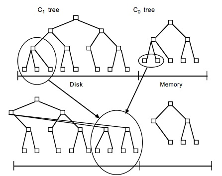
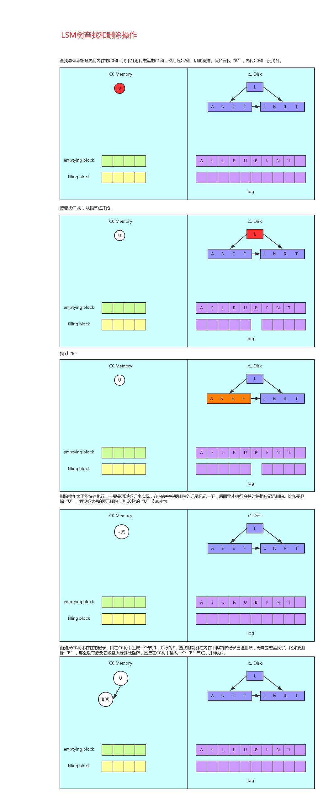

# HBase LSM树存储结构

### 1、LSM树的由来

​		在了解LSM树之前，大家需要对hash表和B+树有所了解。

​		hash存储方式支持增、删、改以及随机读取操作，但不支持顺序扫描，对应的存储系统为key-value存储系统。对于key-value的插入以及查询，哈希表的复杂度都是O(1)，明显比树的操作O(n)快,如果不需要有序的遍历数据，哈希表就是最佳选择

​		B+树不仅支持单条记录的增、删、读、改操作，还支持顺序扫描（B+树的叶子节点之间的指针），对应的存储系统就是关系数据库（Mysql等）。但是删除和更新操作比较麻烦

​		正是基于以上结构的分析，LSM树应运而生。

​		LSM树（Log-Structured Merge Tree）存储引擎和B树存储引擎一样，同样支持增、删、读、改、顺序扫描操作。而且通过批量存储技术规避磁盘随机写入问题。当然凡事有利有弊，LSM树和B+树相比，LSM树牺牲了部分读性能，用来大幅提高写性能。

### 2、LSM的设计思想和原理

​		LSM树的设计思想非常简单：将对数据的修改增量保持在内存中，达到指定的大小限制后将这些修改操作批量写入磁盘，不过读取的时候稍微麻烦，需要合并磁盘中历史数据和内存中最近修改操作，所以写入性能大大提升，读取时可能需要先看是否命中内存，否则需要访问较多的磁盘文件。极端的说，基于LSM树实现的HBase的写性能比Mysql高了一个数量级，读性能低了一个数量级。

​		LSM树原理把一棵大树拆分成N棵小树，它首先写入内存中，随着小树越来越大，内存中的小树会flush到磁盘中，磁盘中的树定期可以做merge操作，合并成一棵大树，以优化读性能。

​		在hbase中LSM的应用流程对应说下：

​		1、因为小树先写到内存中，为了防止内存数据丢失，写内存的同时需要暂时持久化到磁盘，对应了HBase的MemStore和HLog

​		2、MemStore上的树达到一定大小之后，需要flush到HRegion磁盘中（一般是Hadoop DataNode），这样MemStore就变成了DataNode上的磁盘文件StoreFile，定期HRegionServer对DataNode的数据做merge操作，彻底删除无效空间，多棵小树在这个时机合并成大树，来增强读性能。

3、LSM的原理

​		关于LSM Tree，对于最简单的二层LSM Tree而言，内存中的数据和磁盘你中的数据merge操作，如下图

​		lsm tree，理论上，可以是内存中树的一部分和磁盘中第一层树做merge，对于磁盘中的树直接做update操作有可能会破坏物理block的连续性，但是实际应用中，一般lsm有多层，当磁盘中的小树合并成一个大树的时候，可以重新排好顺序，使得block连续，优化读性能。

​		hbase在实现中，是把整个内存在一定阈值后，flush到disk中，形成一个file，这个file的存储也就是一个小的B+树，因为hbase一般是部署在hdfs上，hdfs不支持对文件的update操作，所以hbase这么整体内存flush，而不是和磁盘中的小树merge update，这个设计也就能讲通了。内存flush到磁盘上的小树，定期也会合并成一个大树。整体上hbase就是用了lsm tree的思路。

### LSM树插入和合并操作

### LSM树查找和删除操作
