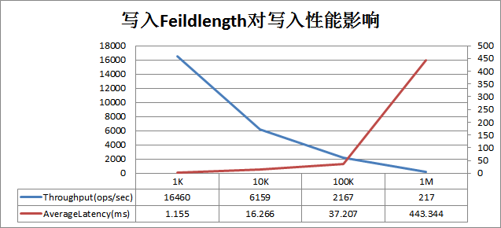

# HBase优化设计

### 1、表的设计

##### 1、Pre-Creating Regions

​		默认情况下，在创建HBase表的时候会自动创建一个region分区，当导入数据的时候，所有的HBase客户端都向这一个region写数据，直到这个region足够大了才进行切分。一种可以加快批量写入速度的方法是通过预先创建一些空的regions，这样当数据写入HBase时，会按照region分区情况，在集群内做数据的负载均衡。	

```java
//第一种实现方式是使用admin对象的切分策略
byte[] startKey = ...;      // your lowest key
byte[] endKey = ...;        // your highest key
int numberOfRegions = ...;  // # of regions to create
admin.createTable(table, startKey, endKey, numberOfRegions);
//第二种实现方式是用户自定义切片
byte[][] splits = ...;   // create your own splits
/*
byte[][] splits = new byte[][] { Bytes.toBytes("100"),
                Bytes.toBytes("200"), Bytes.toBytes("400"),
                Bytes.toBytes("500") };
*/
admin.createTable(table, splits);
```

##### 2、Rowkey设计

​		HBase中row key用来检索表中的记录，支持以下三种方式：

​			1、通过单个row key访问：即按照某个row key键值进行get操作；

​			2、通过row key的range进行scan：即通过设置startRowKey和endRowKey，在这个范围内进行扫描；

​			3、全表扫描：即直接扫描整张表中所有行记录。

​		在HBase中，rowkey可以是任意字符串，最大长度64KB，实际应用中一般为10~100bytes，存为byte[]字节数组，一般设计成定长的。
​		rowkey是按照字典序存储，因此，设计row key时，要充分利用这个排序特点，将经常一起读取的数据存储到一块，将最近可能会被访问的数据放在一块。

​		**Rowkey设计原则：**

​		**1、越短越好，提高效率**

​		（1）数据的持久化文件HFile中是按照KeyValue存储的，如果rowkey过长，比如操作100字节，1000万行数据，单单是存储rowkey的数据就要占用10亿个字节，将近1G数据，这样会影响HFile的存储效率。

​		（2）HBase中包含缓存机制，每次会将查询的结果暂时缓存到HBase的内存中，如果rowkey字段过长，内存的利用率就会降低，系统不能缓存更多的数据，这样会降低检索效率。

​		**2、散列原则--实现负载均衡**

​		如果Rowkey是按时间戳的方式递增，不要将时间放在二进制码的前面，建议将Rowkey的高位作为散列字段，由程序循环生成，低位放时间字段，这样将提高数据均衡分布在每个Regionserver实现负载均衡的几率。如果没有散列字段，首字段直接是时间信息将产生所有新数据都在一个 RegionServer上堆积的热点现象，这样在做数据检索的时候负载将会集中在个别RegionServer，降低查询效率。

​		（1）加盐：添加随机值

​		（2）hash：采用md5散列算法取前4位做前缀

​		（3）反转：将手机号反转

​		**3、唯一原则--字典序排序存储**

​		必须在设计上保证其唯一性，rowkey是按照字典顺序排序存储的，因此，设计rowkey的时候，要充分利用这个排序的特点，将经常读取的数据存储到一块，将最近可能会被访问的数据放到一块。		

##### 3、列族的设计

​		**不要在一张表里定义太多的column family**。目前Hbase并不能很好的处理超过2~3个column family的表。因为某个column family在flush的时候，它邻近的column family也会因关联效应被触发flush，最终导致系统产生更多的I/O。	

​		原因：

​		1、当开始向hbase中插入数据的时候，数据会首先写入到memstore，而memstore是一个内存结构，每个列族对应一个memstore，当包含更多的列族的时候，会导致存在多个memstore，每一个memstore在flush的时候会对应一个hfile的文件，因此会产生很多的hfile文件，更加严重的是，flush操作时region级别，当region中的某个memstore被flush的时候，同一个region的其他memstore也会进行flush操作，当某一张表拥有很多列族的时候，且列族之间的数据分布不均匀的时候，会产生更多的磁盘文件。

​		2、当hbase表的某个region过大，会被拆分成两个，如果我们有多个列族，且这些列族之间的数据量相差悬殊的时候，region的split操作会导致原本数据量小的文件被进一步的拆分，而产生更多的小文件

​		3、与 Flush 操作一样，目前 HBase 的 Compaction 操作也是 Region 级别的，过多的列族也会产生不必要的 IO。					

​		4、HDFS 其实对一个目录下的文件数有限制的（`dfs.namenode.fs-limits.max-directory-items`）。如果我们有 N 个列族，M 个 Region，那么我们持久化到 HDFS 至少会产生 N*M 个文件；而每个列族对应底层的 HFile 文件往往不止一个，我们假设为 K 个，那么最终表在 HDFS 目录下的文件数将是 N*M*K，这可能会操作 HDFS 的限制。

##### 4、in memory

​		hbase在LRU缓存基础之上采用了分层设计，整个blockcache分成了三个部分，分别是single、multi和inMemory。

​		三者区别如下：
​		single：如果一个block第一次被访问，放在该优先队列中；
​		multi：如果一个block被多次访问，则从single队列转移到multi队列
​		inMemory：优先级最高，常驻cache，因此一般只有hbase系统的元数据，如meta表之类的才会放到inMemory队列中。

##### 5、Max Version

​		创建表的时候，可以通过ColumnFamilyDescriptorBuilder.setMaxVersions(int maxVersions)设置表中数据的最大版本，如果只需要保存最新版本的数据，那么可以设置setMaxVersions(1)，保留更多的版本信息会占用更多的存储空间。

##### 6、Time to Live

​		创建表的时候，可以通过ColumnFamilyDescriptorBuilder.setTimeToLive(int timeToLive)设置表中数据的存储生命期，过期数据将自动被删除，例如如果只需要存储最近两天的数据，那么可以设置setTimeToLive(2 * 24 * 60 * 60)。

##### 7、Compaction

​		在HBase中，数据在更新时首先写入WAL 日志(HLog)和内存(MemStore)中，MemStore中的数据是排序的，当MemStore累计到一定阈值时，就会创建一个新的MemStore，并且将老的MemStore添加到flush队列，由单独的线程flush到磁盘上，成为一个StoreFile。于此同时， 系统会在zookeeper中记录一个redo point，表示这个时刻之前的变更已经持久化了**(minor compact)**。

​		StoreFile是只读的，一旦创建后就不可以再修改。因此Hbase的更新其实是不断追加的操作。当一个Store中的StoreFile达到一定的阈值后，就会进行一次合并**(major compact)**，将对同一个key的修改合并到一起，形成一个大的StoreFile，当StoreFile的大小达到一定阈值后，又会对 StoreFile进行分割**(split)**，等分为两个StoreFile。

​		由于对表的更新是不断追加的，处理读请求时，需要访问Store中全部的StoreFile和MemStore，将它们按照row key进行合并，由于StoreFile和MemStore都是经过排序的，并且StoreFile带有内存中索引，通常合并过程还是比较快的。

​		实际应用中，可以考虑必要时手动进行major compact，将同一个row key的修改进行合并形成一个大的StoreFile。同时，可以将StoreFile设置大些，减少split的发生。

​		hbase为了防止小文件（被刷到磁盘的menstore）过多，以保证保证查询效率，hbase需要在必要的时候将这些小的store file合并成相对较大的store file，这个过程就称之为compaction。在hbase中，主要存在两种类型的compaction：minor  compaction和major compaction。

​		1、minor compaction:的是较小、很少文件的合并。

​		minor compaction的运行机制要复杂一些，它由一下几个参数共同决定：

​				hbase.hstore.compaction.min :默认值为 3，表示至少需要三个满足条件的store file时，minor compaction才会启动

​				hbase.hstore.compaction.max 默认值为10，表示一次minor compaction中最多选取10个store file

​				hbase.hstore.compaction.min.size 表示文件大小小于该值的store file 一定会加入到minor compaction的store file中

​				hbase.hstore.compaction.max.size 表示文件大小大于该值的store file 一定不会被添加到minor compaction

​				hbase.hstore.compaction.ratio ：将 StoreFile 按照文件年龄排序，minor compaction 总是从 older store file 开始选择，如果该文件的 size 小于后面 hbase.hstore.compaction.max 个 store file size 之和乘以 ratio 的值，那么该 store file 将加入到 minor compaction 中。如果满足 minor compaction 条件的文件数量大于 hbase.hstore.compaction.min，才会启动。

​		2、major compaction 的功能是将所有的store file合并成一个，触发major compaction的可能条件有：

​			1、major_compact 命令、

​			2、majorCompact() API、

​			3、region server自动运行

​				（1）hbase.hregion.majorcompaction 默认为24 小时

​				（2）hbase.hregion.majorcompaction.jetter 默认值为0.2 防止region server 在同一时间进行major compaction）。

​					hbase.hregion.majorcompaction.jetter参数的作用是：对参数hbase.hregion.majorcompaction 规定的值起到浮动的作用，假如两个参数都为默认值24和0,2，那么major compact最终使用的数值为：19.2~28.8 这个范围。

### 2、hbase写表操作		

##### 1、是否需要写WAL？WAL是否需要同步写入？

优化原理：

​		数据写入流程可以理解为一次顺序写WAL+一次写缓存，通常情况下写缓存延迟很低，因此提升写性能就只能从WAL入手。WAL机制一方面是为了确保数据即使写入缓存丢失也可以恢复，另一方面是为了集群之间异步复制。默认WAL机制开启且使用同步机制写入WAL。首先考虑业务是否需要写WAL，通常情况下大多数业务都会开启WAL机制（默认），但是对于部分业务可能并不特别关心异常情况下部分数据的丢失，而更关心数据写入吞吐量，比如某些推荐业务，这类业务即使丢失一部分用户行为数据可能对推荐结果并不构成很大影响，但是对于写入吞吐量要求很高，不能造成数据队列阻塞。这种场景下可以考虑关闭WAL写入，写入吞吐量可以提升2x~3x。退而求其次，有些业务不能接受不写WAL，但可以接受WAL异步写入，也是可以考虑优化的，通常也会带来1x～2x的性能提升。 

优化推荐：

​		根据业务关注点在WAL机制与写入吞吐量之间做出选择  

##### 2、Put是否可以同步批量提交？

优化原理：

​		HBase分别提供了单条put以及批量put的API接口，使用批量put接口可以减少客户端到RegionServer之间的RPC连接数，提高写入性能。另外需要注意的是，批量put请求要么全部成功返回，要么抛出异常。

优化建议：

​		使用批量put进行写入请求

##### 3、Put是否可以异步批量提交？

优化原理：

​		业务如果可以接受异常情况下少量数据丢失的话，还可以使用异步批量提交的方式提交请求。提交分为两阶段执行：用户提交写请求之后，数据会写入客户端缓存，并返回用户写入成功；当客户端缓存达到阈值（默认2M）之后批量提交给RegionServer。需要注意的是，在某些情况下客户端异常的情况下缓存数据有可能丢失。

优化建议：

​		在业务可以接受的情况下开启异步批量提交

使用方式：

​		setAutoFlush(false)

##### 4. Region是否太少？

优化原理：

​		当前集群中表的Region个数如果小于RegionServer个数，即Num(Region of Table) < Num(RegionServer)，可以考虑切分Region并尽可能分布到不同RegionServer来提高系统请求并发度，如果Num(Region of Table) > Num(RegionServer)，再增加Region个数效果并不明显。

优化建议：

​		在Num(Region of Table) < Num(RegionServer)的场景下切分部分请求负载高的Region并迁移到其他RegionServer；

##### **5. 写入请求是否不均衡？** 

优化原理：

​		另一个需要考虑的问题是写入请求是否均衡，如果不均衡，一方面会导致系统并发度较低，另一方面也有可能造成部分节点负载很高，进而影响其他业务。分布式系统中特别害怕一个节点负载很高的情况，一个节点负载很高可能会拖慢整个集群，这是因为很多业务会使用Mutli批量提交读写请求，一旦其中一部分请求落到该节点无法得到及时响应，就会导致整个批量请求超时。因此不怕节点宕掉，就怕节点奄奄一息！

优化建议：

​		检查RowKey设计以及预分区策略，保证写入请求均衡。

##### **6. 写入KeyValue数据是否太大？** 

​		KeyValue大小对写入性能的影响巨大，一旦遇到写入性能比较差的情况，需要考虑是否由于写入KeyValue数据太大导致。KeyValue大小对写入性能影响曲线图如下：



​		图中横坐标是写入的一行数据（每行数据10列）大小，左纵坐标是写入吞吐量，右坐标是写入平均延迟（ms）。可以看出随着单行数据大小不断变大，写入吞吐量急剧下降，写入延迟在100K之后急剧增大。

##### 7、Utilize Flash storage for WAL(HBASE-12848)

​		这个特性意味着可以将WAL单独置于SSD上，这样即使在默认情况下（WALSync），写性能也会有很大的提升。需要注意的是，该特性建立在HDFS 2.6.0+的基础上，HDFS以前版本不支持该特性。具体可以参考官方jira：https://issues.apache.org/jira/browse/HBASE-12848

##### 8、Multiple WALs(HBASE-14457)

​		该特性也是对WAL进行改造，当前WAL设计为一个RegionServer上所有Region共享一个WAL，可以想象在写入吞吐量较高的时候必然存在资源竞争，降低整体性能。针对这个问题，社区小伙伴（阿里巴巴大神）提出Multiple WALs机制，管理员可以为每个Namespace下的所有表设置一个共享WAL，通过这种方式，写性能大约可以提升20%～40%左右。具体可以参考官方jira：https://issues.apache.org/jira/browse/HBASE-14457

### 3、hbase读表优化

##### 1. scan缓存是否设置合理？

优化原理：

​		在解释这个问题之前，首先需要解释什么是scan缓存，通常来讲一次scan会返回大量数据，因此客户端发起一次scan请求，实际并不会一次就将所有数据加载到本地，而是分成多次RPC请求进行加载，这样设计一方面是因为大量数据请求可能会导致网络带宽严重消耗进而影响其他业务，另一方面也有可能因为数据量太大导致本地客户端发生OOM。在这样的设计体系下用户会首先加载一部分数据到本地，然后遍历处理，再加载下一部分数据到本地处理，如此往复，直至所有数据都加载完成。数据加载到本地就存放在scan缓存中，默认100条数据大小。

通常情况下，默认的scan缓存设置就可以正常工作的。但是在一些大scan（一次scan可能需要查询几万甚至几十万行数据）来说，每次请求100条数据意味着一次scan需要几百甚至几千次RPC请求，这种交互的代价无疑是很大的。因此可以考虑将scan缓存设置增大，比如设为500或者1000就可能更加合适。笔者之前做过一次试验，在一次scan扫描10w+条数据量的条件下，将scan缓存从100增加到1000，可以有效降低scan请求的总体延迟，延迟基本降低了25%左右。

优化建议：

​		大scan场景下将scan缓存从100增大到500或者1000，用以减少RPC次数

##### 2. get请求是否可以使用批量请求？

优化原理：

​		HBase分别提供了单条get以及批量get的API接口，使用批量get接口可以减少客户端到RegionServer之间的RPC连接数，提高读取性能。另外需要注意的是，批量get请求要么成功返回所有请求数据，要么抛出异常。

优化建议：

​		使用批量get进行读取请求

##### 3. 请求是否可以显示指定列族或者列？

优化原理：

​		HBase是典型的列族数据库，意味着同一列族的数据存储在一起，不同列族的数据分开存储在不同的目录下。如果一个表有多个列族，只是根据Rowkey而不指定列族进行检索的话不同列族的数据需要独立进行检索，性能必然会比指定列族的查询差很多，很多情况下甚至会有2倍～3倍的性能损失。

优化建议：

​		可以指定列族或者列进行精确查找的尽量指定查找

##### 4. 离线批量读取请求是否设置禁止缓存？ 

优化原理：

​		通常离线批量读取数据会进行一次性全表扫描，一方面数据量很大，另一方面请求只会执行一次。这种场景下如果使用scan默认设置，就会将数据从HDFS加载出来之后放到缓存。可想而知，大量数据进入缓存必将其他实时业务热点数据挤出，其他业务不得不从HDFS加载，进而会造成明显的读延迟

优化建议：

​		离线批量读取请求设置禁用缓存，scan.setBlockCache(false)

##### 5. 读请求是否均衡？

优化原理：

​		极端情况下假如所有的读请求都落在一台RegionServer的某几个Region上，这一方面不能发挥整个集群的并发处理能力，另一方面势必造成此台RegionServer资源严重消耗（比如IO耗尽、handler耗尽等），落在该台RegionServer上的其他业务会因此受到很大的波及。可见，读请求不均衡不仅会造成本身业务性能很差，还会严重影响其他业务。当然，写请求不均衡也会造成类似的问题，可见负载不均衡是HBase的大忌。

观察确认：

​		观察所有RegionServer的读请求QPS曲线，确认是否存在读请求不均衡现象

优化建议：

​		RowKey必须进行散列化处理（比如MD5散列），同时建表必须进行预分区处理

##### 6. BlockCache是否设置合理？

优化原理：

​		BlockCache作为读缓存，对于读性能来说至关重要。默认情况下BlockCache和Memstore的配置相对比较均衡（各占40%），可以根据集群业务进行修正，比如读多写少业务可以将BlockCache占比调大。另一方面，BlockCache的策略选择也很重要，不同策略对读性能来说影响并不是很大，但是对GC的影响却相当显著，尤其BucketCache的offheap模式下GC表现很优越。另外，HBase 2.0对offheap的改造（HBASE-11425）将会使HBase的读性能得到2～4倍的提升，同时GC表现会更好！

观察确认：

​		观察所有RegionServer的缓存未命中率、配置文件相关配置项一级GC日志，确认BlockCache是否可以优化

优化建议：

​		JVM内存配置量 < 20G，BlockCache策略选择LRUBlockCache；否则选择BucketCache策略的offheap模式；

##### 7. HFile文件是否太多？

优化原理：

​		HBase读取数据通常首先会到Memstore和BlockCache中检索（读取最近写入数据&热点数据），如果查找不到就会到文件中检索。HBase的类LSM结构会导致每个store包含多数HFile文件，文件越多，检索所需的IO次数必然越多，读取延迟也就越高。文件数量通常取决于Compaction的执行策略，一般和两个配置参数有关：hbase.hstore.compaction.min和hbase.hstore.compaction.max.size，前者表示一个store中的文件数超过多少就应该进行合并，后者表示参数合并的文件大小最大是多少，超过此大小的文件不能参与合并。这两个参数不能设置太’松’（前者不能设置太大，后者不能设置太小），导致Compaction合并文件的实际效果不明显，进而很多文件得不到合并。这样就会导致HFile文件数变多。

观察确认：

​		观察RegionServer级别以及Region级别的storefile数，确认HFile文件是否过多

优化建议：

​		hbase.hstore.compaction.min设置不能太大，默认是3个；设置需要根据Region大小确定，通常可以简单的认为hbase.hstore.compaction.max.size = RegionSize / hbase.hstore.compaction.min

##### **8. Compaction是否消耗系统资源过多？** 

优化原理：

​		Compaction是将小文件合并为大文件，提高后续业务随机读性能，但是也会带来IO放大以及带宽消耗问题（数据远程读取以及三副本写入都会消耗系统带宽）。正常配置情况下Minor Compaction并不会带来很大的系统资源消耗，除非因为配置不合理导致Minor Compaction太过频繁，或者Region设置太大情况下发生Major Compaction。

观察确认：

​		观察系统IO资源以及带宽资源使用情况，再观察Compaction队列长度，确认是否由于Compaction导致系统资源消耗过多

优化建议：

​		（1）Minor Compaction设置：hbase.hstore.compaction.min设置不能太小，又不能设置太大，因此建议设置为5～6；hbase.hstore.compaction.max.size = RegionSize / hbase.hstore.compaction.min

​		（2）Major Compaction设置：大Region读延迟敏感业务（ 100G以上）通常不建议开启自动Major Compaction，手动低峰期触发。小Region或者延迟不敏感业务可以开启Major Compaction，但建议限制流量；

##### 9、数据本地率是否太低？

数据本地率：HDFS数据通常存储三份，假如当前RegionA处于Node1上，数据a写入的时候三副本为(Node1,Node2,Node3)，数据b写入三副本是(Node1,Node4,Node5)，数据c写入三副本(Node1,Node3,Node5)，可以看出来所有数据写入本地Node1肯定会写一份，数据都在本地可以读到，因此数据本地率是100%。现在假设RegionA被迁移到了Node2上，只有数据a在该节点上，其他数据（b和c）读取只能远程跨节点读，本地率就为33%（假设a，b和c的数据大小相同）。

优化原理：

​		数据本地率太低很显然会产生大量的跨网络IO请求，必然会导致读请求延迟较高，因此提高数据本地率可以有效优化随机读性能。数据本地率低的原因一般是因为Region迁移（自动balance开启、RegionServer宕机迁移、手动迁移等）,因此一方面可以通过避免Region无故迁移来保持数据本地率，另一方面如果数据本地率很低，也可以通过执行major_compact提升数据本地率到100%。

优化建议：

​		避免Region无故迁移，比如关闭自动balance、RS宕机及时拉起并迁回飘走的Region等；在业务低峰期执行major_compact提升数据本地率