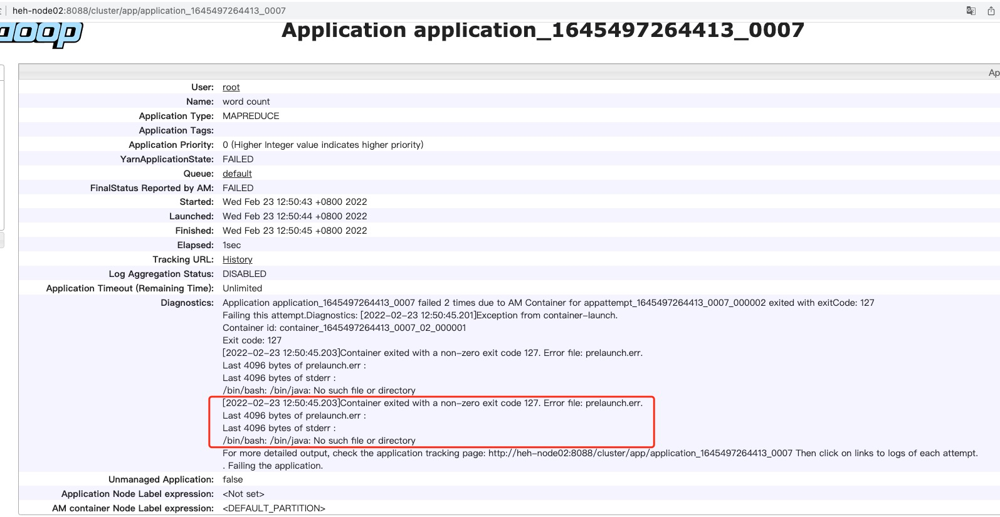

# Yarn 环境搭建

在hadoop——hdfs环境搭建好的情况下

## 修改配置文件

/opt/bigdata/hadoop-2.10.1/etc/hadoop 目录下,修改 mapped-site.xml、yarn-site.xml

```shell
cp mapred-site.xml.template mapped-site.xml
vim mapped-site.xml

<configuration>
    <property>
        <name>mapreduce.framework.name</name>
        <!-- mapreduce on yarn -->
        <value>yarn</value>
    </property>
    <property>
        <name>mapreduce.application.classpath</name>
        <value>/opt/bigdata/hadoop-2.10.1/share/hadoop/mapreduce/*:/opt/bigdata/hadoop-2.10.1/share/hadoop/mapreduce/lib/*</value>
    </property>
</configuration>
    
    
vim yarn-site.xml

<configuration>
    <property>
        <name>yarn.nodemanager.aux-services</name>
        <value>mapreduce_shuffle</value>
    </property>
    <property>
        <name>yarn.nodemanager.env-whitelist</name>
        <value>JAVA_HOME,HADOOP_COMMON_HOME,HADOOP_HDFS_HOME,HADOOP_CONF_DIR,CLASSPATH_PREPEND_DISTCACHE,HADOOP_YARN_HOME,HADOOP_HOME,PATH,LANG,TZ,HADOOP_MAPRED_HOME</value>
    </property>
</configuration>

```

## 启动进程

/opt/bigdata/hadoop-2.10.1/sbin 目录下
```shell
./start-yarn.sh 

使用jps查看角色是否完整
会在主节点启动一个ResourceManager进程
会在每个datanode启动一个NodeManager进程
```

## 环境测试——运行案例程序

```shell 
# 创建hdfs目录，上传对应的文件
   
# 进入案例程序的目录 
cd /opt/bigdata/hadoop-3.3.1/share/hadoop/mapreduce/
# 将程序提交给yarn运行 hadoop jar 【jar文件】 【启动程序全限定类名，案例类直接写名称】 【输入路径（如果是路径，下面所有文件都参与运算）】 【输出路径（空文件夹）】
hadoop jar hadoop-mapreduce-examples-3.3.1.jar wordcount /data/input/big.txt /data/output/bigMR
```

### 问题1：/bin/java: No such file or directory

> 在 shell 执行 /bin/java --> 无法执行       
> 创建 /bin/java 的软链接，指向jdk的真实目录    
> ln -s /opt/bigdata/jdk1.8.0_281/bin/java /bin/java   
> 
> 创建后在执行   /bin/java   可以执行了    
> 重新提交mr任务    