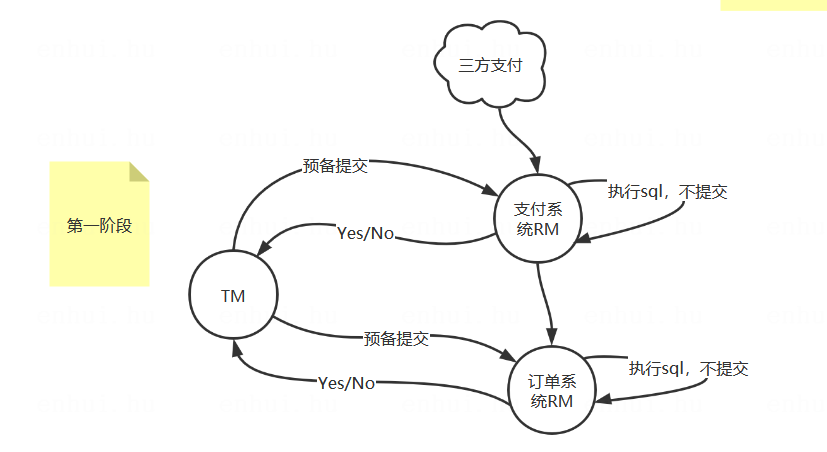
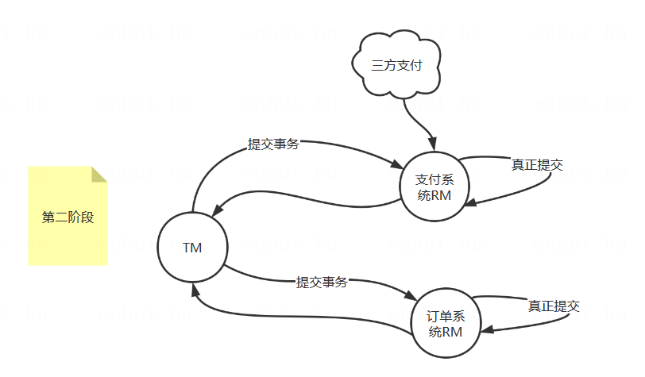
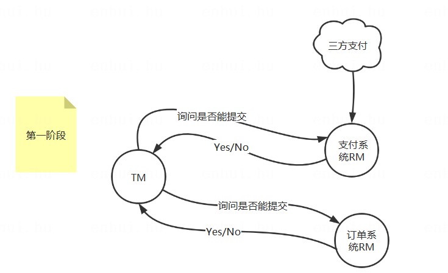

# 两阶段提交和三阶段提交

两阶段提交和三阶段提交方案中，需要引入一个协调者，即事务管理器。   
xa:事务管理器(Transaction Manager)、资源管理器(Resource Manager)   

## 两阶段提交的模型

   
**第一阶段解释：**    
1.由【事务管理器】通知【支付系统】预备提交（执行sql，但不提交）    
2.【支付系统】执行sql，返回执行结果，yes/no    
3.由【事务管理器】通知【订单系统】预备提交（执行sql，但不提交）    
4.【订单系统】执行sql，返回执行结果，yes/no    
5.【事务管理器】通知所有RM并收集结果：    
当所有RM返回均为yes，则意味着不会失败，进入第二阶段，执行真正的提交    
当有任意一个返回为no，则意味着不能提交，进入第二阶段，执行回滚 
   
**超时机制**    
在第一阶段中，假设TM在一定时间内未收到所有RM的回应，则判定为事务失败，向所有RM发送回滚指令   

   
**第二阶段解释：**   
【事务管理器】会根据第一阶段反馈进行最终决策（提交/回滚）     
1.【事务管理器】通知【支付系统】执行真正的提交     
2.【事务管理器】通知【订单系统】执行真正的提交     

**二阶段提交有哪些问题：**   
1.同步阻塞：在第一阶段中，RM执行sql未提交期间，RM会一直锁定资源等待TM下一次指令，无法进行其他操作。   
2.TM单点问题：协调者TM在 2PC 中起到非常大的作用，发生故障会造成很大影响。特别是在阶段二发生故障，所有RM会一直处于等待状态，无法完成其他操作。    
3.数据不一致：在阶段二中，如果TM发送了一部分 Commit 通知后，TM发生故障，导致部分RM接收到提交通知，部分RM未接收到提交通知，导致数据不一致。   
4.太过保守：任意一个RM执行sql失败都会导致整个事务回滚，没有完善的容错机制。   

## 三阶段提交的模型

> 相较于二阶段提交，三阶段进行了优化     
> 在二阶段提交模型之前加了一个过程（询问过程），此阶段不锁资源   
> 引入了RM的超时机制：第二阶段超时，则中断事务；第三阶段超时，提交事务。    

     
**第一阶段解释：**   
1.由【事务管理器】询问【支付系统】是否可以执行事务（不会锁资源）         
2.【支付系统】返回结果yes/no    
3.由【事务管理器】询问【订单系统】是否可以执行事务（不会锁资源）    
4.【订单系统】返回结果yes/no     
5.【事务管理器】根据结果选择是否执行第二阶段     

**第二阶段同2pc中的预提交。**   

**第三阶段同2pc中的提交。**   

 