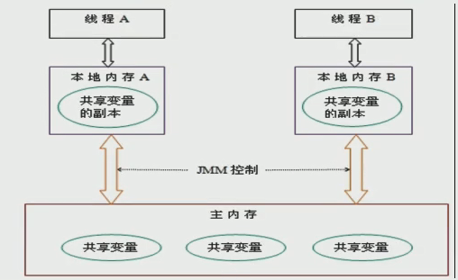
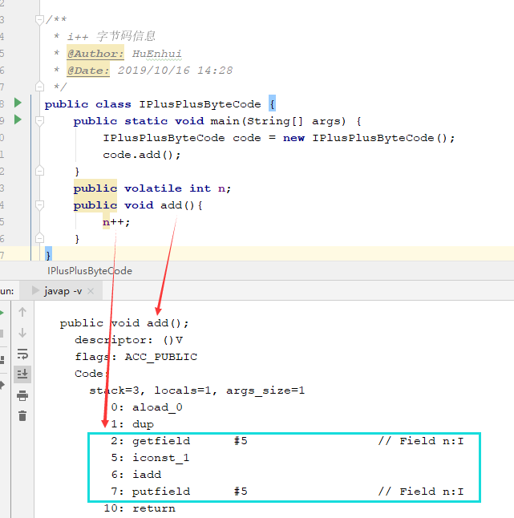
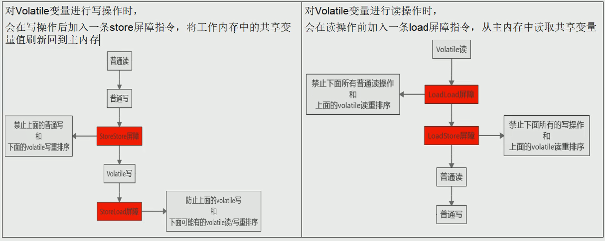

# volatile 关键字
volatile是一个轻量级的同步机制
1. 保证可见性
2. 不保证原子性
3. 禁止指令重排序

# JMM内存模型
- **JMM有三个特性：可见性、原子性、有序性；三个特性让线程安全得到了保证**   
JMM(Java内存模型Java Memory Model,简称JMM)本身是一种抽象的概念**并不真实存在**,
它描述的是一组规则或规范，通过规范定制了程序中各个变量(包括实例字段,静态字段和构成数组对象的元素)的访问方式.  
      
JMM关于同步规定:
1. 线程解锁前,必须把共享变量的值刷新回主内存
2. 线程加锁前,必须读取主内存的最新值到自己的工作内存
3. 加锁解锁是同一把锁

由于JVM运行程序的实体是线程,而每个线程创建时JVM都会为其创建一个工作内存(有些地方称为栈空间),
工作内存是每个线程的私有数据区域,而Java内存模型中规定所有变量都存储在**主内存**,主内存是共享内存区域,
所有线程都可访问,**但线程对变量的操作(读取赋值等)必须在工作内存中进行,首先要将变量从主内存拷贝到自己的工作空间,
然后对变量进行操作,操作完成再将变量写回主内存**,不能直接操作主内存中的变量,
各个线程中的工作内存储存着主内存中的变量副本拷贝,因此不同的线程无法访问对方的工作内存,
线程间的通讯(传值) 必须通过主内存来完成,其简要访问过程如下图:       
       
   
## 可见性说明
通过前面对JMM的介绍,我们知道    
各个线程对主内存中共享变量的操作都是各个线程各自拷贝到自己的工作内存操作后再写回主内存中的.      
这就可能存在一个线程A修改了共享变量number的值还未写回主内存中时 ,另外一个线程B又对主内存中同一个共享变量number进行操作,
但此时A线程工作内存中的共享变量number对线程B来说并不可见.      
这种工作内存与主内存同步延迟现象就造成了可见性问题.
**可见性是指当多个线程访问同一个变量时，一个线程修改了这个变量的值，其他线程能够立即看得到修改的值。** 
> 例如：A和B两个线程操作number变量，number变量初始值为0，   
B线程：若number为0，则一直循环；    
A线程：将number的值改为10   
若number变量未加volatile关键字，则没有可见性，以上程序将一直运行，因为A线程修改number后，B线程不可见       
若number变量加了volatile关键字，则有可见性，以上程序将会终止运行，因为A线程修改number后，B线程会立即知道          
```java
/**
 * 1. 验证volatile保证可见性 visibility方法
 * 1.1 假如int number = 0;  number变量之前没有添加volatile关键字修饰，没有可见性
 * 1.2 假如volatile int number = 0;  number变量之前添加volatile关键字修饰，有可见性
 *
 * @Author: HuEnhui
 * @Date: 2019/10/16 11:35
 */
public class T04_VolatileDemo {
    public static void main(String[] args) {
        visibility();
    }
    
    /**
     * volatile可以保证可见性，及时通知其他线程，主物理内存中的值已经被修改。
     *
     * @author: HuEnhui
     * @date: 2019/10/16 11:48
     */
    public static void visibility() {
        MyData myData = new MyData();
        new Thread(() -> {
            System.out.println(Thread.currentThread().getName() + "\t come in");
            // 暂停一会A线程,给B线程运行提供机会
            try {
                TimeUnit.SECONDS.sleep(3);
            } catch (InterruptedException e) {
                e.printStackTrace();
            }
            myData.addTo10();
            System.out.println(Thread.currentThread().getName() + "\t update number value: " + myData.number);
        }, "A").start();

        new Thread(() -> {
            System.out.println(Thread.currentThread().getName() + "\t come in");
            // 第2个线程就是B线程
            while (myData.number == 0) {
                // B线程一直循环，直到number不再等于0
            }
            System.out.println(Thread.currentThread().getName() + "\t mission is over,number value:" + myData.number);
        }, "B").start();

    }
}

class MyData {
    volatile int number = 0;

    public void addTo10() {
        this.number = 10;
    }
}
```
## 原子性
## volatile不保证原子性的代码演示
> number由volatile修饰，且初始值为0，创建20个线程，每个线程循环1000次，对number变量执行i++操作
```java
/**
 * 2. 验证volatile不保证原子性 atomic方法
 * 2.1 使用volatile和i++ 多个线程操作后，出现写值丢失情况，不保证原子性
 * 2.2 使用AtomicInteger  保证原子性
 *
 * @Author: HuEnhui
 * @Date: 2019/10/16 11:35
 */
public class T04_VolatileDemo {
    public static void main(String[] args) {
        atomic();
    }

    /**
     * volatile原子性
     *
     * @author: HuEnhui
     * @date: 2019/10/16 15:12
     */
    private static void atomic() {
        MyData myData = new MyData();
        for (int i = 0; i < 20; i++) {
            new Thread(() -> {
                for (int j = 0; j < 1000; j++) {
                    // 使用volatile和i++组合
                    myData.addPlusPlus();
                    // 使用AtomicInteger
                    myData.addAtomicPlusPlus();
                }
            }, String.valueOf(i)).start();
        }
        //需要等待上面20个线程全部计算完成后，在用main线程取得最终结果
        // 默认有main线程和GC线程
        while (Thread.activeCount() > 2) {
            Thread.yield();
        }
        System.out.println(Thread.currentThread().getName() + "\t int type,finally number value:" + myData.number);
        System.out.println(Thread.currentThread().getName() + "\t AtomicInteger type,finally number value:" + myData.atomicInteger);

    }
}

class MyData {
    volatile int number = 0;
    /**
     * number由volatile关键字修饰，不保证原子性
     */
    public void addPlusPlus() {
        this.number++;
    }

    AtomicInteger atomicInteger = new AtomicInteger();
    public void addAtomicPlusPlus() {
        // 原子性i++
        atomicInteger.getAndIncrement();
    }
}


```

### volatile不保证原子性理论解释    
原子性：   
1.不可分割，完整性，也即某个线程正在做某个具体业务时，中间不可以被加塞或者分割，需要整体完整   
2.要么同时成功，要么同时失败        

i++实际由三步组成
1. 执行getfield拿到原始n
2. 执行iadd进行加1操作
3. 执行putfield把值写会主内存    
javap执行结果:
 

**出现了丢失写值的情况，没有保证原子性**

### volatile不保证原子性问题解决
- 加synchronized关键字，（大材小用）
- 使用juc下的AtomicInteger代替volatile int n 

## 有序性（禁止指令重排）
### 指令重排
计算机在执行程序时,为了提高性能,编译器和处理器常常会做**指令重排**,一般分为以下3种
      
单线程环境里面确保程序最终执行结果和代码顺序执行的结果一致(单线程程序不用考虑指令重排问题).      
处理器在进行重新排序时必须要考虑指令之间的**数据依赖性**      
多线程环境中线程交替执行,由于编译器优化重排的存在,两个线程使用的变量能否保持一致性是无法确定的,结果无法预测
### volatile禁止指令重排
volatile实现**禁止指令重排优化**，从而避免多线程环境下程序出现乱序执行的现象    
先了解一个概念，内存屏障（Memory Barrier）又称内存栅栏，是一个cpu指令，它的作用有两个：
1. 保证特定操作的执行顺序
2. 保证某些变量的内存可见性（利用该特性实现volatile的内存可见性）  
由于编译器和处理器都能执行指令重排优化。如果在指令间插入一条Memory Barrier则会告诉编译器和CPU，
不管什么指令都不能和这条Memory Barrier指令重排序，也就是说**通过插入内存屏障禁止在内存屏障前后的指令执行重排序优化**。
内存屏障另外一个作用是强制刷出各种CPU的缓存数据，因此任何CPU上的线程都能读取到这些数据的最新版本。
 

## volatile的使用
###  单例模式（DCL双端检索机制）    
 
```java
/**
 * DCL单例模式
 * @Author: HuEnhui
 * @Date: 2019/10/16 16:43
 */
public class T06_SingletonDemo {
    private static SingletonDemo instance = null;
    private SingletonDemo() {
        System.out.println(Thread.currentThread().getName()+"构造方法");
    }
    // DCL （Double Check Lock 双端检锁机制）
    public static SingletonDemo getInstance(){
        if(instance == null){
            synchronized (SingletonDemo.class) {
                if(instance == null){
                    instance = new SingletonDemo();
                }
            }
        }
        return instance;
    }

    public static void main(String[] args) {
        for (int i = 0; i < 10; i++) {
            new Thread(()->{
                SingletonDemo.getInstance();
            },String.valueOf(i)).start();
        }
    }
}
```

### 解析DCL单例模式为什么需要加volatile
DCL(双端检锁) 机制不一定线程安全,原因是有指令重排的存在,加入volatile可以禁止指令重排   
     
原因在于某一个线程在执行到第一次检测,读取到的instance不为null时,instance的引用对象**可能没有完成初始化**.    
instance=new SingletonDem(); 可以分为以下步骤(伪代码)    
memory=allocate();//1.分配对象内存空间    
instance(memory);//2.初始化对象  
instance=memory;//3.设置instance的指向刚分配的内存地址,此时instance!=null      
步骤2和步骤3不存在数据依赖关系.而且无论重排前还是重排后程序执行的结果在单线程中并没有改变,因此这种重排优化是允许的.    
memory=allocate();//1.分配对象内存空间          
instance=memory;//3.设置instance的指向刚分配的内存地址,此时instance!=null 但对象还没有初始化完.            
instance(memory);//2.初始化对象        
但是指令重排只会保证串行语义的执行一致性(单线程) 并不会关心多线程间的语义一致性           
**所以当一条线程访问instance不为null时,由于instance实例未必完成初始化,也就造成了线程安全问题.**         

