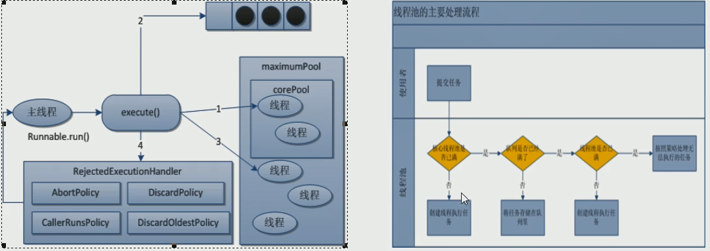
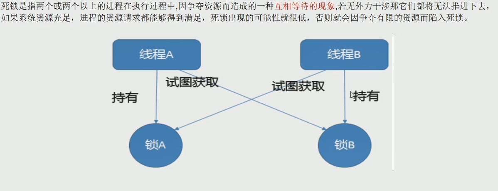
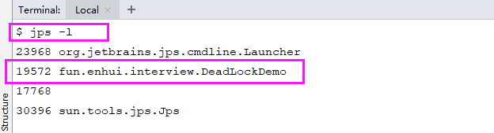
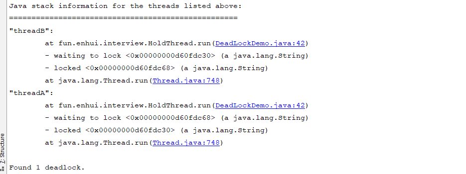

# 线程池

# 线程池的优势
线程池做的工作主要是控制运行的线程的数量,处理过程中将任务加入队列,
然后在线程创建后启动这些任务,如果线程数量超过了最大数量,超出的数量的线程排队等候,
等其他线程执行完毕,再从队列中取出任务来执行.
 
他的主要特点为:，线程复用，控制最大并发数，管理线程.
 
第一:降低资源消耗.通过重复利用已创建的线程降低线程创建和销毁造成的消耗.
第二: 提高响应速度.当任务到达时,任务可以不需要等待线程创建就能立即执行.
第三: 提高线程的可管理性.线程是稀缺资源,如果无限的创建,不仅会消耗资源,
还会降低系统的稳定性,使用线程池可以进行统一分配,调优和监控.

# 线程池的架构
Java中的线程池是通过Executor框架实现的,该框架中用到了Executor,Executors,
ExecutorService,ThreadPoolExecutor这几个类.         
 

# 线程池的使用

```java
package com.enhui.thread.pool;
import java.util.concurrent.*;

/**
 * 线程池的使用，第四种使用线程的方式
 * @Author HuEnhui
 * @Date 2019/10/21 20:28
 **/
public class T06_02_ThreadPool {
    public static void main(String[] args) {
        // 查看本机电脑核数
        System.out.println(Runtime.getRuntime().availableProcessors());
    }

    /**
     *  自定义线程池，使用默认拒绝策略
     * @author: HuEnhui
     * @date: 2019/10/22 11:42
     * @param
     * @return: void
     */
    private static void abortPolicyWayPool() {

        ExecutorService threadPool = new ThreadPoolExecutor(
                2,
                5,
                1L,
                TimeUnit.MILLISECONDS,
                new LinkedBlockingQueue<Runnable>(3),
                Executors.defaultThreadFactory(),
                new ThreadPoolExecutor.AbortPolicy());
        // 模拟十个用户来办理业务
        try{
            // 最大容纳请求数为8，因为线程数最大为5，等待队列长度为3，9则抛出异常，因为AbortPolicy默认拒绝策略的特点
            for (int i = 1; i <= 8; i++) {
                threadPool.execute(()->{
                    System.out.println(Thread.currentThread().getName()+"\t办理业务");
                });
            }
        }catch (Exception e){
            e.printStackTrace();
        }finally {
            threadPool.shutdown();
        }
    }


    /**
     *  三种Executors提供的线程池
     * @author: HuEnhui
     * @date: 2019/10/22 11:35
     * @param
     * @return: void
     */
    private static void threadPoolInit() {
        // 一池有五个线程，假设银行有五个办理窗口
        ExecutorService threadPool1 = Executors.newFixedThreadPool(5);

        // 一池一个线程
        ExecutorService threadPool2 = Executors.newSingleThreadExecutor();

        // 一池N个线程，
        ExecutorService threadPool3 = Executors.newCachedThreadPool();

        // 模拟十个用户来办理业务
        try{
            for (int i = 1; i < 10; i++) {
                threadPool3.execute(()->{
                    System.out.println(Thread.currentThread().getName()+"\t办理业务");
                });
            }
        }catch (Exception e){
            e.printStackTrace();
        }finally {
            threadPool3.shutdown();
        }
    }
}

```
## 了解
-  Executors.newCachedThreadPool();
-  Executors.newWorkStealingPool(int);——java8新增,使用目前机器上可用的处理器作为他的并行级别

## 重点

-  Executors.newFixedThreadPool(int) —— 执行一个长期的任务,性能好很多
>主要特点如下:    
 1.创建一个定长线程池,可控制线程的最大并发数,超出的线程会在队列中等待.  
 2.newFixedThreadPool创建的线程池corePoolSize和MaxmumPoolSize值是相等的,
 它使用的LinkedBlockingQueue        
源码：
```
    public static ExecutorService newFixedThreadPool(int nThreads) {
        return new ThreadPoolExecutor(nThreads, nThreads,
                                      0L, TimeUnit.MILLISECONDS,
                                      new LinkedBlockingQueue<Runnable>());
    }
```

-  Executors.newSingleThreadExecutor() —— 一个任务一个线程执行的任务场景
>主要特点如下:        
1.创建一个单线程化的线程池,它只会用唯一的工作线程来执行任务,保证所有任务都按照指定顺序执行.        
2.newSingleThreadExecutor将corePoolSize和MaxmumPoolSize都设置为1,它使用的LinkedBlockingQueue     
源码：
```
    public static ExecutorService newSingleThreadExecutor() {
        return new FinalizableDelegatedExecutorService
            (new ThreadPoolExecutor(1, 1,
                                    0L, TimeUnit.MILLISECONDS,
                                    new LinkedBlockingQueue<Runnable>()));
    }
```

-  Executors.newCachedThreadPool() —— 适用:执行很多短期异步的小程序或者负载较轻的服务器
> 主要特点如下:       
 1.创建一个可缓存线程池,如果线程池长度超过处理需要,可灵活回收空闲线程,若无可回收,则创建新线程.         
 2.newCachedThreadPool将corePoolSize设置为0，将MaximumPoolSize设置为Integer.MAX_VALUE,
 它使用的是SynchronousQueue,也就是说来了任务就创建线程运行,如果线程空闲超过60秒,就销毁线程      
源码：
```
    public static ExecutorService newCachedThreadPool() {
        return new ThreadPoolExecutor(0, Integer.MAX_VALUE,
                                      60L, TimeUnit.SECONDS,
                                      new SynchronousQueue<Runnable>());
    }
```

# 线程池参数介绍
> 五个参数的构造方法，调用七个参数的构造方法
```
    public ThreadPoolExecutor(int corePoolSize,
                              int maximumPoolSize,
                              long keepAliveTime,
                              TimeUnit unit,
                              BlockingQueue<Runnable> workQueue) {
        this(corePoolSize, maximumPoolSize, keepAliveTime, unit, workQueue,
             Executors.defaultThreadFactory(), defaultHandler);
    }
```        
> 七个参数的构造方法
```
    public ThreadPoolExecutor(int corePoolSize,
                              int maximumPoolSize,
                              long keepAliveTime,
                              TimeUnit unit,
                              BlockingQueue<Runnable> workQueue,
                              ThreadFactory threadFactory,
                              RejectedExecutionHandler handler) {
        if (corePoolSize < 0 ||
            maximumPoolSize <= 0 ||
            maximumPoolSize < corePoolSize ||
            keepAliveTime < 0)
            throw new IllegalArgumentException();
        if (workQueue == null || threadFactory == null || handler == null)
            throw new NullPointerException();
        this.acc = System.getSecurityManager() == null ?
                null :
                AccessController.getContext();
        this.corePoolSize = corePoolSize;
        this.maximumPoolSize = maximumPoolSize;
        this.workQueue = workQueue;
        this.keepAliveTime = unit.toNanos(keepAliveTime);
        this.threadFactory = threadFactory;
        this.handler = handler;
    }
```

1. int corePoolSize:线程池中的常驻核心线程数
>1.在创建了线程池后,当有请求任务来之后,就会安排池中的线程去执行请求任务,近似理解为今日当值线程      
 2.当线程池中的线程数目达到corePoolSize后,就会把到达的任务放入到缓存队列当中.
2. int maximumPoolSize:线程池能够容纳同时执行的最大线程数,此值大于等于1

3. long keepAliveTime:多余的空闲线程存活时间,当空闲时间达到keepAliveTime值时,多余的线程会被销毁直到只剩下corePoolSize个线程为止        
>默认情况下:     
 只有当线程池中的线程数大于 corePoolSize 时 keepAliveTime 才会起作用,直到线程中的线程数不大于 corePoolSize,
4. TimeUnit unit:keepAliveTime的单位

5. BlockingQueue<Runnable> workQueue:任务队列,被提交但尚未被执行的任务

6. ThreadFactory threadFactory:表示生成 线程池中工作线程 的线程工厂,用户创建新线程,一般用默认即可

7. RejectedExecutionHandler handler:拒绝策略,表示当线程队列满了并且工作线程大于等于线程池的最大线程数(maximumPoolSize)时如何拒绝.

# 线程池工作原理

   
1. 在创建了线程池后，等待提交过来的任务请求
2. 当调用execute()方法添加一个请求任务时，线程池会做如下判断：   
2.1 如果正在运行的线程数量小于 corePoolSize，那么马上创建线程运行这个任务    
2.2 如果正在运行的线程数量大于或等于 corePoolSize ，那么将这个任务放入队列  
2.3 如果这时候队列满了且正在运行的线程数量还小于 maximumPoolSize ,那么还是要创建非核心线程立刻运行这个任务    
2.4 如果队列满了且正在运行的线程数量大于或等于 maximumPoolSize，那么线程池会启动饱和拒绝策略来执行 
3. 当一个线程完成任务时，他会从队列中取下一个任务来执行   
4. 当一个线程无事可做超过一定的时间 （keepAliveTime）时，线程池会判断：    
如果当前运行的线程数量大于 corePoolSize，那么这个线程就会被停掉  
所以线程池的所有任务完成后，数量最后会减小到corePoolSize

# 拒绝策略

## 什么是拒绝策略
当线程池的等待队列（BlockingQueue<Runnable> workQueue）满了，
且线程数量达到了最大值（maximumPoolSize），这时就会使用拒绝策略来处理问题

## JDK内置的拒绝策略
以下内置策略均实现了RejectExecutionHandler接口
1. AbortPolicy(默认):直接抛出RejectedException异常阻止系统正常运行

2. CallerRunPolicy:"调用者运行"一种调节机制,该策略既不会抛弃任务,也不会抛出异常,而是将某些任务回退到调用者

3. DiscardOldestPolicy:抛弃队列中等待最久的任务,然后把当前任务加入队列中尝试再次提交

4. DiscardPolicy:直接丢弃任务,不予任何处理也不抛出异常.如果允许任务丢失,这是最好的拒绝策略

# 工作中使用线程池
线程池不允许使用Executors去创建，而是通过ThreadPoolExecutor的方式，因为Executors中     
1）FixedThreadPool和SingleThreadPool:允许的请求队列长度为Integer.MAX_VALUE，可能会堆积大量的请求，从而导致OOM。      
2）CachedThreadPool和ScheduledThreadPool:允许的创建线程数量为Integer.MAX_VALUE，可能会创建大量的线程，从而导致OOM。   

```java
package com.enhui.thread.pool;
import java.util.concurrent.*;

/**
 * 线程池的使用，第四种使用线程的方式
 * @Author HuEnhui
 * @Date 2019/10/21 20:28
 **/
public class T06_02_ThreadPool {
    public static void main(String[] args) {
        // 查看本机电脑核数
        System.out.println(Runtime.getRuntime().availableProcessors());
    }

    /**
     *  自定义线程池，使用默认拒绝策略
     * @author: HuEnhui
     * @date: 2019/10/22 11:42
     * @param
     * @return: void
     */
    private static void abortPolicyWayPool() {

        ExecutorService threadPool = new ThreadPoolExecutor(
                2,
                5,
                1L,
                TimeUnit.MILLISECONDS,
                new LinkedBlockingQueue<Runnable>(3),
                Executors.defaultThreadFactory(),
                new ThreadPoolExecutor.AbortPolicy());
        // 模拟十个用户来办理业务
        try{
            // 最大容纳请求数为8，因为线程数最大为5，等待队列长度为3，9则抛出异常，因为AbortPolicy默认拒绝策略的特点
            for (int i = 1; i <= 8; i++) {
                threadPool.execute(()->{
                    System.out.println(Thread.currentThread().getName()+"\t办理业务");
                });
            }
        }catch (Exception e){
            e.printStackTrace();
        }finally {
            threadPool.shutdown();
        }
    }
}

```

# 如何合理配置线程池的最大数量
使用System.out.println(Runtime.getRuntime().availableProcessors());查看本机的硬件，核数

## cpu密集型业务
CPU密集的意思是该任务需要大量的运算，而没有阻塞，CPU一直全速运行     
CPU密集任务只有在真正多核CPU上才可能通过多线程实现加速，单核CPU不能得到加速，因为CPU总运算能力就这些

CPU密集型任务配置尽可能少的线程数量，参考公式：（CPU核数+1）个线程的线程池
## IO密集型业务
IO密集型，即该任务需要大量的IO，即大量的阻塞。   
在单线程上运行IO密集型的任务会导致浪费大量的CPU运算能力浪费在等待。    
所以在IO密集型任务中使用多线程可以大大的加速程序运行，即使在单核CPU上，这种加速主要就是利用浪费掉的阻塞时间        

IO密集型应多配置线程数
1. CPU核数*2

2. CPU核数/(1-阻塞系数) **阻塞系数在0.8~0.9之间**

# 死锁
  

```java
package com.enhui.thread.base;

import java.util.concurrent.TimeUnit;

/**
 * 死锁
 * 死锁是指两个或者以上的 进程/线程 在执行过程中,
 * 因争夺资源而造成的一种相互等待的现象,
 * 若无外力干涉那他们都将无法推进下去
 *
 * @Author: HuEnhui
 * @Date: 2019/10/22 13:26
 */
public class T02_DeadLockDemo {
    public static void main(String[] args) {
        String lockA = "lockA";
        String lockB = "lockB";
        new Thread(new HoldThread(lockA,lockB),"threadA").start();
        new Thread(new HoldThread(lockB,lockA),"threadB").start();
    }
}
class HoldThread implements Runnable{

    private String lockA;
    private String lockB;

    public HoldThread(String lockA, String lockB) {
        this.lockA = lockA;
        this.lockB = lockB;
    }

    @Override
    public void run() {
        synchronized (lockA){
            System.out.println(Thread.currentThread().getName()+"\t 自己持有锁"+lockA+"尝试获取"+lockB);
            try {
                TimeUnit.SECONDS.sleep(1);
            } catch (InterruptedException e) {
                e.printStackTrace();
            }
            synchronized (lockB){
                System.out.println(Thread.currentThread().getName()+"\t 自己持有锁"+lockB+"尝试获取"+lockA);
            }
        }
    }
}

```

- 故障定位：   
使用```jps -l```查看进程号     
      
使用```jstack 进程号```查看进程信息
 
