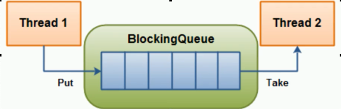
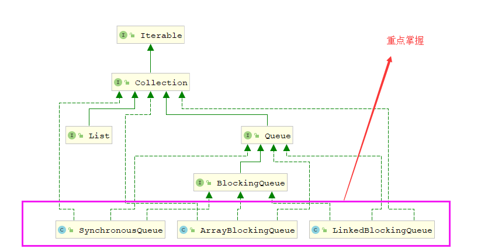
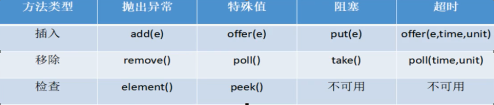

# 阻塞队列

# 阻塞队列理论
阻塞队列,顾名思义,首先它是一个队列,而一个阻塞队列在数据结构中所起的作用大致如图所示:    
       
**线程1往阻塞队列中添加元素二线程2从队列中移除元素**       
当阻塞队列是空时,从队列中**获取**元素的操作将会被阻塞.      
当阻塞队列是满时,往队列中**添加**元素的操作将会被阻塞.      
eg：蛋糕店货柜中能装十个蛋糕，一直做蛋糕，直到装满了就不在做蛋糕了，但是卖掉一个或多个，就开始做，卖完就不能卖了

# 为什么用阻塞队列，有什么优点
在多线程领域:所谓阻塞,在某些情况下会挂起线程(即线程阻塞),一旦条件满足,被挂起的线程又会被自动唤醒
 
为什么需要使用BlockingQueue？   
好处是我们不需要关心什么时候需要阻塞线程,什么时候需要唤醒线程,因为BlockingQueue都一手给你包办好了
也就是说不用再手动 wait 和 notify
 
在concurrent包 发布以前,在多线程环境下,我们每个程序员都必须自己去控制这些细节,尤其还要兼顾效率和线程安全,而这会给我们的程序带来不小的复杂度.

# BlockingQueue接口结构和实现类
BlockingQueue是和List同级的接口，只需要重点掌握三个实现类即可，接口架构如下图：    
 
- **ArrayBlockingQueue** —— 由数组结构组成的有界阻塞队列
- **LinkedBlockingQueue** —— 由链表结构组成的有界（但大小默认值为Integer.MAX_VALUE）阻塞队列
- PriorityBlockingQueue —— 支持优先级排序的无界阻塞队列
- DelayQueue —— 使用优先级队列实现的延迟无界阻塞队列
- **SynchronousQueue** —— 不存储元素的阻塞队列，也即单个元素的队列
- LinkedTransferQueue —— 由链表结构组成的无界阻塞队列
- LinkedBlockingDeque —— 由链表结构组成的双向阻塞队列

# BlockingQueue的核心方法：     
 

| 方法组特性     |                             含义解释                             |
| ---- | :---: |
|   抛出异常   | 当阻塞队列满时,再往队列里面add插入元素会抛IllegalStateException: Queue full<br/>当阻塞队列空时,再往队列Remove元素时候回抛出NoSuchElementException |
| 特殊值 | 插入方法,成功返回true 失败返回false<br/>移除方法,成功返回元素,队列里面没有就返回null |
| 一直阻塞 | 当阻塞队列满时,生产者继续往队列里面put元素,队列会一直阻塞直到put数据or响应中断退出<br/>当阻塞队列空时,消费者试图从队列take元素,队列会一直阻塞消费者线程直到队列可用. |
| 超时退出 | 当阻塞队列满时,队列会阻塞生产者线程一定时间,超过后限时后生产者线程就会退出 |

```java
package fun.enhui.thread.juc.apitest;

import java.util.concurrent.ArrayBlockingQueue;
import java.util.concurrent.BlockingQueue;

/**
 * BlockingQueue阻塞队列
 * @Author: HuEnhui
 * @Date: 2019/10/18 14:13
 */
public class BlockingQueueDemo {
    public static void main(String[] args) {
        // 相当于 List list = new ArrayList();
        BlockingQueue<String> blockingQueue = new ArrayBlockingQueue<>(3);

        // =========add() remove() 抛出异常======================
        for (int i = 0; i < 3; i++) {
            System.out.println(blockingQueue.add("a"));
        }
        // 队列满了在add抛出异常 Exception in thread "main" java.lang.IllegalStateException: Queue full
        // System.out.println(blockingQueue.add("d"));


        for (int i = 0; i < 3; i++) {
            System.out.println(blockingQueue.remove());
        }
        // 队列空了再remove抛出异常 Exception in thread "main" java.util.NoSuchElementException
        // System.out.println(blockingQueue.remove());


    }
}

```
# 阻塞队列之同步SynchronousQueue队列
> 创建一个SynchronousQueue对象，两个线程同时操作此对象，一个线程往队列里塞值，另一个队列从队列里取值。    
这个类的特点:每一次塞值只能塞一个，当队列里有元素，塞值线程就会阻塞，同理，如果队列里没有值，取值线程也会阻塞   
```java
package fun.enhui.thread.juc.apitest;

import java.util.concurrent.BlockingQueue;
import java.util.concurrent.SynchronousQueue;
import java.util.concurrent.TimeUnit;

/**
 * 阻塞队列SynchronousQueue代码演示
 * @Author: HuEnhui
 * @Date: 2019/10/18 14:37
 */
public class SynchronousQueueDemo {

    public static void main(String[] args) {
        BlockingQueue<String> blockingQueue = new SynchronousQueue<>();

        new Thread(()->{
            try {
                System.out.println(Thread.currentThread().getName()+"\t put 1");
                blockingQueue.put("1");
                System.out.println(Thread.currentThread().getName()+"\t put 2");
                blockingQueue.put("2");
                System.out.println(Thread.currentThread().getName()+"\t put 3");
                blockingQueue.put("3");
            } catch (InterruptedException e) {
                e.printStackTrace();
            }
        },"A").start();

        new Thread(()->{
            try {
                // 暂停一会线程
                try { TimeUnit.SECONDS.sleep(1); } catch (InterruptedException e) { e.printStackTrace(); }
                System.out.println(Thread.currentThread().getName()+"\t take 1");
                blockingQueue.take();

                // 暂停一会线程
                try { TimeUnit.SECONDS.sleep(1); } catch (InterruptedException e) { e.printStackTrace(); }
                System.out.println(Thread.currentThread().getName()+"\t take 2");
                blockingQueue.take();

                // 暂停一会线程
                try { TimeUnit.SECONDS.sleep(1); } catch (InterruptedException e) { e.printStackTrace(); }
                System.out.println(Thread.currentThread().getName()+"\t take 3");
                blockingQueue.take();
            } catch (InterruptedException e) {
                e.printStackTrace();
            }
        },"B").start();
    }
}

```  
# 使用场景
- 生产者消费者模式（原理东西，掌握）
- 线程池
- 消息中间件

# 生产者消费者模式
## 传统版
- 用 synchronized 加锁，wait 和 notify 操作
- 用 ReentrantLock 加锁，await 和 signal 操作      

```java
package fun.enhui.thread.juc.interview;
import java.util.concurrent.locks.Condition;
import java.util.concurrent.locks.Lock;
import java.util.concurrent.locks.ReentrantLock;

/**
 * 生产者消费者 实例
 * 题目：多个线程操作初始值为0的一个变量
 * 实现一部分线程对该变量+1，一部分线程对该变量-1
 * 实现交替操作，十次循环，变量仍为0
 *
 * 1.高内聚低耦合前提下，线程操作资源类
 * 2.判断、干活、通知。判断不能使用if，使用while
 * 3.防止虚假唤醒
 * @Author HuEnhui
 * @Date 2019/10/9 20:14
 **/
public class ProduceConsumerDemo {
    public static void main(String[] args) throws Exception {
        Aircondition aircondition = new Aircondition();
        new Thread(()->{
            for (int j = 0; j <10 ; j++) {
                try {
                    aircondition.increment();
                } catch (Exception e) {
                    e.printStackTrace();
                }
            }
        },"A").start();

        new Thread(()->{
                for (int j = 0; j < 10; j++) {
                    try {
                        aircondition.devrement();
                    } catch (Exception e) {
                        e.printStackTrace();
                    }
                }
        },"B").start();
        new Thread(()->{
                for (int j = 0; j < 10; j++) {
                    try {
                        aircondition.increment();
                    } catch (Exception e) {
                        e.printStackTrace();
                    }
                }
        },"C").start();
        new Thread(()->{
                for (int j = 0; j < 10; j++) {
                    try {
                        aircondition.devrement();
                    } catch (Exception e) {
                        e.printStackTrace();
                    }
                }
        },"D").start();
    }
}

/**
 *  资源类
 * @author: HuEnhui
 * @date: 2019/10/9 20:16
  */
class Aircondition{
    private int number = 0;
    private Lock lock = new ReentrantLock();
    private Condition condition = lock.newCondition();

    // 使用lock的写法
    public void increment() throws Exception {
        lock.lock();
        try {
            // 1.判断
            while(number != 0){
                condition.await();
            }
            // 2.任务
            number++;
            System.out.println(Thread.currentThread().getName()+" "+number);
            // 3.通知
            condition.signalAll();
        }finally {
            lock.unlock();
        }
    }

    public void devrement() throws Exception {
        lock.lock();
        try{
            // 1.判断
            while(number == 0){
                condition.await();
            }
            // 2.任务
            number--;
            System.out.println(Thread.currentThread().getName()+" "+number);
            // 3.通知
            condition.signalAll();
        }finally {
            lock.unlock();
        }
    }
    // 使用synchronized的写法
    /*public synchronized void increment() throws Exception {
        // 1.判断
        while(number != 0){
            this.wait();
        }
        // 2.任务
        number++;
        System.out.println(Thread.currentThread().getName()+" "+number);
        // 3.通知
        this.notifyAll();
    }
    public synchronized void devrement() throws Exception {
        // 1.判断
        while(number == 0){
            this.wait();
        }
        // 2.任务
        number--;
        System.out.println(Thread.currentThread().getName()+" "+number);
        // 3.通知
        this.notifyAll();
    }*/
}

```
## 阻塞队列版
```java
package fun.enhui.thread.juc.handwriting;

import java.util.concurrent.ArrayBlockingQueue;
import java.util.concurrent.BlockingQueue;
import java.util.concurrent.TimeUnit;
import java.util.concurrent.atomic.AtomicInteger;

/**
 * 使用阻塞队列实现生产者消费者
 * @Author: HuEnhui
 * @Date: 2019/10/18 15:58
 */
public class ProduceConsumer_BlockQueueDemo {
    public static void main(String[] args) {
        MyResource myResource = new MyResource(new ArrayBlockingQueue(10));

        new Thread(()->{
            System.out.println(Thread.currentThread().getName()+"\t生产线程启动");
            try {
                myResource.produce();
            } catch (Exception e) {
                e.printStackTrace();
            }
        },"生产者").start();

        new Thread(()->{
            System.out.println(Thread.currentThread().getName()+"\t消费线程启动");
            try {
                myResource.consumer();
            } catch (Exception e) {
                e.printStackTrace();
            }
        },"消费者").start();

        // 暂停一会线程
        try { TimeUnit.SECONDS.sleep(5); } catch (InterruptedException e) { e.printStackTrace(); }
        myResource.stop();
    }
}

/**
 *  我的消息队列
 * @author: HuEnhui
 * @date: 2019/10/18 16:19
 */
class MyResource{

    private volatile boolean FLAG = true;
    private AtomicInteger atomicInteger = new AtomicInteger();
    BlockingQueue<String> blockingQueue = null;

    /**
     *  构造方法，使用接口作为参数，可满足七个阻塞队列实现类
     * @author: HuEnhui
     * @date: 2019/10/18 16:17
     * @param blockingQueue
     * @return:
     */
    public MyResource(BlockingQueue blockingQueue) {
        this.blockingQueue = blockingQueue;
        System.out.println(blockingQueue.getClass().getName() + "\t实现类实现阻塞队列");
    }

    /**
     *  生产方法
     * @author: HuEnhui
     * @date: 2019/10/18 16:17
     * @param
     * @return: void
     */
    public void produce()throws Exception {
        String data = null;
        boolean retValue;
        while(FLAG){
            data = atomicInteger.incrementAndGet() + "";
            retValue = blockingQueue.offer(data,2L,TimeUnit.SECONDS);
            if(retValue){
                System.out.println(Thread.currentThread().getName()+"\t插入队列..."+data+"成功");
            }else{
                System.out.println(Thread.currentThread().getName()+"\t插入队列..."+data+"失败");
            }
            TimeUnit.SECONDS.sleep(1);
        }
        System.out.println("FLAG = false，生产停止了");
    }
    /**
     *  消费方法
     * @author: HuEnhui
     * @date: 2019/10/18 16:18
     * @param
     * @return: void
     */
    public void consumer()throws Exception {
        String result = null;
        while(FLAG) {
            result = blockingQueue.poll(2L,TimeUnit.SECONDS);
            if(null == result || "".equalsIgnoreCase(result)) {
                FLAG = false;
                System.out.println(Thread.currentThread().getName()+"\t超过2秒没有取到蛋糕，消息退出");

                return;
            }
            System.out.println(Thread.currentThread().getName()+"\t消费队列..."+result+"成功");
        }
    }

    /**
     *  停止
     * @author: HuEnhui
     * @date: 2019/10/18 16:19
     * @param
     * @return: void
     */
    public void stop() {
        this.FLAG = false;
    }
}

```
