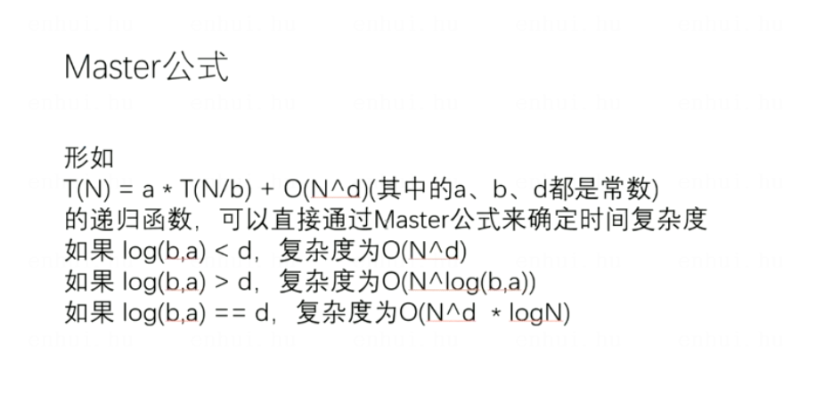

# day03

## 单链表和双链表
### 单链表的反转

### 双链表的反转

### 单链表把给定值都删除

### 双链表把给定值都删除

## 栈和队列
### 双向链表实现栈

### 双向链表实现队列

### 数组实现栈

### 数组实现队列
> 固定长度的数组实现队列，满了不能进就给异常，空了不能取也给异常     
> 来三个变量，bigein，end，size    
> begin管从哪进数据    
> end管从哪出数据     
> size管能不能放，能不能取    

### 实现一个特殊栈，除了常规都pop和push，在提供一个getMin，可以使用现成的栈结构，要求三个方法的时间复杂度都是O(1)
> 用两个栈实现，一个数据栈，一个最小栈     
> 每次放数据，数据栈正常放，最小栈放Min(新数,最小栈顶)——怎么理解呢，就是最小栈存的是当前层次内的最小值    
> 注意事项：要放一起放，要取一起取  

### 如何使用栈结构实现队列结构
> Stack 
> 搞两个栈，一个push栈，一个pop栈     
> 放数据就直接放在push栈里，取数据，就将push栈里的数据倒进pop栈，然后在弹出   
> 倒数据的方法需要注意：   
> 1、每次倒数据，要把push栈倒完，不能剩；   
> 2、只有pop栈是空的才能倒数据    

### 如何使用队列结构实现栈结构
> Queue LinkedList    
> 搞两个队列，队列1，队列2，记录当前队列    
> 每次放数据，就往当前队列放；    
> 每次取数据，就将当前队列的数据放进备用队列，留下最后一个就是要取的，然后切换当前队列   

## 递归
### 一个数组找最大值，用递归实现(理解递归)
> 递归方法，求数组中L到R位置的最大值      
> 主方法调用，就是数组的0～N-1位置     
> 递归方法，将数组分为 0~mid 和 mid+1~N-1 两部分，当左右位置相同时，最大值就是自己         
> 左边递归得到左边最大值，右边递归得到右边最大值   
> 返回Max(左边最大值，右边最大值)  
> 
> 理解递归：都将递归拆分为逻辑顺序，参照下图        
> [1,3,2,6]   
> 以上逻辑可以拆分为    
> ----------------f(0,3)        
> -----f(0,1)----------------f(2,3)     
> --f(0,0)--f(1,1)--------f(2,2)--f(3,3)

### Master公式(只有子函数的规模一致才能使用)

> N^d --> N的d次方；log(b,a) --> 以b为底a的对数
> 
> T(N) = a * T(N/b) + O(N的d次方)   
> 解释：递归实现数组求最大值     
> 数组长度是N，所以是T(N)    
> 子函数是把数组分为左右两边，规模是N/2，左右共两次，所以a是2，b是2   
> 除了递归，其他操作的时间复杂度是O(1),所以d是0       
> 所以时间复杂度是 T(N) = 2*(N/2) + O(1)    
> a=2；b=2；d=0 --> log(b,a) > 0 --> O(N)=O(N^log(2,2)) --> O(N)

## 哈希表和有序表
> 哈希表：HashMap     
> 有序表：TreeMap，可以使用【红黑树、avl树、sb树、跳表】实现，在java中是使用红黑树实现的       
> 
> 哈希表的增删改查的时间复杂度都是O(1)-常数项操作，只是常数项比较大    
> 有序表的增删改查的时间复杂度都是O(logN)    
> 
> 哈希表的使用：   
> 1.对于java原生类型(Integer、String等)，使用值传递    
> 2.对于非原生类型（自己写的类），使用引用传递    
> 
> 有序表的使用：    
> firstKey()-最小的；lastKey()-最大的；    
> floorKey(4)-小于等于4最近的；ceilingKey(4)-大于等于4最近的   
> 1.对于java原生类型，可以直接用，因为已经定义好如何比较    
> 2.对于非原生类型（自己写的类），需要传一个compare，告诉它如何比
    