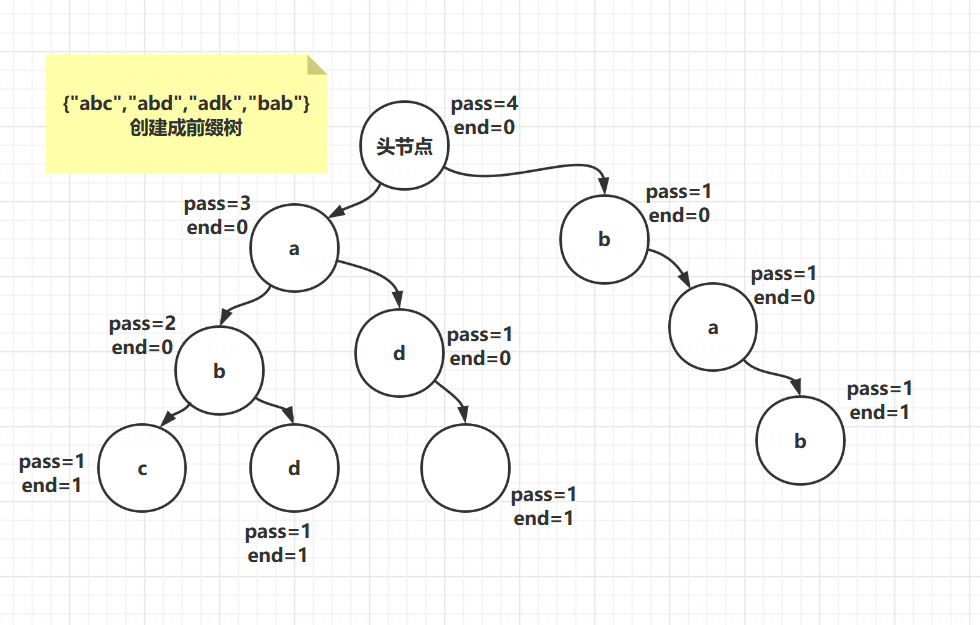

# day08
## 前缀树 （Trie tree）
> 定义：   
> 举个例子：有一个字符串数组{"abc","abd","adk","bab"}     
> 根据此数组创建一颗树，有个头节点，每个节点中维护一个pass（表示通过次数）一个end（表示结束次数）   
> 1.头节点pass+1，看第一个，a节点，此时没有，新建一个a节点，a节点的pass+1，end是0；
> a下面再看b，没有，a下面建b节点，b的pass+1，end是0；b下面再看c，没有，b下面建c节点，c的pass+1，end是1
> 2.看第二个数组，同上规则，所以ab复用，pass都加1，没有d，在b下面新建节点d，d的pass=1，end=1
> 3.以此类推


```
1.创建一个前缀树结构，支持以下方法
添加字符串：public void insert(String word)
word这个单词加入过的次数：public int search(String word)
所有加入的字符串中，有几个是以pre这个字符作为前缀的：public int prefixNumber(String pre)
删除字符串：pulic void delete(String word)
-->tips：删除之前先查一下是不是有。如果删的时候，发现某个节点pass为0，不往下删，直接上个节点指向空，让jvm去回收下面节点
```

## 不基于比较的排序——桶排序
[排序总结](夯实基础/数据结构与算法/总结/排序.md)

## 排序算法总结
[排序总结](夯实基础/数据结构与算法/总结/排序.md)