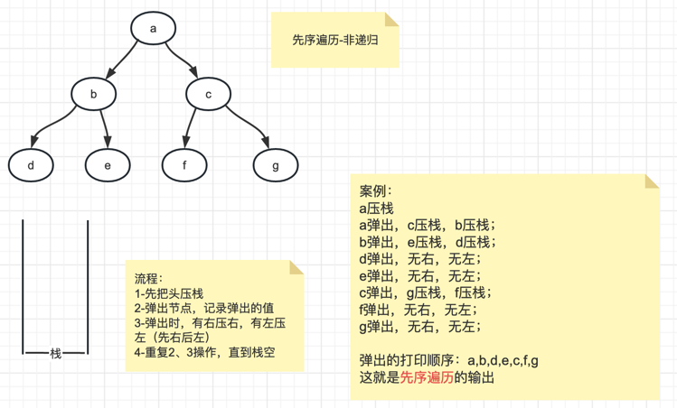
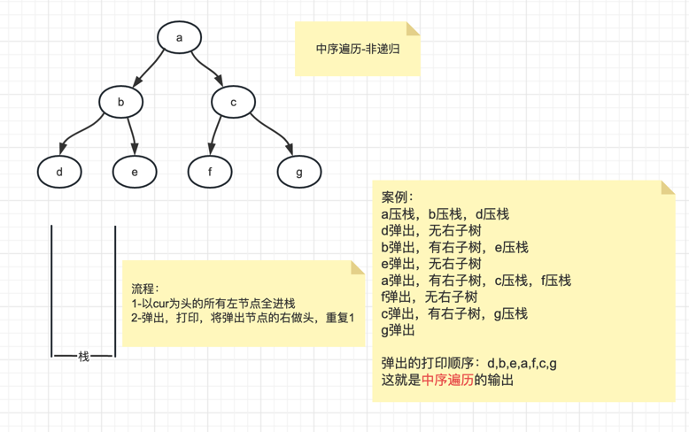

# day10

## 【TX10_001】：二叉树的前序遍历
> 题目：二叉树的前序遍历   
> 任何子树的处理顺序，先头节点，再左子树，再右子树
> 
> 思路：    
> 1、递归实现   
> 
> 2、非递归实现    
> 1-先把头压栈   
> 2-弹出节点，记录弹出的值   
> 3-弹出时，有右压右，有左压左（先右后左）   
> 4-重复2、3操作，直到栈空   

## 【TX10_002】：二叉树的后序遍历
> 题目：二叉树的后序遍历   
> 任何子树的处理顺序，先左子树，再右子树，再头节点
>
> 思路：    
> 1、递归实现
>
> 2、非递归实现   
> 先序遍历，是 头 左 右   
> 改造一下，压栈时先左后右，就可以得到 头 右 左 的顺序   
> 上面这个逆序，就得到 左 右 头 顺序，就是后序遍历了   
> 
> 所以准备两个栈，第一个栈和先序遍历一样   
> 将打印操作换为进栈2   
> 所有操作完毕后，再把栈2的元素全部弹出，就实现了逆序

## 【TX10_003】：二叉树的中序遍历
> 题目：二叉树的中序遍历   
> 任何子树的处理顺序，先左子树，再头节点，再右子树
>
> 思路：    
> 1、递归实现
>
> 2、非递归实现
> 1-以cur为头的所有左节点全进栈   
> 2-弹出，打印，将弹出节点的右做头，重复1   

