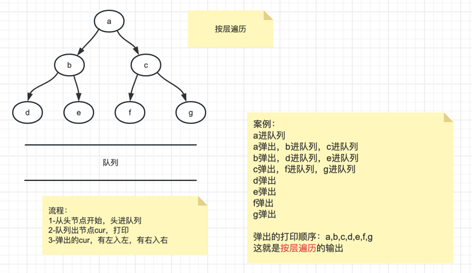
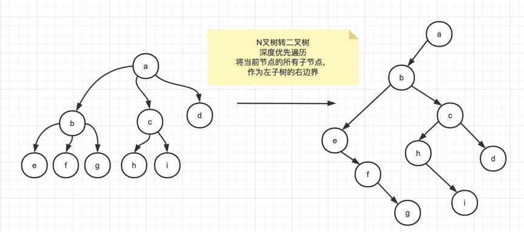

# day11

## 【TX11_001】：二叉树的按层遍历（宽度优先遍历）
> 题目：二叉树的按层遍历   
> 
> 思路：使用队列LinkedList   
> 1-从头节点开始，头进队列    
> 2-队列出节点cur，打印   
> 3-弹出的cur，有左入左，有右入右

## 【TX11_002】：二叉树的序列化和反序列化
> 题目：二叉树的序列化 
> 
> 思路：   
> 可以使用先序遍历、后序遍历、按层遍历来序列化。但是不能拿中序遍历序列化，因为有歧义   
> 
> 1、先序遍历，不忽略空节点，可以用特殊符号代替空，比如#   
> 
> 2、按层遍历，不忽略空节点，可以用特殊符号代替空，比如#   

> 题目：二叉树的反序列化   
> 
> 思路：   
> 什么方式序列化，就要用什么方式反序列化     
> 
> 1、先序遍历   
> 递归方法：传入list，返回二叉树的头节点      
> 
> 弹出一个值，假如是#，就返回null；   
> 将弹出值封装为node，为cur节点    
> 递归，得到一个节点作为cur的左子树   
> 递归，得到一个节点作为cur的右子树   
> 返回cur   
> 
> 2、按层遍历   
> 

## 【TX11_003】：将N叉树编码为二叉树（leetcode：431带锁题）
> 题目：将N叉树编码为二叉树，要求能反序列化回多叉树   
> 实现两个方法    
> public TreeNode encode(Node root):将多叉树转为二叉树      
> public Node decode(TreeNode):将二叉树转回多叉树   
> 
> 思路：   
> 将cur的所有子节点串起来，作为左子树的右边界   
> 递归，深度优先遍历   

## 【TX11_004】：求二叉树最宽的层有多少个节点
> 题目：求二叉树最宽的层有多少个节点   
> 
> 思路：    
> 

