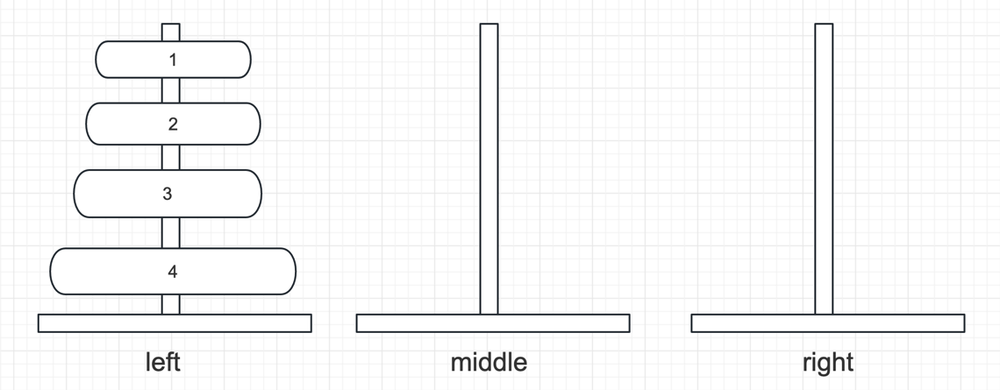

# day17

## 【TX17_002】: 打印n层汉诺塔从最左边移动到最右边的全部过程

> 题目：最左侧的初始化数据为数组：【1，2，3】    
> 题解：把上面这个问题看成一个大问题，就是    
> 把1～3从左边移到右边 = 把1～2从左边移到中间；把3从左边移到右边；把1～2从中间移到右边   
> 把1～2从左边移到中间 = 把1从左边移到右边；把2从左边移到中间；把1从右边移到中间     
> 把1从右边移到中间，直接移动就可以   
> 
> 上面的步骤，就把n的问题，转化为了n-1的问题 加上一个移动操作    
> base case 是当n=1时，递归结束  

## 【TX17_003】: 打印一个字符串的全部子序列
> 字符串 'abc'   
> 全部子序列：a b c ab ac bc abc

## 【TX17_004】: 打印一个字符串的全部子序列，要求不出现重复字面值的子序列
> 字符串 'acc'   
> 全部子序列：a c c ac ac cc acc  
> 不重复的全部子序列：a c ac cc acc
> 
## 【TX17_005】: 打印一个字符串的全部排列
> 字符串 'abc'   
> 全排列：abc acb bac bca cab cba

## 【TX17_006】: 打印一个字符串的全部排列，要求不出现重复的全排列
> 字符串 'acc'   
> 不重复的全排列：acc cac cca   
> 如何实现不重复？   
> 1.全部计算后，用set去重     
> 2.剪枝，在发生前，发现已经计算过了，跳过计算（剪枝性能更优）   

## 【TX17_007】: 给你一个栈，仅使用递归函数，逆序这个栈（不能申请额外的数据结构）
> 