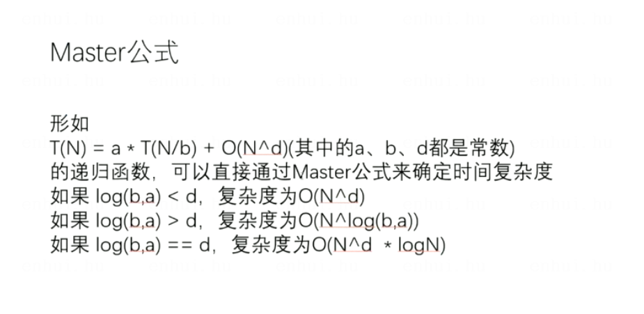

# 算法第二天学习

## 链表数据结构的熟悉
```
1.反转单向链表和反转双向链表

编码见 Code01_ReverseList

2.删除链表中给定的值
编码见 Code02_DeleteGivenValue
```

## 栈和队列数据结构的熟悉
```
1.双向链表实现栈和队列
用双向链表实现四个方法：从头部加，从尾部加；从头部弹出，从尾部弹出。
栈：使用从头部加，从头部弹出
队列：使用从头部加，从尾部弹出
Code03_DoubleEndsQueueToStackAndQueue.MyStack
Code03_DoubleEndsQueueToStackAndQueue.MyQueue

2.数组实现栈和队列（固定长度数组即可）
栈：正常使用
队列：环形数组
Code04_RingArray.MyStack
Code04_RingArray.MyQueue

3.实现一个栈，要求push、pop、getMin三个方法时间复杂度都是O(1).
其中getMin是获取栈中最小值（可以用已有的栈来加工实现）
思路1：
用两个栈存储数据 stackData 和 stackMin
每次存的时候，stackData都存，但只有存的值小于等于最小栈顶，才存入stackMin
每次取的时候，stackData正常取，但只有取得值等于最小栈顶，才从stackMin弹出
思路2：
用两个栈存储数据 stackData 和 stackMin
每次加元素，stackData正常加，stactMin加（栈顶和新加 两者取最小）
每次取元素，两者同步取
编码见 Code05_GetMinStack中的 MyStack1 和 MyStack2


4.用两个栈实现队列效果
一个push栈，一个pop栈
每次存忘push栈存，想取的时候，先把push栈的元素倒腾到pop栈
两个原则：
只有pop栈空了才可以倒
从push栈倒出数据，必须一次性倒腾空
编码见 Code06_TwoStacksImplementQueue

5.用两个队列实现栈效果
一个data队列，一个help队列
每次存数据向data队列存，
取数据时，将data队列中数据倒到help队列，只留一个返回出去。然后在倒回来
```

## 递归

> 公式解释：   
> 当一个长度为N的数据求递归，假设他的子过程都是同量级的，就可以套用此公式   
> 其中 a 表示调用子过程的次数，b 表示子过程被拆分份数，N的d次方 表示除递归过程，其余算法的时间复杂度   
> 举个例子：   
> 问题：想找到一个长度为 N 的数组，其中最大值是多少   
> 解答：利用递归，（将数组分为两份，分别求左边最大和右边最大，一直拆到左边和右边为同一位置）  
```
public static int getMax(int[] arr, int L, int R) {
    if (L == R) {
        return arr[L];
    }
    // 数组拆成两份，分别计算最大值
    int mid = L + ((R - L) >> 1);
    int leftMax = getMax(arr, L, mid);
    int rightMax = getMax(arr, mid + 1, R);

    return Math.max(leftMax, rightMax);
}
``` 
> 此答案适用此公式：T(N) = 2 * T(N/2) + O(1)    
> 所以 a=2，b=2,d=0 ---> 以b为底a的对数是1  1 大于 0   所以时间复杂度是 O(N^log(b,a)) --> O(N)   