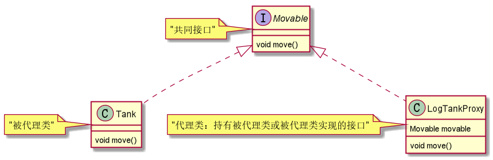

# 代理模式

## 静态代理
角色分析：    
1.抽象主题：Movable    
2.实际主题：Tank    
3.代理类：LogProxy 

      

可移动物品接口：Movable    
```java
public interface Movable {
    void move();
}
```
坦克类：Tank    
```java
public class Tank implements Movable {
    @Override
    public void move() {
        System.out.println("坦克移动...");
    }
}
```
代理类：LogProxy    
```java
public class LogProxy implements Movable {
    Movable movable;
    public LogProxy(Movable movable) {
        this.movable = movable;
    }
    @Override
    public void move() {
        System.out.println("日志：坦克移动前");
        movable.move();
        System.out.println("日志：坦克移动后");
    }
}
```
客户端主方法：   
```java
public class Main {
    public static void main(String[] args) {
        new LogProxy(new Tank()).move();
    }
}
```

## jdk动态代理（被代理类实现了接口）    

可移动物品接口：Movable    
```java
public interface Movable {
    void move();
}
```
坦克类：Tank    
```java
public class Tank implements Movable {
    @Override
    public void move() {
        System.out.println("坦克移动...");
    }
}
```
主方法，生成代理对象：    
```java
public class Main {
    public static void main(String[] args) {
        Tank tank = new Tank();
        // 保存生成的代理类
        System.getProperties().put("sun.misc.ProxyGenerator.saveGeneratedFiles","true");
        Movable m = (Movable)Proxy.newProxyInstance(Tank.class.getClassLoader(), new Class[]{Movable.class}, new InvocationHandler() {
            @Override
            public Object invoke(Object proxy, Method method, Object[] args) throws Throwable {
                System.out.println("坦克移动前");
                Object invoke = method.invoke(tank, args);
                System.out.println("坦克移动后");
                return invoke;
            }
        });
        m.move();
    }
}
```

## cglib动态代理（被代理类不能是final）

坦克类：Tank    
```java
public class Tank {
    public void move(){
        System.out.println("坦克移动...");
    }
}
```
主方法，生成代理对象：     
```java
public class Main {
    public static void main(String[] args) {
        Enhancer enhancer = new Enhancer();
        // 设置父类
        enhancer.setSuperclass(Tank.class);
        // 增强方法
        enhancer.setCallback(new MethodInterceptor() {
            @Override
            public Object intercept(Object o, Method method, Object[] objects, MethodProxy methodProxy) throws Throwable {
                // 验证父类是被代理类
                System.out.println(o.getClass().getSuperclass().getName());
                System.out.println("坦克移动前");
                Object result = methodProxy.invokeSuper(o, objects);
                System.out.println("坦克移动后");
                return result;
            }
        });
        // 生成代理对象-->为被代理对象的子类
        Tank tank = (Tank)enhancer.create();
        tank.move();
    }
}
```