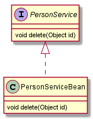

# UML图
**分类**
1. 用例图（use case）
2. 静态结构图：类图、对象图、包图、组件图、部署图
3. 动态行为图：交互图（时序图与协作图）、状态图、活动图

## UML类图
类图是描述类与类之间的关系的，是UML图中最核心的。在学习设计模式时，会经常使用类图，所以下面详细记录下UML类图

类之间的关系：依赖、泛化（继承）、实现、关联、聚合与组合

### 画图标准（idea的plantUML插件的语法）

1. 类的属性、方法的可见性使用+、#、－分别表示public、protected、private。
2. 泛化（ <|-- 和 <|.. ）：继承使用 **空心三角形+实线** 实现使用 **空心三角形+虚线**
3. 依赖（ ..> ）：**虚线箭头**
4. 关联（ --> ）： **实线箭头**
5. 聚合（ o-- ）： **空心的菱形+实线箭头**
6. 组合（ *-- ）： **实心的菱形+实线箭头**


### 依赖
类中用到了对方：
1. 是类的成员属性
2. 是方法的返回类型
3. 是方法接收的参数类型
4. 方法中的局部变量
```
public class PersonServiceBean{
    private PersonDao personDao;
    public void save(Person person){}
    public IDCard getIDCard(Integer personid){}
    public void modify(){
        Department department = new Department();
    }
}
public class PersonDao{}
public class IDCard{}
public class Person{}
public class Department{}
```
  

### 继承
```
public abstract class DaoSupport{
    public void save(Object entity){}
    public void delete(Object id){}
}
public class PersonServiceBean extends Daosupport{}
```


### 实现
```
public interface PersonService{
    public void delete(Object id){}
}
public class PersonServiceBean implements PersonService{
    public void delete(Object id){}
}
```

 
### 关联
关联关系是类与类之间的联系。关联关系是依赖关系的特例
- 单向一对一关系
```puml
public class Person{
    private IDCard card;
}
public class IDCard{}
```

- 双向一对一关系
```
public class Person{
    private IDCard card;
}
public class IDCard{
    private Person person;
}
```


### 聚合
聚合关系表示的是  整体和部分  的关系，**整体和部分可以分开**。聚合关系是关联关系的特例
```
public class Computer{
    private Mouse mouse;
    private Monitor monitor;
    public void setMouse(Mouse mouse){
        this.mouse = mouse;
    }
    public void setMonitor(Monitor monitor){
        this.monitor = monitor;
    }
}
public class Mouse{}
public class Monitor{}
```


### 组合
组合关系表示的是  整体和部分  的关系，**整体和部分不能分开**。聚合关系是关联关系的特例
```
//创建Person对象一定会创建Head对象，但不一定创建了IDCard对象，所以和Head是不能分割，和IDCard是可以分割
public class Person{
    private IDCard card;
    private Head head = new Head();
}
public class IDCard{}
public class Head{}
```
