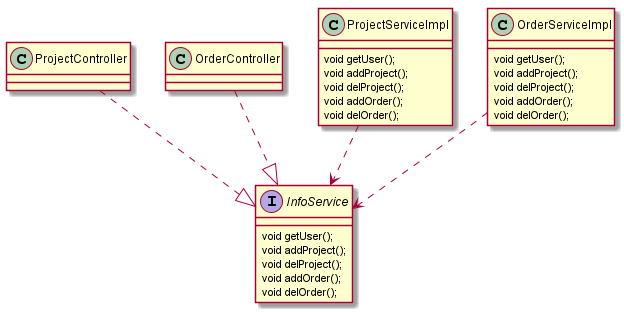

# 七大设计原则
设计原则是程序员在编程时应当遵守的原则，也是各种设计模式的基础（即设计模式为什么这样设计的依据）

设计原则的核心思想：
1. 找出应用中可能需要变化之处，把他们独立出来，不要和那些不需要变化的代码混在一起
2. 针对接口编程，而不是针对实现类编程
3. 为了交互对象之间的松耦合设计而努力

## 开闭原则
开闭原则（Open Closed Principle）是编程中 **最基础、最重要** 的设计原则     
开放-封闭原则的意思就是说，你设计的时候，时刻要考虑，尽量让这个类足够好，
写好了就不要去修改了，如果新需求来，我们增加一些类就完事了，原来的代码能不动则不动。
这个原则有两个特性，一个是说“对于扩展是开放的”，另一个是说“对于更改是封闭的”。
面对需求，对程序的改动是通过增加新代码进行的，而不是更改现有的代码。这就是“开放-封闭原则”的精神所在     
> 看个例子更好的理解——https://www.jianshu.com/p/6c8a9611b38b

## 单一职责原则      
这个原则是对类来说的，一个类应该只负责一项职责。比如订单类只负责订单相关的操作，用户类只负责用户相关的操作       

## 接口隔离原则
使用多个专门功能的接口，而不是单一的总接口       
我们要为各个类建立专用的接口,而不要试图去建立一个很庞大的接口供所有依赖它的类去调用。    

**示例：**     
类 ProjectController 通过接口 InfoService 依赖类 ProjectServiceImpl ，     
类 OrderController 通过接口 InfoService 依赖类 OrderServiceImpl ,       
如果接口 InfoService 对于类 ProjectController 和类 OrderController 来说不是最小接口，        
那么类 ProjectServiceImpl 和类 OrderServiceImpl 必须去实现他们不需要的方法。               
类 ProjectController 要使用 getUser() addProject() delProject() 方法       
类 OrderController 要使用 getUser() addOrder() delOrder()  方法        
1.所有的方法都在接口 InfoService 中定义，类 ProjectServiceImpl 和类 OrderServiceImpl 重写全部的方法。          
     
2.按照隔离原则处理：将接口 InfoService 拆分为独立的几个接口，类 ProjectController 和类 OrderController 分别与他们需要的接口建立依赖关系        
  
[如果不能理解上面的类图，可以参考百度百科](https://baike.baidu.com/item/%E6%8E%A5%E5%8F%A3%E9%9A%94%E7%A6%BB%E5%8E%9F%E5%88%99)

## 依赖倒转原则        
依赖倒置原则（Dependence Inversion Principle）是程序要依赖于抽象接口，不要依赖于具体实现。        
依赖倒转的中心思想是面向接口编程

## 里氏替换原则
使用继承时需要注意哪些==>里氏替换原则
1. 所有使用基类的地方必须能透明的使用其子类的对象
2. 里氏替换原则要求在子类中尽量不要重写父类的方法
3. 继承实际让两个类耦合性增强了，在适当的情况下，可以通过**聚合、组合、依赖**来解决问题

### 迪米特法则
1. 迪米特法则又叫最少知道法则，就是一个类对自己依赖的类知道的越少越好。对于被依赖的类不管多复杂，都尽量将逻辑封装在类的内部，对外除了提供的public方法，不对外泄露任何信息
2. 迪米特法则还有个更简单的定义： 只与直接的朋友通信
3. 直接的朋友：我们称 **出现在成员变量、方法参数、方法返回值中的类** 为直接朋友，而出现在局部变量中的类不是直接的朋友        
迪米特法则的核心是降低类之间的耦合       
**注意：** 迪米特法则只是要求降低类之间的耦合关系，并不是要求完全没有依赖关系

### 合成复用原则
合成复用原则就是 尽量使用合成/聚合的方式，而不是使用继承
