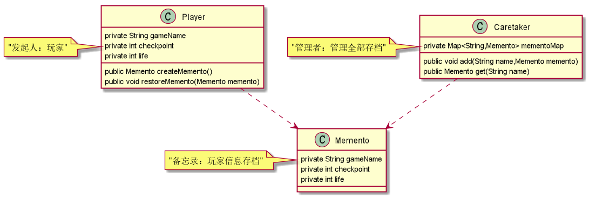

# 备忘录模式

使用场景：存盘、快照     
     
备忘录模式的主要角色如下:     
发起人：提供存档和恢复存档两个方法          
备忘录：和发起人要存档的信息一致     
管理者：管理所有的存档信息（即List<备忘录>，容器不限于List）    

> 玩游戏时的存档功能，闯关时候先存档，失败后可以从存档那里继续闯关

发起人：     
```java
/**
 * 发起人-玩家
 *
 * @Author 胡恩会
 * @Date 2020/6/27 16:03
 **/
@Getter
@Setter
@AllArgsConstructor
@ToString
public class Player {
    /**
     * 游戏名称
     *
     * @Author: 胡恩会
     * @Date: 2020/6/27 16:07
     **/
    private String gameName;
    /**
     * 关卡
     *
     * @Author: 胡恩会
     * @Date: 2020/6/27 16:07
     **/
    private int checkpoint;
    /**
     * 生命
     *
     * @Author: 胡恩会
     * @Date: 2020/6/27 16:08
     **/
    private int life;

    /**
     * 新建存档
     * @Author: 胡恩会
     * @Date: 2020/6/27 16:13
     **/
    public Memento createMemento(){
        Memento memento = new Memento();
        memento.setCheckpoint(checkpoint);
        memento.setGameName(gameName);
        memento.setLife(life);
        return memento;
    }

    /**
     * 恢复存档
     * @Author: 胡恩会
     * @Date: 2020/6/27 16:13
     **/
    public void restoreMemento(Memento memento){
        checkpoint = memento.getCheckpoint();
        gameName = memento.getGameName();
        life = memento.getLife();
    }
}
```     
备忘录：    
```java
/**
 * 备忘录-其实就是发起人的副本对象
 *
 * @Author 胡恩会
 * @Date 2020/6/27 16:14
 **/
@Getter
@Setter
public class Memento {
    private String gameName;
    private int checkpoint;
    private int life;
}
``` 
管理者：    
```java
/**
 * 管理者
 * @Author 胡恩会
 * @Date 2020/6/27 16:17
 **/
public class Caretaker {
    private Map<String,Memento> mementoMap = new HashMap<>();
    public void add(String name,Memento memento){
        mementoMap.put(name,memento);
    }
    public Memento get(String name){
        return mementoMap.get(name);
    }
}
```

 

