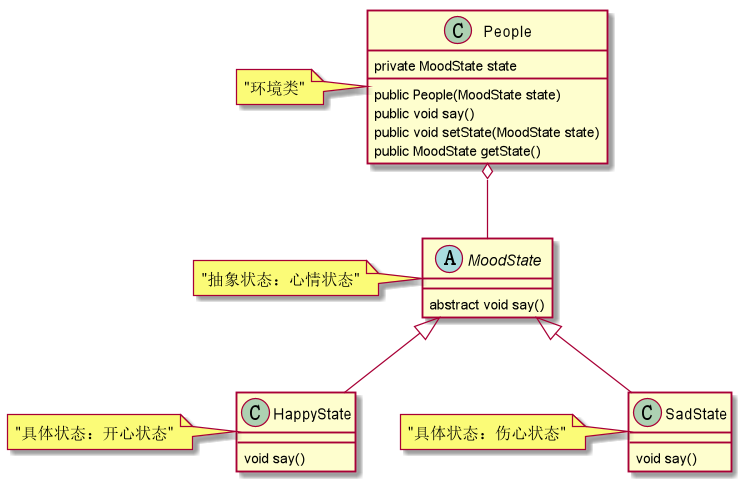

# 状态模式

状态模式的角色：    
1.抽象状态       
2.具体状态     
3.环境类      

> 一个人有不同的心情，心情不同，说话的语气不同。   
由于心情可能会增加，比如增加激动，感动等,所以适合使用状态模式。    
现在有两种心情：高兴和伤心，示例代码如下    


抽象状态：
```java
/**
 * 抽象状态-心情
 * @Author 胡恩会
 * @Date 2020/6/27 21:02
 **/
public abstract class MoodState {
    abstract void say();
}
```
具体状态：
```java
/**
 * 具体状态-开心
 * @Author 胡恩会
 * @Date 2020/6/27 21:09
 **/
public class HappyState extends MoodState{
    @Override
    void say() {
        System.out.println("微笑着说话");
    }
}

/**
 * 具体状态-伤心
 * @Author 胡恩会
 * @Date 2020/6/27 21:09
 **/
public class SadState extends MoodState{

    @Override
    void say() {
        System.out.println("哭泣着说话");
    }
}
```
环境类：
```java
/**
 * 环境类-人
 *
 * @Author 胡恩会
 * @Date 2020/6/27 21:10
 **/
@Getter
@Setter
public class People {
    private MoodState state;
    public People(MoodState state){
        this.state = state;
    }

    public void say(){
        state.say();
    }
}
```
程序入口：
```java
public class Main {
    public static void main(String[] args) {
        People people = new People(new HappyState());
        people.say();

        people.setState(new SadState());
        people.say();
    }
}
```

