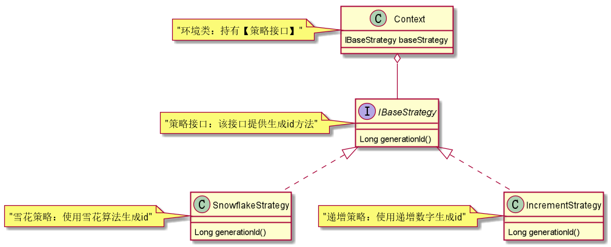
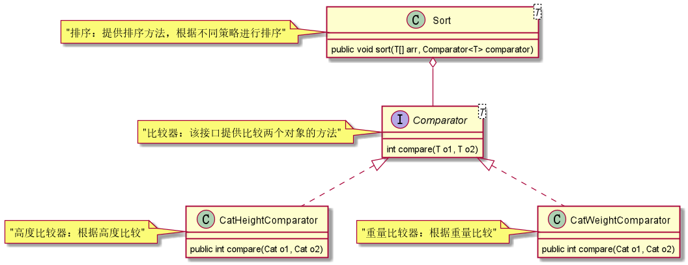

# 策略模式

在有多种算法可以实现某一功能时，对多种算法可以有不同设计
1. 在一个算法类中提供多种方法，每种方法提供一种算法支持。
2. 在一个算法类中有一个方法，根据传参动态判断，选择算法支持。
3. 抽象一个算法接口，每种算法都实现此接口，并使用不同算法提供支持。

第三种则为策略模式：将不同算法封装进独立的类中，实现不同算法的类可以称为不同策略。
为了保证这些策略的一致性，用一个抽象的策略类来做算法的定义，而具体每种算法则对应于一个具体策略类。

策略模式的角色：     
1.抽象策略接口：     
2.具体策略实现：     
3.环境类：持有策略接口的引用    

> 不同算法生成id案例：   
现在有两种生成id的策略，一种是雪花算法，一种是递增数字。   
为了方便策略的扩展，可以使用策略模式，UML类图如下   

    

> 仿照jdk中Comparator案例：    
对于一个实体类Cat，有两个属性，Height高度和Weight重量    
现有两种需求，根据高度和重量对猫进行排序    
解决方案：    
1.有一个比较器接口，提供比较方法   
2.分别使用两个比较策略实现比较器接口    
3.一个排序类，根据传入的比较策略进行排序    

抽象策略接口：比较器     
```java
public interface Comparator<T> {
    int compare(T o1, T o2);
}
```
具体策略：根据身高比较    
```java
public class CatHeightComparator implements Comparator<Cat> {
    public int compare(Cat o1, Cat o2) {
        if (o1.height > o2.height) return 1;
        else if (o1.height < o2.height) return -1;
        else return 0;
    }
}
```
具体策略：根据体重比较      
```java
public class CatWeightComparator implements Comparator<Cat> {
    public int compare(Cat o1, Cat o2) {
        if (o1.weight > o2.weight) return 1;
        else if (o1.weight < o2.weight) return -1;
        else return 0;
    }
}
```
环境类：排序功能     
```java
/**
 * 排序
 *
 * @Author 胡恩会
 * @Date 2020/5/24 22:56
 **/
public class Sort<T> {
    /**
     * 根据比较器对数组排序
     *
     * @param arr:数组
     * @param comparator:比较器
     * @Author: 胡恩会
     * @Date: 2020/5/25 22:31
     * @return: void
     **/
    public void sort(T[] arr, Comparator<T> comparator) {
        for (int i = 0; i < arr.length - 1; i++) {
            int minPos = i;
            for (int j = i + 1; j < arr.length; j++) {
                minPos = comparator.compare(arr[j], arr[minPos]) == -1 ? j : minPos;
            }
            swap(arr, i, minPos);
        }
    }
    public void swap(T[] arr, int i, int j) {
        T temp = arr[i];
        arr[i] = arr[j];
        arr[j] = temp;
    }
}
```
程序入口：     
```java
/**
 * 测试入口
 *
 * @Author 胡恩会
 * @Date 2020/5/24 22:57
 **/
public class Main {
    public static void main(String[] args) {
        Cat[] arr = {new Cat(1, 1), new Cat(9, 9), new Cat(5, 5)};
        Sort<Cat> sort = new Sort<Cat>();
        // 猫的身高比较策略
        sort.sort(arr, new CatHeightComparator());
        System.out.println(Arrays.toString(arr));
        // 猫的体重比较策略
        sort.sort(arr, new CatWeightComparator());
        System.out.println(Arrays.toString(arr));
    }
}
```   
   
UML类图如下：   

