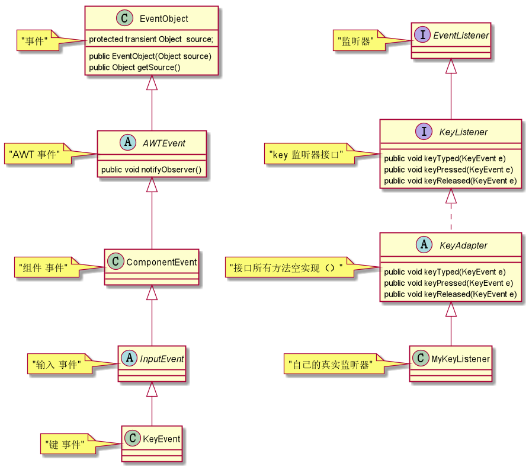

# 观察者模式

jdk中的键盘监听使用了观察者模式，大致类图如下：

    

观察者模式角色：    
1.事件源    
2.事件      
3.抽象观察者      
4.具体观察者      

> 看孩子案例    
一个孩子类，包含两个属性（哭和睡）  
一个事件类：孩子哭了；孩子睡了      
有两个观察者，父亲和狗   
孩子哭了：父亲哄孩子，狗叫   
孩子睡了：父亲玩游戏，狗趴窝里   

事件源：     
```java
/**
 * 抽象事件源。
 * @Author 胡恩会
 * @Date 2020/6/18 22:01
 **/
public abstract class BaseSource {
    /**
     * 所有观察者
     **/
    List<BaseObserver> observers = new ArrayList<>();
    /**
     * 添加观察者
     **/
    public void add(BaseObserver observer) {
        this.observers.add(observer);
    }
    /**
     * 移除观察者
     **/
    public void remove(BaseObserver observer) {
        this.observers.remove(observer);
    }
    /**
     * 唤醒观察者
     **/
    public abstract void notifyObserver();
}

/**
 * 事件源对象
 *
 * @Author 胡恩会
 * @Date 2020/6/18 21:38
 **/
public class Child extends BaseSource {
    boolean cry;
    boolean sleep ;
    public void isCry() {
        cry = true;
        this.notifyObserver();
    }
    public void isSleep(){
        sleep = true;
        this.notifyObserver();
    }

    @Override
    public void notifyObserver() {
        ChildActionEvent event = new ChildActionEvent(this,this.cry,this.sleep);
        for (BaseObserver observer : observers) {
            observer.actionOnEvent(event);
        }
    }
}
```
事件：    
```java
// java.util下事件祖宗
public class EventObject implements java.io.Serializable {
    // 持有事件源对象
    protected transient Object  source;
    public EventObject(Object source) {
        if (source == null)
            throw new IllegalArgumentException("null source");
        this.source = source;
    }
    public Object getSource() {
        return source;
    }
}

/**
 * 儿童活动事件
 *
 * @Author 胡恩会
 * @Date 2020/6/18 21:29
 **/
public class ChildActionEvent extends EventObject {
    public boolean childCry;
    public boolean childSleep;
    public ChildActionEvent(Object source,boolean childCry,boolean childSleep) {
        super(source);
        this.childCry = childCry;
        this.childSleep = childSleep;
    }
}
```
抽象观察者：     
```java
/**
 * 抽象观察者
 *
 * @Author 胡恩会
 * @Date 2020/6/18 21:33
 **/
public interface BaseObserver extends EventListener {
    /**
     * 处理事件
     *
     * @param event:
     * @Author: 胡恩会
     * @Date: 2020/6/18 21:37
     * @return: void
     **/
    void actionOnEvent(ChildActionEvent event);
}
```
具体观察者：    
```java
/**
 * 观察者-狗
 *
 * @Author 胡恩会
 * @Date 2020/6/18 21:34
 **/
public class DogObserver implements BaseObserver {
    @Override
    public void actionOnEvent(ChildActionEvent event) {
        Object source = event.getSource();
        if (event.childSleep){
            System.out.println(source + "孩子睡了，狗趴在窝里");
        }
        if (event.childCry){
            System.out.println(source + "孩子哭了，狗汪汪叫");
        }
    }
}

/**
 * 观察者-父亲
 *
 * @Author 胡恩会
 * @Date 2020/6/18 22:30
 **/
public class FatherObserver implements BaseObserver {
    @Override
    public void actionOnEvent(ChildActionEvent event) {
        Object source = event.getSource();
        if (event.childSleep){
            System.out.println(source + "孩子睡了，爸爸开始玩游戏");
        }
        if (event.childCry){
            System.out.println(source + "孩子哭了，爸爸来哄孩子");
        }
    }
}
```
    