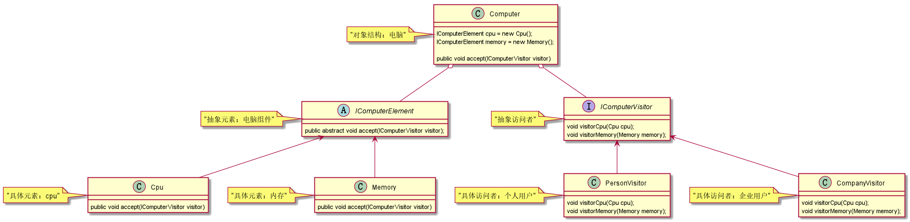

# 访问者模式

>常用场景：编译器       
通常在以下情况可以考虑使用访问者（Visitor）模式：       
1.对象结构相对稳定，但其操作算法经常变化的程序        
2.对象结构中的对象需要提供多种不同且不相关的操作，而且要避免让这些操作的变化影响对象的结构         
3.对象结构包含很多类型的对象，希望对这些对象实施一些依赖于其具体类型的操作         

>访问者的角色：      
1.抽象访问者：定义一个访问具体元素的接口，为每个具体元素类对应一个访问操作 visit() ，该操作中的参数类型标识了被访问的具体元素。        
2.具体访问者：实现抽象访问者角色中声明的各个访问操作，确定访问者访问一个元素时该做什么。       
3.抽象元素：声明一个包含接受操作 accept() 的接口，被接受的访问者对象作为 accept() 方法的参数。         
4.具体元素：实现抽象元素角色提供的 accept() 操作，其方法体通常都是 visitor.visit(this) ，另外具体元素中可能还包含本身业务逻辑的相关操作。         
5.对象结构：是一个包含元素角色的容器，提供让访问者对象遍历容器中的所有元素的方法，通常由 List、Set、Map 等聚合类实现。       

对象结构：     
```java
public class Computer {
    IComputerElement cpu = new Cpu();
    IComputerElement memory = new Memory();
    public void accept(IComputerVisitor visitor){
        cpu.accept(visitor);
        memory.accept(visitor);
    }
}
```
抽象元素：     
```java
/**
 * 抽象元素-电脑组件
 *
 * @Author 胡恩会
 * @Date 2020/6/26 14:44
 **/
public abstract class IComputerElement {
    public abstract void accept(IComputerVisitor visitor);
}
```
具体元素：    
```java
/**
 * 具体元素-cpu
 *
 * @Author 胡恩会
 * @Date 2020/6/26 14:43
 **/
public class Cpu extends IComputerElement{
    @Override
    public void accept(IComputerVisitor visitor) {
        visitor.visitorCpu(this);
    }
}
/**
 * 具体元素-内存
 *
 * @Author 胡恩会
 * @Date 2020/6/26 14:43
 **/
public class Memory extends IComputerElement {
    @Override
    public void accept(IComputerVisitor visitor) {
        visitor.visitorMemory(this);
    }
}
```
抽象访问者：    
```java
/**
 * 抽象访问者
 *
 * @Author 胡恩会
 * @Date 2020/6/26 14:35
 **/
public interface IComputerVisitor {
    void visitorCpu(Cpu cpu);
    void visitorMemory(Memory memory);
}
```
具体访问者：    
```java
/**
 * 具体访问者-企业用户
 *
 * @Author 胡恩会
 * @Date 2020/6/26 14:38
 **/
public class CompanyVisitor implements IComputerVisitor {
    @Override
    public void visitorCpu(Cpu cpu) {
        System.out.println("企业用户购买cpu打8折");
    }
    @Override
    public void visitorMemory(Memory memory) {
        System.out.println("企业用户购买内存打8.5折");
    }
}
/**
 * 具体访问者-个人用户
 *
 * @Author 胡恩会
 * @Date 2020/6/26 14:36
 **/
public class PersonVisitor implements IComputerVisitor {
    @Override
    public void visitorCpu(Cpu cpu) {
        System.out.println("个人用户购物cpu，价格打9折");
    }
    @Override
    public void visitorMemory(Memory memory) {
        System.out.println("个人用户购买内存，价格打9.5折");
    }
}
```
 