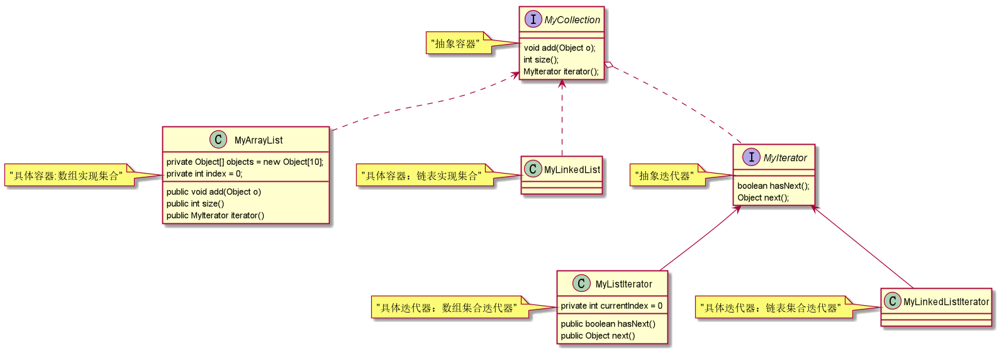

# 迭代器模式

核心：容器与容器遍历专用模式     
迭代器的角色：    
1.抽象容器类     
2.具体容器类     
3.抽象迭代器     
4.具体迭代器     


抽象容器：      
```java
/**
 * 模仿jdk的Collection
 *
 * @Author 胡恩会
 * @Date 2020/6/25 12:00
 **/
public interface MyCollection {
    void add(Object o);
    int size();
    MyIterator iterator();
}
```
具体容器：     
```java
/**
 * 模仿ArrayList
 *
 * @Author 胡恩会
 * @Date 2020/6/25 12:01
 **/
public class MyArrayList implements MyCollection {
    private Object[] objects = new Object[10];
    private int index = 0;
    @Override
    public void add(Object o) {
        // 扩容
        if (index == objects.length) {
            Object[] newObjects = new Object[objects.length * 2];
            System.arraycopy(objects, 0, newObjects, 0, objects.length);
            objects = newObjects;
        }
        objects[index] = o;
        index++;
    }
    @Override
    public int size() {
        return objects.length;
    }
    @Override
    public MyIterator iterator() {
        return new MyListIterator();
    }

    /**
     * 具体迭代角色
     * 私有的内部类，只是自己遍历使用
     *
     * @Author: 胡恩会
     * @Date: 2020/6/25 12:07
     **/
    private class MyListIterator implements MyIterator {
        private int currentIndex = 0;
        @Override
        public boolean hasNext() {
            if (currentIndex >= index) {
                return false;
            }
            return true;
        }
        @Override
        public Object next() {
            Object o = objects[currentIndex];
            currentIndex++;
            return o;
        }
    }
}
```
抽象迭代：      
```java
/**
 * 抽象迭代器
 *
 * @Author 胡恩会
 * @Date 2020/6/25 12:01
 **/
public interface MyIterator {
    boolean hasNext();
    Object next();
}
```
具体迭代：     
代码见MyArrayList的内部类     

 