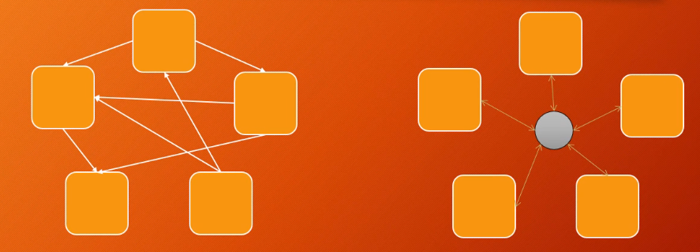
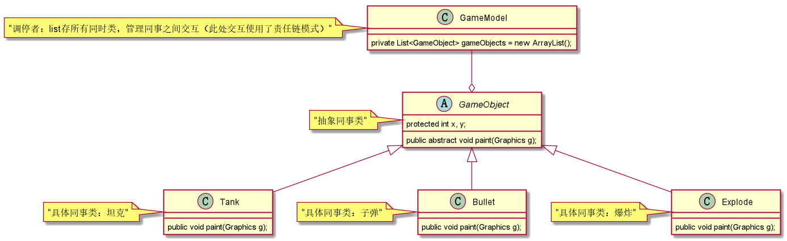
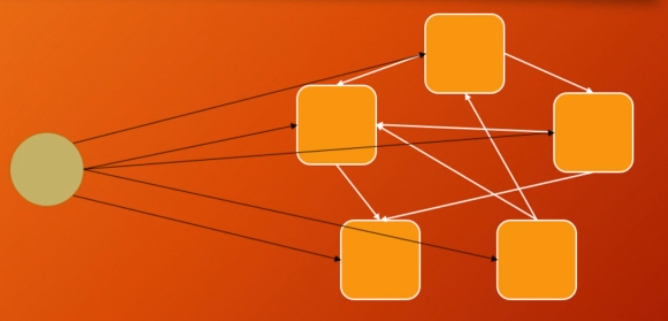
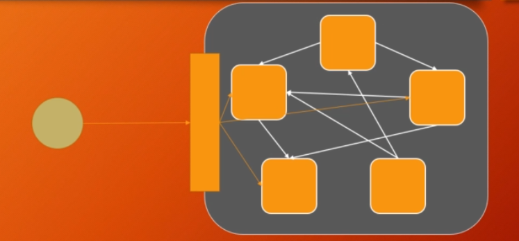

# 门面模式和调停者模式

## 调停者  

> 调停者（Mediator）：定义一个中介对象来封装一系列对象之间的交互，
使原有对象之间的耦合松散，且可以独立地改变它们之间的交互。
调停者又叫中介者模式，它是迪米特法则的典型应用。    
调停者主要优点如下：   
1.降低了对象之间的耦合性，使得对象易于独立地被复用。   
2.将对象间的一对多关联转变为一对一的关联，提高系统的灵活性，使得系统易于维护和扩展。   
其主要缺点是：    
1.当同事类太多时，中介者的职责将很大，它会变得复杂而庞大，以至于系统难以维护。  

> Tank项目中的例子：   
坦克与坦克，坦克与子弹之间的交互   
1.抽象同事类：GameObject   
2.具体同事类：坦克，子弹，爆炸   
3.抽象中介者：暂无   
4.具体中介者：GameModel   
  
  
 
 从Tank项目的TankFrame类角度看，GameModel就是门面模式
 
## 门面模式    
    
     
