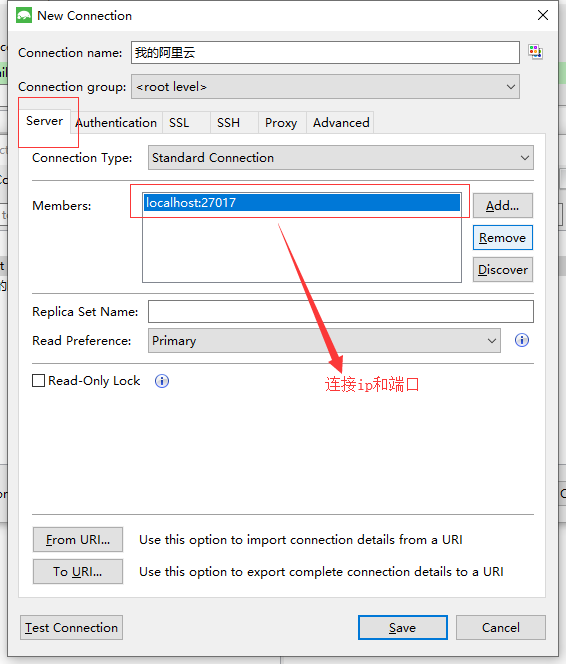
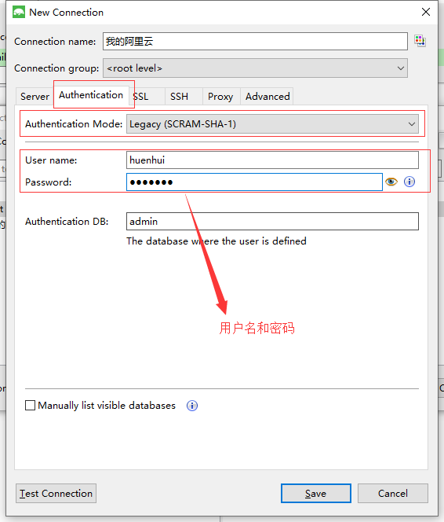

# MongoDB

## 在CentOS上安装MongoDB

安装步骤：
1. 创建仓库文件: ```vi /etc/yum.repos.d/mongodb-org-3.4.repo```   
2. 复制下面配置，保存退出： ```[mongodb-org-3.4]       
                name=MongoDB Repository     
                baseurl=https://repo.mongodb.org/yum/redhat/$releasever/mongodb-org/3.4/x86_64/     
                gpgcheck=1      
                enabled=1       
                gpgkey=https://www.mongodb.org/static/pgp/server-3.4.asc```          
3. yum安装：  ```yum install -y mongodb-org```     
4. 安装完毕后修改配置文件： ```vi /etc/mongod.conf```      
**修改配置文件的 bind_ip, 默认是 127.0.0.1 只限于本机连接。必须把这个修改为 0.0.0.0 ,否则通过别的机器是没法连接的!**        
**MongoDB默认将数据文件存储在/var/lib/mongo目录，默认日志文件在/var/log/mongodb中。可在此配置文件修改**

启动、停止、重启：
1. 启动命令： ```service mongod start```
2. 停止命令： ```service mongod stop```
3. 重启命令： ```service mongod restart```
4. 查看是否启动成功命令：  
通过查看日志文件```cat /var/log/mongodb/mongod.log```       
启动成功最后一句显示： ```[initandlisten] waiting for connections on 27017```，27017为端口号

## 本地安装 Studio 3T 工具连接数据库
1. 在服务器CentOS进入MongoDB：   ```mongo```
2. 切换为admin数据库```use admin```
3. 创建用户```db.createUser({user:"huenhui",pwd:"huenhui",roles:["root"]})```
4. 重启： ```service mongod  restart```
      



## 基础概念的理解

与关系型数据库概念进行比较，易于理解

|   SQL术语   | MongoDB术语 |                    说明                    |
| :---------: | :---------: | :----------------------------------------: |
|  database   |  database   |                   数据库                   |
|    table    | collection  |               数据库表/集合                |
|     row     |  document   |              数据记录行/文档               |
|   column    |    field    |                数据字段/域                 |
|    index    |    index    |                    索引                    |
| table joins |             |           表连接(MongoDB不支持)            |
| primary key | primary key | 主键，MongoDB自动在每个集合中添加_id的主键 |
|             |             |                                            |


