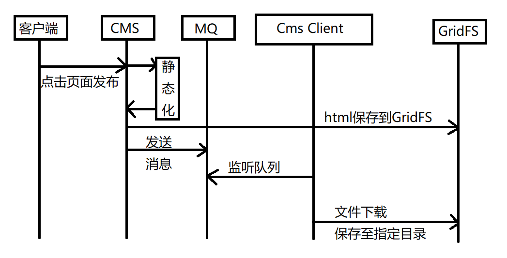

# 页面发布功能

## 页面发布流程图

1. 管理员操作CMS系统，点击页面发布按钮
2. CMS系统使用freemarker静态化技术生成html文件
3. CMS系统将html文件保存至GridFS中
4. CMS系统发送消息至MQ队列中
5. CMS Client系统监听MQ队列
6. Cms Client收到消息后从GridFS中下载html文件到Cms Client所在服务器的指定目录

## 功能实现
- CMS服务端（生产者）
```
        /**
         *  页面发布
         * @param pageId 页面id
         * @return: com.xuecheng.framework.model.response.ResponseResult
         */
        public ResponseResult post(String pageId) {
            // 页面静态化
            String html = this.getPageHtml(pageId);
            // 把html存到GridFS
            CmsPage cmsPage = saveHtml(pageId,html);
            // 向MQ发消息
            sendPostPage(pageId);
            return new ResponseResult(CommonCode.SUCCESS);
        }
        
        /**
         *  页面静态化
         * @param pageId 页面id
         * @return: java.lang.String
         */
        public String getPageHtml(String pageId) {
            // 获取数据模型
            Map model = this.getModelByPageId(pageId);
            if(model == null){
                ExceptionCast.cast(CmsCode.CMS_GENERATEHTML_DATAISNULL);
            }
            // 获取页面模板
            String template = getTemplateByPageId(pageId);
            if(StringUtils.isEmpty(template)){
                ExceptionCast.cast(CmsCode.CMS_GENERATEHTML_TEMPLATEISNULL);
            }
    
            // 执行静态化
            String html = generateHtml(template, model);
            return html;
        }
    
        /**
         *  获取数据模型
         * @param pageId 页面id
         * @return: java.util.Map
         */
        private Map getModelByPageId(String pageId) {
            // 取出页面信息
            CmsPage cmsPage = this.getById(pageId);
            if(cmsPage == null) {
                ExceptionCast.cast(CmsCode.CMS_PAGE_NOTEXISTS);
            }
            // 取出页面的dataUrl
            String dataUrl = cmsPage.getDataUrl();
            if(StringUtils.isEmpty(dataUrl)){
                ExceptionCast.cast(CmsCode.CMS_GENERATEHTML_DATAURLISNULL);
            }
            // 通过restTemplate请求dataUrl获取数据
            ResponseEntity<Map> forEntity = restTemplate.getForEntity(dataUrl, Map.class);
            return forEntity.getBody();
        }
    
        /**
         *  获取页面模板
         * @param pageId 页面id
         * @return: java.lang.String
         */
        private String getTemplateByPageId(String pageId) {
            // 取出页面信息
            CmsPage cmsPage = this.getById(pageId);
            if(cmsPage == null) {
                ExceptionCast.cast(CmsCode.CMS_PAGE_NOTEXISTS);
            }
    
            // 获取页面模板id
            String templateId = cmsPage.getTemplateId();
            if(StringUtils.isEmpty(templateId)){
                ExceptionCast.cast(CmsCode.CMS_GENERATEHTML_TEMPLATEISNULL);
            }
            // 查询模板信息
            Optional<CmsTemplate> optional = cmsTemplateRepository.findById(templateId);
            if(optional.isPresent()) {
                // 获取模板文件id
                CmsTemplate cmsTemplate = optional.get();
                String templateFileId = cmsTemplate.getTemplateFileId();
                // 从GridFS中获取模板文件内容
                //根据文件id查询文件
                GridFSFile gridFSFile = gridFsTemplate.findOne(Query.query(Criteria.where("_id").is(templateFileId)));
    
                //打开一个下载流对象
                GridFSDownloadStream gridFSDownloadStream = gridFSBucket.openDownloadStream(gridFSFile.getObjectId());
                //创建GridFsResource对象，获取流
                GridFsResource gridFsResource = new GridFsResource(gridFSFile,gridFSDownloadStream);
                //从流中取数据
                try {
                    String content = IOUtils.toString(gridFsResource.getInputStream(), "utf-8");
                    return  content;
                } catch (IOException e) {
                    e.printStackTrace();
                }
            }
            return null;
        }
    
        /**
         *  执行静态化
         * @param templateContent 模板
         * @param model 数据
         * @return: java.lang.String
         */
        private String generateHtml(String templateContent,Map model){
            // 创建配置对象
            Configuration configuration = new Configuration(Configuration.getVersion());
            // 创建模板加载器
            StringTemplateLoader stringTemplateLoader = new StringTemplateLoader();
            stringTemplateLoader.putTemplate("template",templateContent);
            // 向configuration配置模板加载器
            configuration.setTemplateLoader(stringTemplateLoader);
            // 获取模板内容
            try {
                Template tempalte = configuration.getTemplate("template");
                // 调用api进行静态化,生成html文件内容
                String content = FreeMarkerTemplateUtils.processTemplateIntoString(tempalte,model);
                return content;
            } catch (Exception e) {
                e.printStackTrace();
            }
            return null;
        }
    
        /**
         *  保存html到GridFS
         * @param pageId 页面id
         * @param htmlContent html内容
         * @return: com.xuecheng.framework.domain.cms.CmsPage
         */
        private CmsPage saveHtml(String pageId,String htmlContent) {
            CmsPage cmsPage = this.getById(pageId);
            if(cmsPage == null){
                ExceptionCast.cast(CommonCode.INVALID_PARAM);
            }
            ObjectId objectId = null;
            // html文件内容保存到GridFS
            try {
                InputStream inputStream = IOUtils.toInputStream(htmlContent,"utf-8");
                objectId = gridFsTemplate.store(inputStream,cmsPage.getPageName());
            } catch (IOException e) {
                e.printStackTrace();
            }
            // 将html的fileId保存到cmsPage
            cmsPage.setHtmlFileId(objectId.toHexString());
            cmsPageRepository.save(cmsPage);
            return cmsPage;
        }
    
        /**
         *  向MQ发送消息
         * @param pageId 页面id
         * @return: void
         */
        private void sendPostPage(String pageId){
            // 获得页面信息
            CmsPage cmsPage = this.getById(pageId);
            if(cmsPage == null){
                ExceptionCast.cast(CommonCode.INVALID_PARAM);
            }
            // 消息封装
            Map<String,String> msg = new HashMap<>();
            msg.put("pageId",pageId);
            // 转为json
            String jsonString = JSON.toJSONString(msg);
            // 从页面信息中取出站点id
            String siteId = cmsPage.getSiteId();
            rabbitTemplate.convertAndSend(RabbitmqConfig.EX_ROUTING_CMS_POSTPAGE,siteId,jsonString);
        }
        
```

- CMS Client服务端（消费者）
```
/**
 *  监听MQ
 */
@Component
@Slf4j
public class ConsumerPostPage {

    @Autowired
    private PageService pageService;
    @RabbitListener(queues = {"${xuecheng.mq.queue}"})
    public void postPage(String msg){
        // 解析json消息
        Map map = JSON.parseObject(msg,Map.class);
        // 页面id
        String pageId = (String)map.get("pageId");
        CmsPage cmsPage = pageService.findCmsPageById(pageId);
        if(cmsPage == null) {
            log.error("receive postpage msg,cmsPage is null,pageId:{}",pageId);
            return;
        }
        // 保存html到服务器
        pageService.savePageToServerPath(pageId);
    }
}

/**
 *  页面管理
 */
@Service
@Slf4j
public class PageService {
    @Autowired
    private GridFsTemplate gridFsTemplate;
    @Autowired
    private GridFSBucket gridFSBucket;
    @Autowired
    private CmsPageRepository cmsPageRepository;
    @Autowired
    private CmsSiteRepository cmsSiteRepository;
    /**
     *  保存html页面到服务器物理路径
     * @param pageId
     * @return: void
     */
    public void savePageToServerPath(String pageId) {
        // 根据id查询页面信息
        CmsPage cmsPage = findCmsPageById(pageId);
        String htmlFileId = cmsPage.getHtmlFileId();
        // 从gridFS查询html文件
        InputStream inputStream = getFileById(htmlFileId);
        if(inputStream == null){
            log.error("getFileById InputStream is null,htmlFile:{}",htmlFileId);
            return ;
        }
        // 获取站点信息
        CmsSite cmsSite = findCmsSiteById(cmsPage.getSiteId());
        // 获取站点的物理路径
        String sitePhysicalPath= cmsSite.getSitePhysicalPath();

        //页面的物理路径：站点物理路径+页面物理路径+页面名称
        String pagePath = sitePhysicalPath + cmsPage.getPagePhysicalPath() + cmsPage.getPageName();
        FileOutputStream fileOutputStream = null;
        try {
            fileOutputStream = new FileOutputStream(new File(pagePath));
            // 将html文件保存到服务器物理路径上
            IOUtils.copy(inputStream,fileOutputStream);
        } catch (Exception e) {
            e.printStackTrace();
        }finally {
            try {
                inputStream.close();
            } catch (IOException e) {
                e.printStackTrace();
            }
            try {
                fileOutputStream.close();
            } catch (IOException e) {
                e.printStackTrace();
            }

        }

    }

    /**
     *  根据文件id得到下载流
     * @param htmlFileId
     * @return: java.io.InputStream
     */
    public InputStream getFileById(String htmlFileId) {
        //根据文件id查询文件
        GridFSFile file = gridFsTemplate.findOne(Query.query(Criteria.where("_id").is(htmlFileId)));
        //打开一个下载流对象
        GridFSDownloadStream gridFSDownloadStream = gridFSBucket.openDownloadStream(file.getObjectId());
        //创建GridFsResource对象，获取流
        GridFsResource gridFsResource = new GridFsResource(file,gridFSDownloadStream);

        try {
            return gridFsResource.getInputStream();
        } catch (IOException e) {
            e.printStackTrace();
        }
        return null;
    }
    /**
     *  根据页面id查询页面信息
     * @param pageId
     * @return: com.xuecheng.framework.domain.cms.CmsPage
     */
    public CmsPage findCmsPageById(String pageId) {
        Optional<CmsPage> optional = cmsPageRepository.findById(pageId);
        if(optional.isPresent()) {
            return optional.get();
        }
        return null;
    }

    /**
     *  根据站点id获取站点信息
     * @param siteId
     * @return: com.xuecheng.framework.domain.cms.CmsSite
     */
    public CmsSite findCmsSiteById(String siteId){
        Optional<CmsSite> optional = cmsSiteRepository.findById(siteId);
        if (optional.isPresent()) {
            return optional.get();
        }
        return null;
    }
}
```


