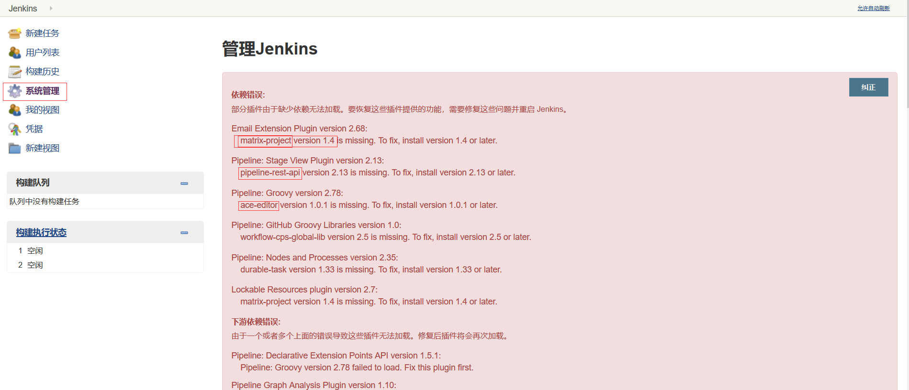
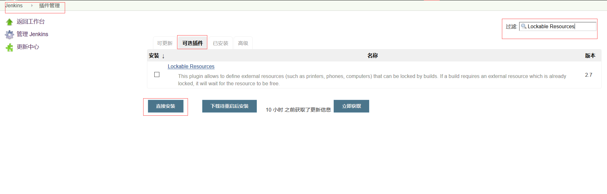

# Jenkins 配置

## 登陆后选择 推荐方式安装插件
插件可能会安装的很慢，耐心等待，可能还会出现安装插件失败的情况，可以进入系统后在解决。     
进入系统后，点击 系统管理 情况如下：        
       
解决办法：       
对所有丢失的插件，进入 插件管理 - 可选插件 - 搜索需要的插件 - 直接安装
         
安装后在服务器端重启tomcat，再次登陆即可发现问题已经解决了        
可能有提示 反向代理设置有误 ，暂不处理

## 全局安全配置
勾选用户注册（防止忘记密码的情况）

## 全局工具配置
可以在服务器使用 ``` echo $MAVEN_HOME``` 来查看环境变量             
1.maven配置。两个位置均选择maven的settings路径。例如：/usr/local/maven/maven3.6/conf/settings.xml          
2.JDK。随便起个名字，取消自动安装并填写jdk的JAVA_HOME     
3.maven。随便起个名字，取消自动安装并填写maven的MAVEN_HOME
4.git。随便起个名字，取消自动安装并填写git的安装路径。例如：/usr/local/git/bin
