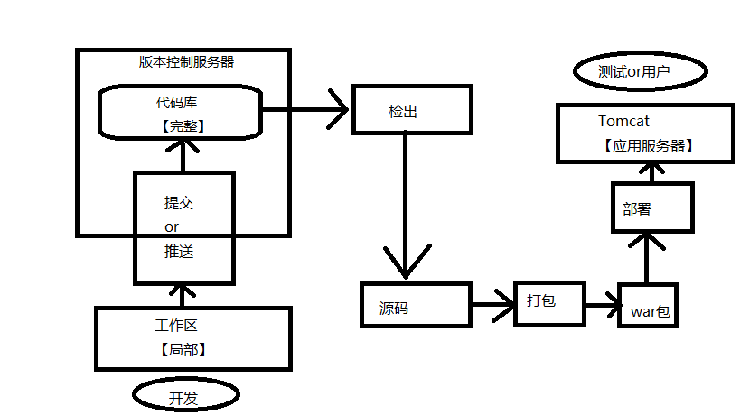
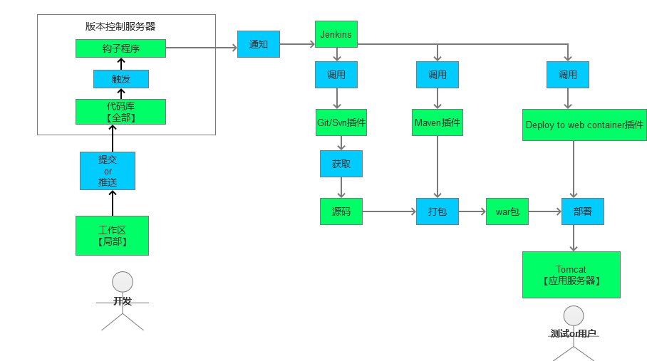

# 持续集成的学习
jenkins 和 hudson 都是持续集成及自动化部署工具，此处主要学习 jenkins 的使用

- 手动部署的过程       
  

- 自动化部署
  

## Jenkins 环境搭建

准备工作：       
此教程使用一台阿里云服务器，所以所有应用都装在一台服务器上，需要安装的应用如下
1. [centOS安装java](常用组件/Jenkins/CentOS安装jdk.md)
2. [centOS安装tomcat](常用组件/Jenkins/CentOS安装tomcat.md)
3. [centOS安装maven](常用组件/Jenkins/CentOS安装maven.md)
4. [centOS安装git](常用组件/Jenkins/CentOS安装git.md)
5. [centOS安装jenkins](常用组件/Jenkins/CentOS安装jenkins.md)

## Jenkins 配置
[Jenkins 全局配置](常用组件/Jenkins/Jenkins的配置.md)

## Jenkins创建部署任务
[Jenkins创建war部署任务](常用组件/Jenkins/部署任务-war.md)

[Jenkins创建jar部署任务](常用组件/Jenkins/部署任务-jar.md)

[Jenkins创建vue部署任务](常用组件/Jenkins/部署任务-vue.md)

