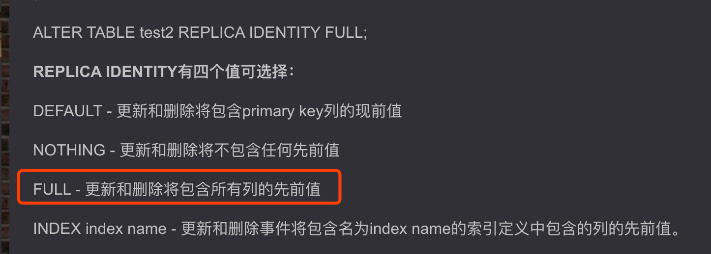

# OpenGauss系数据库

## 基本使用

### 复制槽使用
``` 
-- 创建复制槽
select * from pg_create_logical_replication_slot('replication_slot', 'mppdb_decoding')

-- 查询复制槽
select * from pg_replication_slots;

-- 删除复制槽
select pg_drop_replication_slot('slot_name');

-- 读取复制槽slot1解码结果，解码条数为4096
SELECT * FROM pg_logical_slot_peek_changes('replication_slot', NULL, 4096);

-- replication权限
ALTER USER user1 REPLICATION;
```

## 问题梳理

### 问题1:使用复制槽时，无主键表捕获不到 D 类型事件、 U 类型事件只有after有值，before都是null

> 需要REPLICA IDENTITY属性设置为FULL   
> -- 查级别，查出来的可能是缩写，只有首字母
> SELECT n.nspname,c.relname,relreplident FROM pg_catalog.pg_class c LEFT JOIN pg_catalog.pg_namespace n ON c.relnamespace=n.oid where c.relname = 'heh_0714'
> -- 修改级别
> ALTER TABLE heh_0714 REPLICA IDENTITY FULL



### 问题2:no pg_hba.conf entry for replication connection from host "xxx.xxx.xxx.xx", user "test", SSL off
> 解决：这个错误通常出现在使用 PostgreSQL 数据库时开启了复制功能，但在 pg_hba.conf 文件中没有为复制连接配置对应的权限。   
> 要解决这个问题，需要在 PostgreSQL 数据库中为对应的用户（在这个错误中是 dp_test 用户）添加对应的权限配置。   
> vim pg_hba.conf   
> 添加内容，对所有数据库、所有用户、允许所有ip以sha256认证的连接；replication 表示要进行复制连接   
> 
> host all all 0.0.0.0/0 sha256   
> host replication all 0.0.0.0/0 sha256   
> 
> 修改完成后，重启即可：

### 问题3:FATAL(Gbase 8c): can't decode in pmState is not run or recovery in progress.
> 主从切换中，无法使用，需要等待切换完成后使用

### 问题4(Gbase 8c):socket is not closed;Urgent packet sent to back end successfully:An I/O error occured while sending to the backend.detail:Unexpected packet type:102;
> 数据库问题，当数据库中有事务未提交，创建复制槽会有该报错。   
> 你在dn上可以查询：   select * from pg_stat_activity where state !='idle'  order by xact_start;   
> 然后看看是不是有事务一直处于active 或者 idle transaction状态的    

### 问题5(Vastbase G100):Hint: try increasing wal_sender_timeout or check system time
> 方案一：sql修改，直接生效：（重启后可能就没了）     
> ALTER SYSTEM SET wal_sender_timeout TO 60000;    
> ALTER SYSTEM SET wal_receiver_timeout TO 60000;     
> 方案二：修改配置文件    
> 使用命令修改配置：/usr/local/vastbase/has/bin/hasctl -c /usr/local/vastbase/has/has_conf.yml edit-config    
> 添加如下两个配置，然后重启集群    
> wal_receiver_timeout: 60000    
> wal_sender_timeout: 60000    

### 问题6(Vastbase G100): 主从模式下，主的复制槽如何同步给从
> 使用命令修改配置：/usr/local/vastbase/has/bin/hasctl -c /usr/local/vastbase/has/has_conf.yml edit-config   
> 添加如下配置，然后重启集群   
> enable_slot_log: true   
