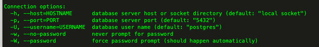

# PostgreSQL

> PG 是一个开源的关系型数据库，底层基于C实现。    
> PG的开源协议，BDS、MIT开源协议。开源的比较彻底，可以对PG进行封装，然后商业化收费。   
> 
> 版本选择：为了稳定推荐12.x；想体验新特性，推荐14.x   
> 
> 官方地址：https://www.postgresql.org/   
> 国内社区：http://www.postgres.cn/v2/document   

## 安装
``` 
# 下载rpm包
sudo yum install -y https://download.postgresql.org/pub/repos/yum/reporpms/EL-7-x86_64/pgdg-redhat-repo-latest.noarch.rpm
# 安装
sudo yum install -y postgresql14-server
# 设置开机启动
sudo /usr/pgsql-14/bin/postgresql-14-setup initdb
sudo systemctl enable postgresql-14
# 启动PG
sudo systemctl start postgresql-14

# 查看PG服务状态
systemctl status postgresql-14

# 停服务
systemctl stop postgresql-14 

# 重启服务
sudo systemctl restart postgresql-14 
```

## 基本使用
不推荐使用root用户管理，安装成功后，会默认创建一个postgres用户
``` 
# 切换操作系统用户到 postgres
su postgres

# 可以用psql --help查看帮助信息
psql --help

# \help查看数据库级别的命令，\?可以查看服务级别的命令
\help

# 查看命令操作的详情：比如想查看create user这个命令怎么写
\help create user

# 连接到本地的pg
psql

# 查看有哪些数据库
\l

# 可以基于psql直接查看一些信息，也可以进入psql后，在查看
psql -l
```


## 配置
配置文件位置：/var/lib/pgsql/14/data   
两个主要关心的配置文件：pg_hba.conf 和 postgresql.conf     

### 允许远程连接
``` 
# 1、修改配置文件：pg_hba.conf
# TYPE  DATABASE        USER            ADDRESS                 METHOD
# 自定义配置：允许任意来源ip，任意用户，连接全部数据库 
host    all             all             0.0.0.0/0               md5  

# 2、修改配置文件：postgresql.conf
# listen_addresses = 'localhost' -- 默认配置的localhost，改为*
listen_addresses = '*'
```

> 第一块：local表示本地连接，host代表可以指定连接的address   
> 第二块：database编写数据库名，如果写all，表示所有库都可以连接     
> 第三块：user编写连接的用户，可以写all，表示所有用户都可以连接   
> 第四块：address表示哪些IP可以连接，全部写0.0.0.0/0    
> 第五块：method加密方式，不用太关注，写md5即可   
> 
> 最粗暴的配置，允许任意来源ip，任意用户，连接全部数据库      
> host    all             all             0.0.0.0/0               md5

### 配置日志
> PG默认保留7天的日志文件，循环覆盖
```
# 修改配置文件：postgresql.conf [REPORTING AND LOGGING部分]
# 默认已经开启了日志
logging_collector = on   
# 默认路径在log目录下
log_directory = 'log'
# 日志的文件名称，%a表示星期几作为后缀
# 例如，如果 PostgreSQL 日志文件的配置为 postgresql-%a.log，那么每周的日志文件将被命名为 postgresql-Mon.log、postgresql-Tue.log、postgresql-Wed.log 等等，对应每周的星期一、星期二、星期三等
log_filename = 'postgresql-%a.log'
# 默认一周后，日志文件会被循环覆盖
log_truncate_on_rotation = on
# 一天一个日志文件
log_rotation_age = 1d 
# 一个日志文件的大小限制，0是不限制
log_rotation_size = 0
```
