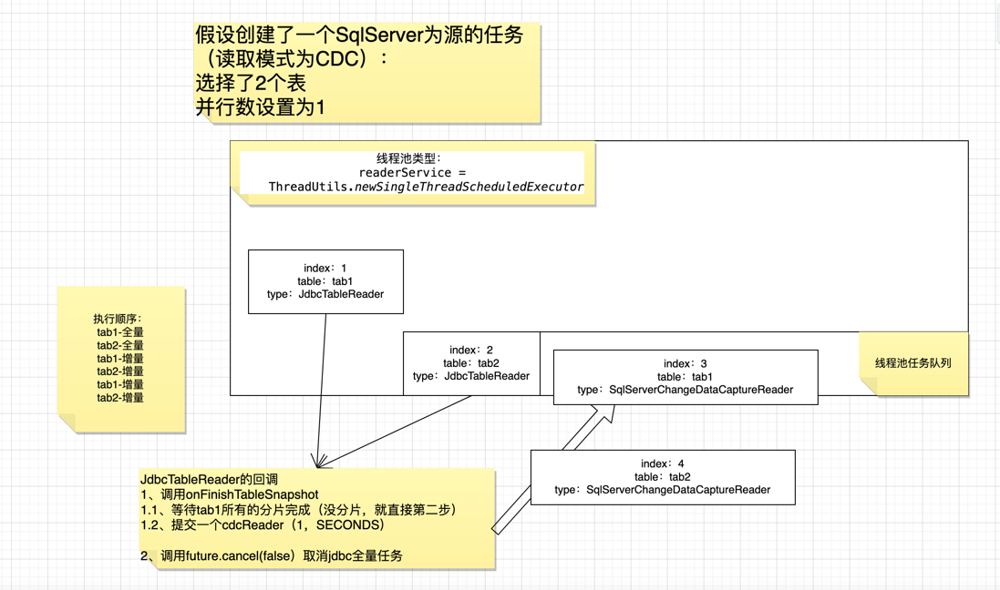

# Sql Server CDC(Change Data Capture)

> SQL Server 2016 Enterprise(腾讯云RDS)   
> 
> DBMS: Microsoft SQL Server (ver. 13.00.6300)     
> Case sensitivity: plain=mixed, delimited=mixed     
> Driver: Microsoft JDBC Driver 12.2 for SQL Server (ver. 12.2.0.0, JDBC4.2)     
> Ping: 24 ms     
> SSL: yes    

https://learn.microsoft.com/zh-cn/sql/relational-databases/system-stored-procedures/sys-sp-cdc-disable-table-transact-sql?view=sql-server-ver16&redirectedfrom=MSDN



```sql
-- 创建数据库
create database heh_cdc
go
exec sp_addextendedproperty 'MS_Description', '测试cdc'
go

-- 查看数据库是否开启CDC
SELECT is_cdc_enabled FROM SYS.databases where name = 'heh_cdc';

-- 开启数据库级别的CDC
USE [heh_cdc]
EXECUTE sys.sp_cdc_enable_db;

-- 关闭数据库级别的CDC
USE [heh_cdc]    
EXECUTE sys.sp_cdc_disable_db;
    
--  查看该库所有开启了CDC的表
EXEC sys.sp_cdc_help_change_data_capture;

-- 查看该库的[dbo].[test_cdc]表是否开启了CDC，如果有记录，则为成功开启 (可以查到该表的instance)
-- 一个表最多可以创建两个instance，应该根据start_lsn取较大的那个instance（发生ddl时创建第二个，才能捕获到新增列的数据） 
EXEC sys.sp_cdc_help_change_data_capture 'dbo', 'test_cdc';

-- 开启表级别CDC（一个表最多可以创建两个instance）
EXEC sys.sp_cdc_enable_table
     @source_schema= 'dbo',
     @source_name = 'test_cdc', -- 需要开启CDC的表名
     @capture_instance = 'test_cdc_instance', -- 为CDC实例起的名
     @role_name = null;

-- 关闭表的CDC(关闭即删除)  
EXECUTE sys.sp_cdc_disable_table
     @source_schema= 'dbo',
     @source_name = 'test_cdc',
     @capture_instance = 'test_cdc_ddl_instance';


-- 全量查询前，先查询全增量衔接位点
-- 1、数据库.cdc.instanceName_CT
SELECT MAX(__$start_lsn) from [heh_cdc].[cdc].[test_cdc_instance_CT];
-- 2、如果方案1查不到，使用方案2
SELECT sys.fn_cdc_map_time_to_lsn ('largest less than or equal',CURRENT_TIMESTAMP);

-- ddl 捕获（object_id是查出来的）
SELECT * FROM [heh_cdc].[cdc].[ddl_history] WHERE object_id = '380085386' ORDER BY ddl_lsn ASC;

-- 从上次读到的lsn开始 查询操作类型、lsn 以及 数据 
-- __$operation：(主键变更是D+I)
-- 1=DELETE、2=INSERT、4=UPDATE-after、3=UPDATE-before(only when the row filter option 'all update old' is specified.)
SELECT __$operation, __$start_lsn,id,col1,col2 FROM [heh_cdc].[cdc].[test_cdc_instance_CT] 
        WHERE __$start_lsn > 0x0000258D000001580005 AND __$operation != 3 ORDER BY __$start_lsn ASC;
```

``` 
partition: 0  offset: 6  timestamp: 2024-04-26 19:29:19
key: {"id": 5}
value: 
{"after": {"id": 5, "col1": 5, "col2": 5}, 
"before": null, 
"source": {"msg_t": "I", "database": "heh_cdc", "schema": "dbo", "entity": "test_cdc", "entity2": "", "partition": 0, "size": 3, "islastone": false, "snapshot": false, "idx": 4, "totalb": 12, "b": 3, "totalc": 4, "total_i_b": 12, "total_i_c": 4, "total_u_b": 0, "total_u_c": 0, "total_d_b": 0, "total_d_c": 0, "total_tran_c": 0, "ts_sec": 1714130959075, "eqr": false, "src_schema_id": 825, "sink_entity_id": 0, "start_time": 0, "collect_ts": 1714130959075, "ver": 0, "custom_param": {}, "src_address": "", "clear_dest_ids": null, "partial_update": null, "par_names": null, "par_type": null, "idempotent_uid": null, "ddl_content": null, "sourceOffsetKey": "", "sourceOffsetValue": "", "lsn": "0x00000033000009030003"}}


partition: 0  offset: 7  timestamp: 2024-04-26 19:29:19
key: {"id": 5}
value: 
{"after": {"id": 5, "col1": 6, "col2": 6}, 
"before": null, 
"source": {"msg_t": "U", "database": "heh_cdc", "schema": "dbo", "entity": "test_cdc", "entity2": "", "partition": 0, "size": 3, "islastone": false, "snapshot": false, "idx": 5, "totalb": 15, "b": 3, "totalc": 5, "total_i_b": 12, "total_i_c": 4, "total_u_b": 3, "total_u_c": 1, "total_d_b": 0, "total_d_c": 0, "total_tran_c": 0, "ts_sec": 1714130959076, "eqr": false, "src_schema_id": 825, "sink_entity_id": 0, "start_time": 0, "collect_ts": 1714130959076, "ver": 0, "custom_param": {}, "src_address": "", "clear_dest_ids": null, "partial_update": null, "par_names": null, "par_type": null, "idempotent_uid": null, "ddl_content": null, "sourceOffsetKey": "", "sourceOffsetValue": "", "lsn": "0x00000033000009080003"}}


partition: 0  offset: 8  timestamp: 2024-04-26 19:29:19
key: {"id": 5}
value: 
{"after": {"id": 5, "col1": 6, "col2": 6}, 
"before": null, 
"source": {"msg_t": "D", "database": "heh_cdc", "schema": "dbo", "entity": "test_cdc", "entity2": "", "partition": 0, "size": 3, "islastone": false, "snapshot": false, "idx": 6, "totalb": 18, "b": 3, "totalc": 6, "total_i_b": 12, "total_i_c": 4, "total_u_b": 3, "total_u_c": 1, "total_d_b": 3, "total_d_c": 1, "total_tran_c": 0, "ts_sec": 1714130959077, "eqr": false, "src_schema_id": 825, "sink_entity_id": 0, "start_time": 0, "collect_ts": 1714130959077, "ver": 0, "custom_param": {}, "src_address": "", "clear_dest_ids": null, "partial_update": null, "par_names": null, "par_type": null, "idempotent_uid": null, "ddl_content": null, "sourceOffsetKey": "", "sourceOffsetValue": "", "lsn": "0x00000033000009090004"}}
```

## 注意事项

会导致CDC不可用的操作（需要测试）：

> 不准确的说法，仅供参考，具体看测试后结果：    
> 1.当源表更改字段类型时，会同步更改CDC实例表中的该字段。
> 
> 如果CDC实例表无法更改该字段，则会导致库级别的CDC无法使用，需要关闭库级别的CDC后重新开启。
> 
> 2.如果将CDC实例表删除，会导致库级别的CDC无法使用，需要关闭库级别的CDC后重新开启。
