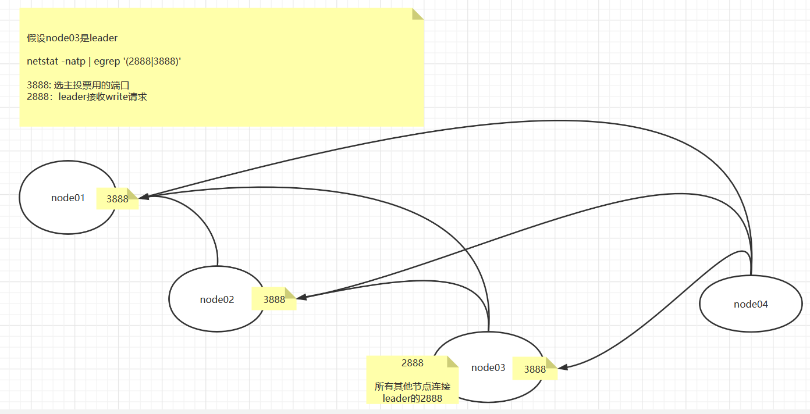

# zk安装及cli使用

> 官方下载地址：http://zookeeper.apache.org/releases.html   
> 选择最新稳定版下载（Apache ZooKeeper 3.7.0 是我们当前的版本，3.6.3 是我们最新的稳定版本。）     
> https://www.apache.org/dyn/closer.lua/zookeeper/zookeeper-3.6.3/apache-zookeeper-3.6.3-bin.tar.gz   

## 三个节点的集群安装
> 保证：已安装jdk，已配置jdk环境变量   
> 安装目录：/usr/local/zk/    
> 数据目录：/var/zk/   
> apache-zookeeper-3.6.3-bin.tar.gz    

``` 
# 切换目录并上传安装文件
cd /usr/local/zk/

# 解压
tar xf apache-zookeeper-3.6.3-bin.tar.gz

# 复制一个配置文件
cd /conf
cp zoo_sample.cfg zoo.cfg

# 修改配置文件
vim zoo.cfg
【
dataDir=/var/zk/
# 文件末尾写入所有节点（根据节点列表计算过半数；2888用于leader接收write请求；3888用于节点间通信，选举leader）
server.1=node01:2888:3888
server.2=node02:2888:3888
server.3=node03:2888:3888
】

# 需要修改hosts文件
vim /etc/hosts
# 文件末尾 新增  ip 域名（别名）
39.100.158.215 node01
106.14.158.60 node02
47.95.121.160 node03

# 创建 dataDir 配置的目录
cd /var
mkdir zk

# dataDir 目录下，创建 myid 文件，并写入 唯一id值
cd /var/zk/
vim myid
写入1，保存退出

# 分发至其他机器（重复操作所有节点）
cd /usr/local/
scp -r ./zk/ node02:`pwd`
输入密码验证，等待传输完成 

去节点2，创建dataDir，并创建myid，写入唯一id值（id值和配置文件中的一致。server.后面的数字）

# 配置环境变量
vim /etc/profile
【
JAVA_HOME=/home/jdk1.8
ZOOKEEPER_HOME=/usr/local/zk/apache-zookeeper-3.6.3-bin
PATH=$PATH:$JAVA_HOME/bin:$ZOOKEEPER_HOME/bin
】
source /etc/profile

# 启动程序（前台启动）
zkServer.sh start-foreground

# 启动报错：云服务器ip问题
解决方案：配置文件【quorumListenOnAllIPs=true】
来源：https://blog.csdn.net/u014284000/article/details/74508963
```

netstat -natp | egrep '(2888|3888)'    
通过命令分析zk集群的socket连接情况   


## Cli 基本使用

``` 
# 使用客户端连接zk集群（默认连接本机）
zkCli.sh

# 查看支持的api
help 

# 查看 / 目录
ls /
# 创建 /node1
create /node1 "hello"
# 查看 /node1 
get -s node1
【
hello  //节点存储的值
cZxid = 0x400000002   // 创建的事务id
ctime = Sun Nov 07 15:24:41 CST 2021     // 创建的时间
mZxid = 0x400000003         // 修改的事务id
mtime = Sun Nov 07 15:25:14 CST 2021   // 修改的时间
pZxid = 0x400000002   
cversion = 0
dataVersion = 1
aclVersion = 0
ephemeralOwner = 0x0   // session id（临时节点时显示）
dataLength = 5
numChildren = 0
】
```