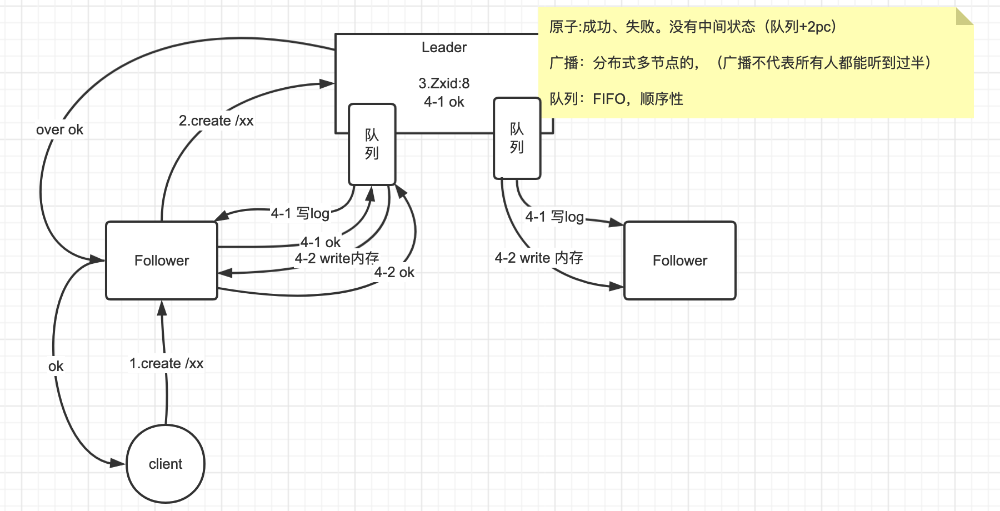

# 总结

#### ZooKeeper 是什么
> ZooKeeper 是一个分布式协调服务   
> 他是基于内存的目录树存储，在各个节点都可以存储数据（并非只有叶子节点可以存数据）   
> 他是主从架构，一主多从，而又天然有高可用性，他得高可用得益于他的主挂了，可以快速在从节点中快速恢复一个主   
> 他是基于 zab 实现的数据一致，zab改编自paxos算法   

#### ZooKeeper的数据一致性，paxos和zab

> paxos：基于消息传递的一致性算法    
> zab：paxos的变种，原子广播协议   
> 
> zk中的应用

- 概念
  - leader：主节点
  - follower：从节点
  - observer：没有投票权从节点，可以提高并发读
  - Zxid：事务id

> node01: myid：1   
> node02: myid：2   
> node03: myid：3   
> node04: myid：4 observer     
> node05: myid：5 observer  
> 
> 集群包括五台机器，但具有投票权的只有三台，过半数为2   
> 
> 集群启动：   
> 假设node01、node02、node03顺序启动   
> 当node02启动后，拥有投票权的服务已过半，则leader从node01、和node02中选出   
> 由于集群刚启动，所以所有的Zxid都是0，myid比较大小--> 所以node02 被选为leader
> 
> 集群现状：   
> leader：node02   
> follower：node01、node03    
> observer：node04、node05
> 
> （创建、修改、删除过程差不多）   
> 创建 /zkStudy 节点（过程可见下图）： 
> 
> 1、client 向 node01 发起create指令  
> 2、node01将写请求转发给leader   
> 3、leader基于创建，向所有节点发起投票    
> 4-1、node02自身投上一票，并将操作记录本地日志文件;   
> 4-2、node01收到投票请求，投上一票，并将操作记录本地日志文件，并返回ok；   
> 4-3、node03由于网络原因，未做出响应    
> 5、leader统计投票结果，总票数为3，投票数为2，过半票，所以认为创建可以成功，向所有节点发起创建指令      
> 6-1、leader 执行 create /zkStudy 创建节点，Zxid修改为1   
> 6-2、node01 执行 create /zkStudy 创建节点，Zxid修改为1   
> 6-3、node02,Zxid依然是0   
> 
> leader挂了，重新选主：    
> node03发现leader挂了，发起选主，选自己一票，（亮出自己的Zxid和myid）   
> node01收到node03的选举，发现node03的Zxid比自己小，说明数据不全，拒绝node03,并投自己一票选主   
> node03收到node01,向node01投上一票，票数为2，过半，node01成功被选为leader    
> 选主做两个比较：   
> 1.首先比较Zxid，Zxid表示数据完整性，一定在最大Zxid中选主   
> 2.当有多个节点的Zxid相同时，比较myid，选myid大的为主（推举而非抢夺）   

#### 了解ZooKeeper的watch机制吗
> ZooKeeper 可以在 znode 上设置 watch，当znode改变时，将会触发watch，回调客户端，watch是一次性的，触发后会被移除   
> 在 3.6.0 版本后，支持了永久的watch    

#### ZooKeeper 的节点有哪些分类
> ZooKeeper中的节点分为 持久节点和临时节点，这两种节点都支持序列   
> 持久节点：一直存在，不会因为客户端的断开而删除    
> 临时节点：session级别，客户端创建的EPHEMERAL节点，会随着客户端断联而被移除   
> 序列特性：允许各客户端创建同名znode，会自动编号结尾的形式同时存在   