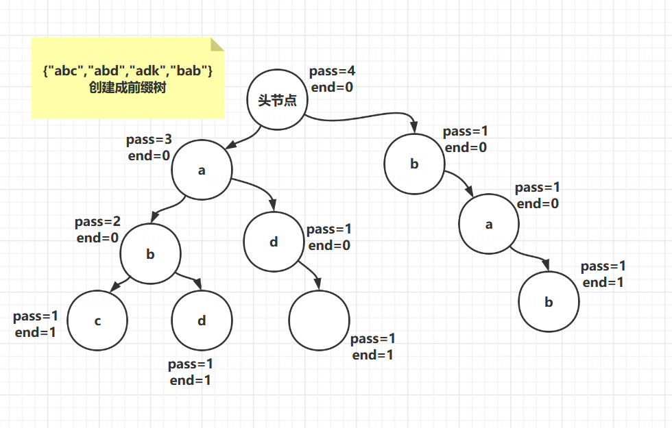

# 算法第五天学习

## 前缀树 （Trie tree）
> 定义：   
> 举个例子：有一个字符串数组{"abc","abd","adk","bab"}     
> 根据此数组创建一颗树，有个头节点，每个节点中维护一个pass（表示通过次数）一个end（表示结束次数）   
> 1.头节点pass+1，看第一个，a节点，此时没有，新建一个a节点，a节点的pass+1，end是0；
> a下面再看b，没有，a下面建b节点，b的pass+1，end是0；b下面再看c，没有，b下面建c节点，c的pass+1，end是1
> 2.看第二个数组，同上规则，所以ab复用，pass都加1，没有d，在b下面新建节点d，d的pass=1，end=1
> 3.以此类推
  

```
1.创建一个前缀树结构，支持以下方法
添加字符串：public void insert(String word)
word这个单词加入过的次数：public int search(String word)
所有加入的字符串中，有几个是以pre这个字符作为前缀的：public int prefixNumber(String pre)
删除字符串：pulic void delete(String word)
-->tips：删除之前先查一下是不是有。如果删的时候，发现某个节点pass为0，不往下删，直接上个节点指向空，让jvm去回收下面节点

代码见 Code01_TrieTree
```

## 不基于比较的排序——桶排序
桶排序思想下的排序： 计数排序 & 基数排序
> 桶排序思想下的排序都是不基于比较的排序   
> 时间复杂度O(N) , 额外空间复杂度 O(M)   
> 应用范围有限，需要样本的数据状况满足桶的划分   

计数排序（桶排序的一种，相当于用一个数字做桶）  
要求样本是整数，而且范围比较窄   
> 例子：一个数组中arr[] 存了N个员工的年龄，将数组排序   
> 员工年龄肯定不大于200岁，所以我创建一个help[201]，0位置表示0岁，201位置表示200岁   
> 遍历原数组，向help数组中写数，将对应位置 值++    
> 遍历help数组，对原数组进行覆盖。   
> 排序完成，时间复杂度 O(N)   
Code02_CountSort

基数排序（桶排序的一种，相当于用一个队列做桶）   
经典的基数排序用骚操作模拟队列入栈出栈过程   
要求样本是10进制的正整数   
> 例子：一个数组[100,5,13,27,17,29,19] 进行排序    
> 所有数字以位数最多的为准，补足位置，前面补0    
> 做一个0~9的数组，数组上挂着一个队列做桶     
> 以个位数字比较，放进对应桶中，放完之后在从0号桶开始倒回原数组   
> 然后以十位数字比较，放进对应桶中，放完之后从0号桶开始在倒回原数组   
> 以此类推比较到最高位，最后一次放回原数组时，有序了    
Code03_RadixSort   

## 排序算法总结

1.不基于比较的排序，对样本数据有严格要求，不易改写   
2.基于比较的排序，只要规定好两个样本怎么比大小就可以直接复用   
3.基于比较的排序，时间复杂度的极限是O(N*log(N))   
4.时间复杂度O(N*log(N))、额外空间复杂度低于O(N)、且稳定的基于比较的排序不存在   
5.为了绝对的速度选快排，为了省空间选堆排序，为了稳定性选归并排序   
     
