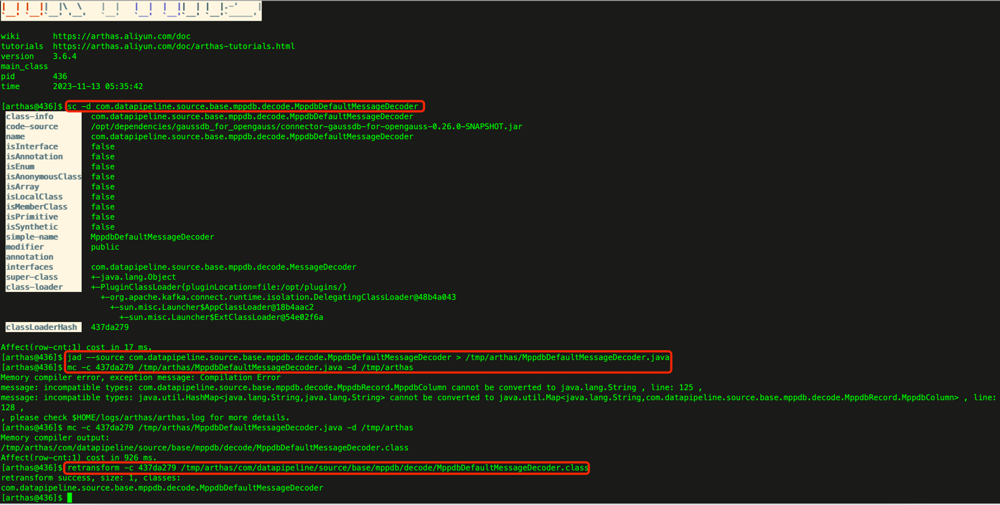

# arthas 修改线上代码

## 命令学习

> 使用的命令解释：
>  
> sc    
> 描述：查看 JVM 已加载的类信息    
> 参数：   
> [d] 输出当前类的详细信息，包括这个类所加载的原始文件来源、类的声明、加载的 ClassLoader 等详细信息。 如果一个类被多个 ClassLoader 所加载，则会出现多次
> 
> jad   
> 描述：反编译指定已加载类的源码    
> 参数：    
> [source-only] 默认情况下，反编译结果里会带有ClassLoader信息，通过--source-only选项，可以只打印源代码。方便和mc/retransform命令结合使用。    
> 
> mc    
> 描述：Memory Compiler/内存编译器，编译.java文件生成.class。   
> 参数：    
> [c] 可以通过-c参数指定 classloader    
> [d] 可以通过-d命令指定输出目录   
> 问题：   
> 使用mc命令来编译jad的反编译的代码有可能失败。可以在本地修改代码，编译好后再上传到服务器上。    
>  
> retransform   
> 描述：加载外部的.class文件，retransform jvm 已加载的类。   
> [c] 使用指定的类加载器   
> 限制：   
> 1、不允许新增加 field/method   
> 2、正在跑的函数，没有退出不能生效，比如下面新增加的System.out.println，只有run()函数里的会生效（https://arthas.aliyun.com/doc/retransform.html#retransform-%E7%9A%84%E9%99%90%E5%88%B6）

## 使用案例

> 1、查看类加载信息：sc -d com.datapipeline.source.base.mppdb.decode.MppdbDefaultMessageDecoder   
> 2、反编译运行中的class文件，得到java文件：jad --source com.datapipeline.source.base.mppdb.decode.MppdbDefaultMessageDecoder > /tmp/arthas/MppdbDefaultMessageDecoder.java    
> 3、修改java文件：vim /tmp/arthas/MppdbDefaultMessageDecoder.java    
> 4、编译修改后的java文件，得到class文件：mc -c 437da279 /tmp/arthas/MppdbDefaultMessageDecoder.java -d /tmp/arthas     
> 5、重新加载class文件：retransform -c 437da279 /tmp/arthas/com/datapipeline/source/base/mppdb/decode/MppdbDefaultMessageDecoder.class
> 

