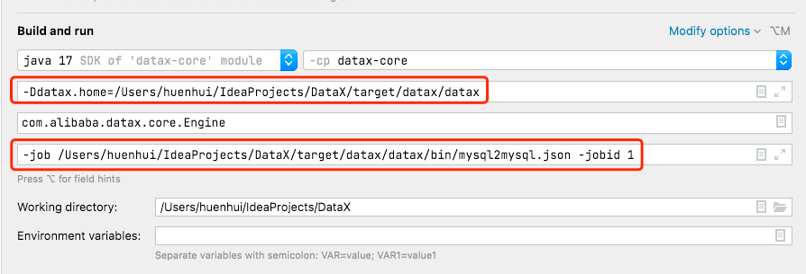
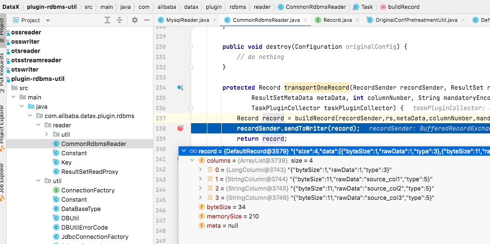
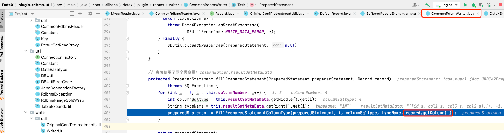

# datax

https://github.com/alibaba/DataX

## 使用体验
https://github.com/alibaba/DataX/blob/master/userGuid.md

### 工具部署
不是为了用而用，所以使用git clone源码的方式进行使用   
(1)、下载DataX源码：
```
git clone git@github.com:alibaba/DataX.git
```
(2)、通过maven打包：
```
cd  {DataX_source_code_home}
mvn -U clean package assembly:assembly -Dmaven.test.skip=true
```
打包成功后的DataX包位于 {DataX_source_code_home}/target/datax/datax/ ，结构如下：
```
cd  {DataX_source_code_home}
ls ./target/datax/datax/
bin		conf		job		lib		log		log_perf	plugin		script		tmp
```

### 配置使用：mysql-source —— mysql-sink
(1)、创建配置文件（json格式）   
进入对应目录：cd {DataX_source_code_home}/target/datax/datax/bin   

可以通过命令查看配置模板：    
python datax.py -r {YOUR_READER} -w {YOUR_WRITER}    
比如：python datax.py -r mysqlreader -w mysqlwriter >> mysql2mysql.json

根据模版修改如下：
```mysql2mysql.json 
{
    "job": {
        "content": [
            {
                "reader": {
                    "name": "mysqlreader", 
                    "parameter": {
                        "column": ["id","col1","col2","col3"], 
                        "connection": [
                            {
                                "jdbcUrl": ["jdbc:mysql://heh-mysql:3306/datapipeline"], 
                                "table": ["datax_source"]
                            }
                        ], 
                        "password": "Datapipeline123", 
                        "username": "root"
                    }
                }, 
                "writer": {
                    "name": "mysqlwriter", 
                    "parameter": {
                        "column": ["id","col1","col2","col3"], 
                        "connection": [
                            {
                                "jdbcUrl": "jdbc:mysql://heh-mysql:3306/datapipeline", 
                                "table": ["datax_sink"]
                            }
                        ], 
                        "password": "Datapipeline123", 
                        "username": "root", 
                        "writeMode": "update"
                    }
                }
            }
        ], 
        "setting": {
            "speed": {
                "channel": "1"
            }
        }
    }
}
```

**需要注意**：mysql-reader的jdbcUrl是数组，mysql-writer的jdbcUrl是字符串
### 启动
``` 
cd {DataX_source_code_home}/target/datax/datax/bin   
python datax.py ./mysql2mysql.json   
```

## 疑问
1、想要不使用脚本启动，而是直接在程序中传参启动从而debug应该如何做？    
启动类： com.alibaba.datax.core.Engine    
VM options：-Ddatax.home=/Users/huenhui/IdeaProjects/DataX/target/datax/datax    
Program arguments：-job /Users/huenhui/IdeaProjects/DataX/target/datax/datax/bin/mysql2mysql.json -jobid 1    


2、datax是怎么知道我想将哪个字段映射到哪个字段（字段映射的规则？）  
通过debug发现，reader读到的数据，转换为record后，是一个数组，且不包含字段名称信息，   
所以可以知道，record数组的值的顺序就是配置文件中配置的字段的顺序
     
看writer部分使用record的逻辑，是使用下标进行匹配的，所以配置reader和writer的column时，顺序就是字段映射。
且看源码发现reader配置的字段数量和writer配置的字段数量必须一致。



## datax 开发宝典
https://github.com/alibaba/DataX/blob/master/dataxPluginDev.md

## 分析

datax对于企业中没有相关配套设施，且只需一次性数据迁移的场景比较合适 

有哪些限制 ？  

不支持增量日志捕获数据      
完全基于内存，不支持类似断点续传的功能，任务报错后重新启动，需要重来（不过相当于只有全量快照阶段，没有增量阶段，可能其他产品的全量阶段也是重来）   
修改各类数据库节点配置时，直接修改json文件，如何填写配置及填写错了如何排查较为复杂      


