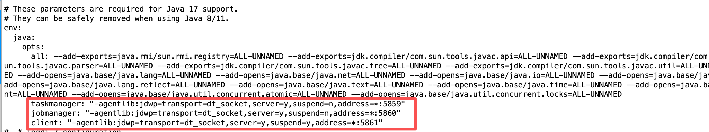

# Seatunnel & Flink
> 版本说明：2.3.13-SNAPSHOT 和 flink-2.1.0不兼容

## seatunnel 提交flink脚本开启debug

vim apache-seatunnel-2.3.13-SNAPSHOT/bin/start-seatunnel-flink-15-connector-v2.sh
```text
CMD=$(java ${JAVA_OPTS} -agentlib:jdwp=transport=dt_socket,server=y,suspend=n,address=*:5858 -cp ${CLASS_PATH} ${APP_MAIN} ${args}) && EXIT_CODE=$? || EXIT_CODE=$?
```


## flink 开启debug

vim flink-2.1.0/conf/config.yaml
```text
# These parameters are required for Java 17 support.
# They can be safely removed when using Java 8/11.
env:
  java:
    opts:
      all: --add-exports=java.rmi/sun.rmi.registry=ALL-UNNAMED --add-exports=jdk.compiler/com.sun.tools.javac.api=ALL-UNNAMED --add-exports=jdk.compiler/com.sun.tools.javac.file=ALL-UNNAMED --add-exports=jdk.compiler/com.sun.tools.javac.parser=ALL-UNNAMED --add-exports=jdk.compiler/com.sun.tools.javac.tree=ALL-UNNAMED --add-exports=jdk.compiler/com.sun.tools.javac.util=ALL-UNNAMED --add-exports=java.security.jgss/sun.security.krb5=ALL-UNNAMED --add-opens=java.base/java.lang=ALL-UNNAMED --add-opens=java.base/java.net=ALL-UNNAMED --add-opens=java.base/java.io=ALL-UNNAMED --add-opens=java.base/java.nio=ALL-UNNAMED --add-opens=java.base/sun.nio.ch=ALL-UNNAMED --add-opens=java.base/java.lang.reflect=ALL-UNNAMED --add-opens=java.base/java.text=ALL-UNNAMED --add-opens=java.base/java.time=ALL-UNNAMED --add-opens=java.base/java.util=ALL-UNNAMED --add-opens=java.base/java.util.concurrent=ALL-UNNAMED --add-opens=java.base/java.util.concurrent.atomic=ALL-UNNAMED --add-opens=java.base/java.util.concurrent.locks=ALL-UNNAMED
      taskmanager: "-agentlib:jdwp=transport=dt_socket,server=y,suspend=n,address=*:5859"
      jobmanager: "-agentlib:jdwp=transport=dt_socket,server=y,suspend=n,address=*:5860"
      client: "-agentlib:jdwp=transport=dt_socket,server=y,suspend=y,address=*:5861"
```
