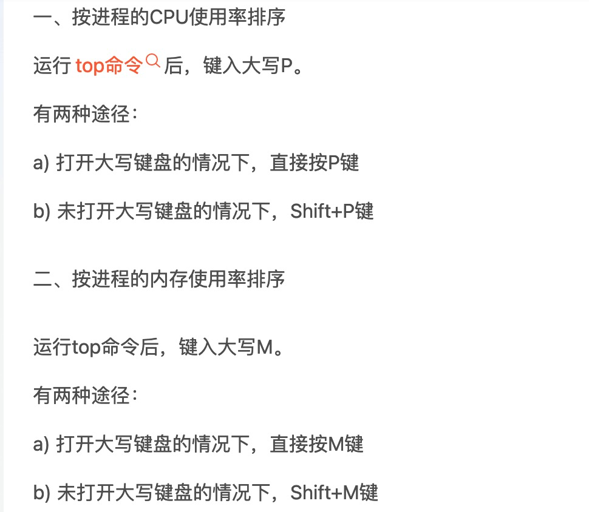

# 问题排查专题

## 常用命令

### kafka相关命令
``` 
# 查看topic列表
kafka-topics --bootstrap-server kafka1:9092 --list

# 查看topic[offset_connect_source_dp]的信息（分区数、副本因子、配置项-数据回收时间、大小两个策略、每个分区的leader、isr）
kafka-topics --bootstrap-server kafka1:9092 --describe --topic offset_connect_sink_dp

# 从头消费topic[offset_connect_source_dp]，带着时间戳和key
kafka-console-consumer --bootstrap-server kafka1:9092 --topic offset_connect_source_dp --from-beginning --property print.key=true --property print.timestamp=true

# 从指定分区的指定偏移开始消费，只消费1条
kafka-console-consumer --bootstrap-server kafka1:9092 --topic offset_connect_source_dp --partition 1 --offset 1 --max-messages 1

```

### 网络抓包相关
> 抓本机与某ip的网络交互，以明文展示：tcpdump net xx_ip_xx -A     
> 
> 使用场景 ：    
> 1、需要分析发的网络包是否为预期内容；     
>  
> 2、可以根据握手和挥手的细节，分析网络相关报错，由谁发起的断连，从而分析网络报错是否有客户端编码导致      

### 在线debug（尽量不要在生产环境使用）

使用java -jar 如何开启debug：java -agentlib:jdwp=transport=dt_socket,server=y,suspend=n,address=5005 -jar YourApp.jar

> jdb:    
1.修改compose文件，打开debug：KAFKA_DEBUG=true(和开发机使用一样，source、sink、manager是kafka_debug。web是debug)    
2.重启容器，让debug配置生效    
3.进入对应容器：docker exec -it sourcedp1 bash     
4.使用jdb连接服务，jdb -attach localhost:5005    
5.打断点：stop at com.datapipeline.base.connector.source.DpAbstractReader:209    
6.查看当前断点停留位置：where    
7.查看变量名称：eval e.getMessage()     
8.查看有哪些线程：threads    
9.thread 线程名称     
10.执行下一行：next    
11.查看有哪些断点：clear     
12.执行到下一个断点：run    
13.查看当前局部变量：locals


### 内存相关
#### jvm
> 使用arthas 利用dashboard监控内存使用变化
>  
> 使用jmap: jmap -dump:live,format=b,file=/home/dump.hprof java进程id   
>  
> 


#### top 命令


#### 每隔一段时间记录 free -h 和 docker stats 的脚本
``` 
#!/bin/bash

# 定义日志文件路径
LOG_FILE="/root/monitor/docker_stats.log"

# 每分钟执行一次循环
while true; do
  # 获取当前日期和时间
  CURRENT_TIME=$(date +"%Y-%m-%d %H:%M:%S")

  # 获取 Docker 容器的状态并将其附加到日志文件
  docker stats --no-stream >> "$LOG_FILE"

  # 获取系统内存使用情况并将其附加到日志文件
  free -h >> "$LOG_FILE"

  # 在日志中添加时间戳
  echo "----------------------------------------" >> "$LOG_FILE"
  echo "Timestamp: $CURRENT_TIME" >> "$LOG_FILE"
  echo "----------------------------------------" >> "$LOG_FILE"

  # 等待 1 分钟
  sleep 60
done
```
#### 每隔一段时间记录top按内存排序的脚本
``` 
#!/bin/bash

# 定义日志文件路径
log_file="/root/monitor/top_memory.log"

# 运行top命令并将结果追加到日志文件
while true; do
  # 获取当前日期和时间
  CURRENT_TIME=$(date +"%Y-%m-%d %H:%M:%S")

    # 获取top 按内存排序，前30行
    top -b -n 1 -o +%MEM | head -n 30 >> "$log_file"

  # 在日志中添加时间戳
  echo "----------------------------------------" >> "$log_file"
  echo "Timestamp: $CURRENT_TIME" >> "$log_file"
  echo "----------------------------------------" >> "$log_file"
    sleep 600  # 休眠10分钟
done
```
