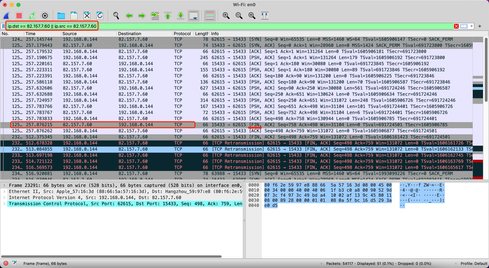
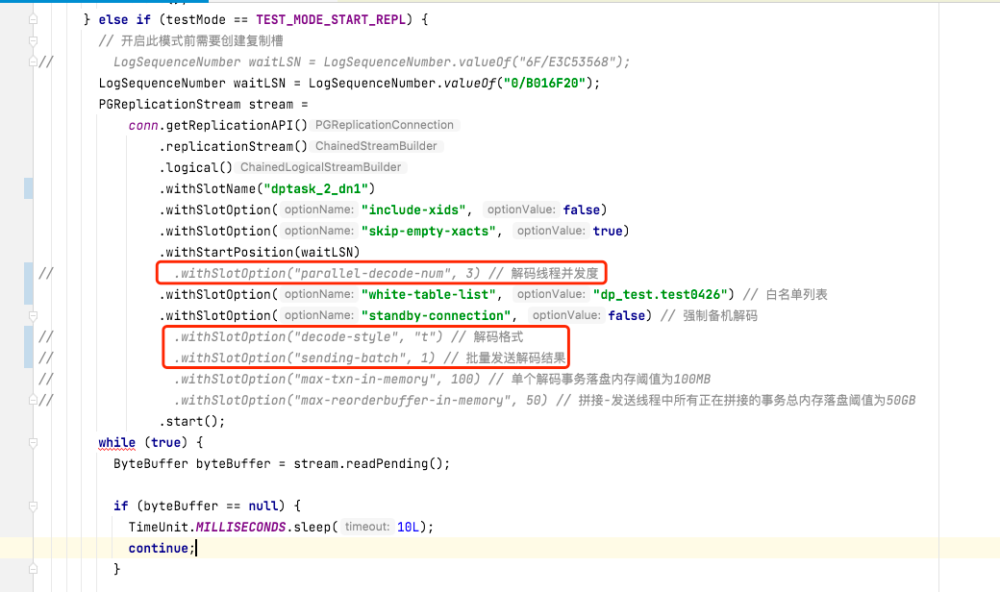
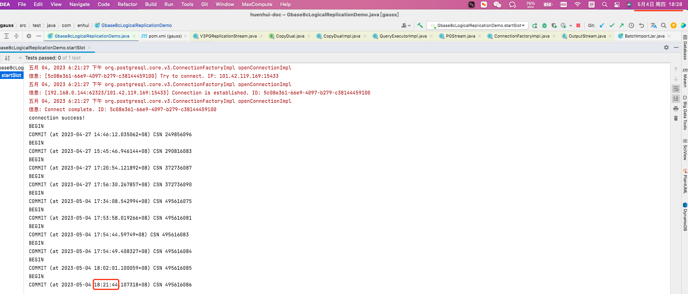

# gbase 8c Broken pipe (Write failed)故障排查

环境信息：
> master：101.42.119.169          192.168.64.50   
> node1:  43.138.123.50           192.168.64.98   
> node2:  82.157.7.60             192.168.64.96   
> 
> gsql -d dp_test -p 15433 -ar 
## 直接问题
报错堆栈如下
``` 
org.postgresql.util.PSQLException: Database connection failed when writing to copy
	at org.postgresql.core.v3.QueryExecutorImpl.flushCopy(QueryExecutorImpl.java:1130)
	at org.postgresql.core.v3.CopyDualImpl.flushCopy(CopyDualImpl.java:23)
	at org.postgresql.core.v3.replication.V3PGReplicationStream.updateStatusInternal(V3PGReplicationStream.java:192)
	at org.postgresql.core.v3.replication.V3PGReplicationStream.timeUpdateStatus(V3PGReplicationStream.java:183)
	at org.postgresql.core.v3.replication.V3PGReplicationStream.readInternal(V3PGReplicationStream.java:123)
	at org.postgresql.core.v3.replication.V3PGReplicationStream.readPending(V3PGReplicationStream.java:80)
	at com.enhui.Gbase8cLogicalReplicationDemo.slot(Gbase8cLogicalReplicationDemo.java:140)
	at com.enhui.Gbase8cLogicalReplicationDemo.startSlot(Gbase8cLogicalReplicationDemo.java:99)
	at sun.reflect.NativeMethodAccessorImpl.invoke0(Native Method)
	at sun.reflect.NativeMethodAccessorImpl.invoke(NativeMethodAccessorImpl.java:62)
	at sun.reflect.DelegatingMethodAccessorImpl.invoke(DelegatingMethodAccessorImpl.java:43)
	at java.lang.reflect.Method.invoke(Method.java:498)
	at org.junit.runners.model.FrameworkMethod$1.runReflectiveCall(FrameworkMethod.java:59)
	at org.junit.internal.runners.model.ReflectiveCallable.run(ReflectiveCallable.java:12)
	at org.junit.runners.model.FrameworkMethod.invokeExplosively(FrameworkMethod.java:56)
	at org.junit.internal.runners.statements.InvokeMethod.evaluate(InvokeMethod.java:17)
	at org.junit.internal.runners.statements.RunBefores.evaluate(RunBefores.java:26)
	at org.junit.runners.ParentRunner$3.evaluate(ParentRunner.java:306)
	at org.junit.runners.BlockJUnit4ClassRunner$1.evaluate(BlockJUnit4ClassRunner.java:100)
	at org.junit.runners.ParentRunner.runLeaf(ParentRunner.java:366)
	at org.junit.runners.BlockJUnit4ClassRunner.runChild(BlockJUnit4ClassRunner.java:103)
	at org.junit.runners.BlockJUnit4ClassRunner.runChild(BlockJUnit4ClassRunner.java:63)
	at org.junit.runners.ParentRunner$4.run(ParentRunner.java:331)
	at org.junit.runners.ParentRunner$1.schedule(ParentRunner.java:79)
	at org.junit.runners.ParentRunner.runChildren(ParentRunner.java:329)
	at org.junit.runners.ParentRunner.access$100(ParentRunner.java:66)
	at org.junit.runners.ParentRunner$2.evaluate(ParentRunner.java:293)
	at org.junit.runners.ParentRunner$3.evaluate(ParentRunner.java:306)
	at org.junit.runners.ParentRunner.run(ParentRunner.java:413)
	at org.junit.runner.JUnitCore.run(JUnitCore.java:137)
	at com.intellij.junit4.JUnit4IdeaTestRunner.startRunnerWithArgs(JUnit4IdeaTestRunner.java:69)
	at com.intellij.rt.junit.IdeaTestRunner$Repeater.startRunnerWithArgs(IdeaTestRunner.java:33)
	at com.intellij.rt.junit.JUnitStarter.prepareStreamsAndStart(JUnitStarter.java:235)
	at com.intellij.rt.junit.JUnitStarter.main(JUnitStarter.java:54)
Caused by: java.net.SocketException: Broken pipe (Write failed)
	at java.net.SocketOutputStream.socketWrite0(Native Method)
	at java.net.SocketOutputStream.socketWrite(SocketOutputStream.java:111)
	at java.net.SocketOutputStream.write(SocketOutputStream.java:155)
	at java.io.BufferedOutputStream.flushBuffer(BufferedOutputStream.java:82)
	at java.io.BufferedOutputStream.flush(BufferedOutputStream.java:140)
	at org.postgresql.core.PGStream.flush(PGStream.java:527)
	at org.postgresql.core.v3.QueryExecutorImpl.flushCopy(QueryExecutorImpl.java:1127)
	... 33 more
```


## 排查
> 该问题是客户端读取复制槽时出现的错误。    
> 怀疑是客户端读取过程中，服务端断开了连接，导致出现该问题。    
> 
> 需要通过抓包，来定位是服务端主动断开连接    
> 使用wireshark进行抓包，对本机与82.157.7.60机器的交互都过滤出来   
> 可以发现是服务端发起的 FIN


通过去服务端机器，查看网络连接情况，发现每次运行程序读取复制槽，该进程都会短暂的退出（pid前后不同），然后查看进程运行时长发现确实如此
```
-- 查看端口使用情况，可以看到pid
[root@gbase_master ~]# lsof -i:15432
COMMAND  PID  USER   FD   TYPE   DEVICE SIZE/OFF NODE NAME
gaussdb 3820 gbase    8u  IPv4 97817992      0t0  TCP *:15432 (LISTEN)
gaussdb 3820 gbase    9u  IPv6 97817993      0t0  TCP *:15432 (LISTEN)
gaussdb 3820 gbase   99u  IPv4 97861710      0t0  TCP gbase_master:15432->gbase_node1:42682 (ESTABLISHED)
gaussdb 3820 gbase  107u  IPv4 97869285      0t0  TCP gbase_master:15432->gbase_node1:shaperai (ESTABLISHED)

-- 根据pid查询进程启动时间和运行时长
[root@gbase_master ~]# ps -p 3820 -o lstart,etime
                 STARTED     ELAPSED
Thu May  4 17:29:22 2023       07:25
```

原厂排查后，建议去掉部分并行解析相关的参数,修改后不在出现报错，但新的问题是读取不到增量数据，只有BEGIN和COMMIT消息




```xml
    <dependencies>
        <dependency>
            <groupId>org.opengauss</groupId>
            <artifactId>opengauss-jdbc</artifactId>
            <version>3.1.0</version>
        </dependency>
        <dependency>
            <groupId>junit</groupId>
            <artifactId>junit</artifactId>
            <version>4.13.2</version>
            <scope>test</scope>
        </dependency>
        <dependency>
            <groupId>com.zaxxer</groupId>
            <artifactId>HikariCP</artifactId>
            <version>4.0.3</version>
            <scope>compile</scope>
        </dependency>
    </dependencies>
```

```java
package com.enhui;

import org.junit.Before;
import org.junit.Test;
import org.postgresql.PGProperty;
import org.postgresql.jdbc.PgConnection;
import org.postgresql.replication.LogSequenceNumber;
import org.postgresql.replication.PGReplicationStream;

import java.nio.ByteBuffer;
import java.sql.DriverManager;
import java.sql.ResultSet;
import java.sql.SQLException;
import java.sql.Statement;
import java.util.Properties;
import java.util.concurrent.TimeUnit;

public class Gbase8cLogicalReplicationDemo {
  private static PgConnection conn = null;
  // 测试模式：创建逻辑复制槽
  int TEST_MODE_CREATE_SLOT = 1;
  // 测试模式：开启逻辑复制（前提条件是逻辑复制槽已经存在）
  int TEST_MODE_START_REPL = 2;
  // 测试模式：删除逻辑复制槽
  int TEST_MODE_DROP_SLOT = 3;

  @Before
  public void before() {
    String driver = "org.postgresql.Driver";
    // 此处配置数据库IP以及端口，这里的端口为haPort，通常默认是所连接DN的port+1端口
    // master：101.42.119.169          192.168.64.50
    //node1:     43.138.123.50          192.168.64.98
    //node2:     82.157.7.60              192.168.64.96
    String masterIp = "101.42.119.169";
    String node1Ip = "43.138.123.50";
    String node2Ip = "82.157.7.60";
    String dn1Ip = masterIp;
    int port = 15433;
    String sourceURL = String.format("jdbc:postgresql://%s:%s/dp_test", dn1Ip, port);

    try {
      Class.forName(driver);
      Properties properties = new Properties();
      PGProperty.USER.set(properties, "dp_test");
      PGProperty.PASSWORD.set(properties, "Datapipeline123!");
      // 对于逻辑复制，以下三个属性是必须配置项
      PGProperty.ASSUME_MIN_SERVER_VERSION.set(properties, "9.4");
      PGProperty.REPLICATION.set(properties, "database");
      PGProperty.PREFER_QUERY_MODE.set(properties, "simple");
      conn = (PgConnection) DriverManager.getConnection(sourceURL, properties);
      System.out.println("connection success!");
    } catch (Exception e) {
      e.printStackTrace();
      return;
    }
  }

  @Test
  public void showTables() throws SQLException {
    Statement statement = conn.createStatement();
    ResultSet resultSet = statement.executeQuery("select * from pg_tables");
    while (resultSet.next()) {
      String name1 = resultSet.getString(1);
      String name2 = resultSet.getString(2);
      if (name2.contains("heh")) {
        System.out.println(name1 + " " + name2);
      }
    }
  }

  @Test
  public void createTable() throws SQLException {
    Statement statement = conn.createStatement();
    String tableName = "heh_test_t1";
    statement.execute(
        "create table "
            + tableName
            + "\n"
            + "(\n"
            + "\tid serial\n"
            + "\t\tconstraint heh_test_t1_pk\n"
            + "\t\t\tprimary key,\n"
            + "\tcolumn_2 int,\n"
            + "\tcolumn_3 int,\n"
            + "\tcolumn_4 int\n"
            + ");\n"
            + "\n");
    System.out.println("创建成功：" + tableName);
  }

  @Test
  public void createSlot() {
    slot(TEST_MODE_CREATE_SLOT);
    System.out.println("create slot");
  }

  @Test
  public void startSlot() {
  slot(TEST_MODE_START_REPL);
  System.out.println("start slot");
  }

  @Test
  public void dropSlot() {
    slot(TEST_MODE_DROP_SLOT);
    System.out.println("drop slot");
  }

  public void slot(int testMode) {
    try {
      // 默认逻辑复制槽的名称是：replication_slot
      if (testMode == TEST_MODE_CREATE_SLOT) {
        conn.getReplicationAPI()
            .createReplicationSlot()
            .logical()
            .withSlotName("replication_slot") // 这里字符串如包含大写字母则会自动转化为小写字母
            .withOutputPlugin("mppdb_decoding")
            .make();
      } else if (testMode == TEST_MODE_START_REPL) {
        // 开启此模式前需要创建复制槽
//        LogSequenceNumber waitLSN = LogSequenceNumber.valueOf("6F/E3C53568");
        LogSequenceNumber waitLSN = LogSequenceNumber.valueOf("0/B016F20");
        PGReplicationStream stream =
            conn.getReplicationAPI()
                .replicationStream()
                .logical()
                .withSlotName("dptask_2_dn1")
                .withSlotOption("include-xids", false)
                .withSlotOption("skip-empty-xacts", true)
                .withStartPosition(waitLSN)
//                .withSlotOption("parallel-decode-num", 3) // 解码线程并发度
                .withSlotOption("white-table-list", "dp_test.test0426") // 白名单列表
                .withSlotOption("standby-connection", false) // 强制备机解码
//                .withSlotOption("decode-style", "t") // 解码格式
//                .withSlotOption("sending-batch", 1) // 批量发送解码结果
//                .withSlotOption("max-txn-in-memory", 100) // 单个解码事务落盘内存阈值为100MB
//                .withSlotOption("max-reorderbuffer-in-memory", 50) // 拼接-发送线程中所有正在拼接的事务总内存落盘阈值为50GB
                .start();
        while (true) {
          ByteBuffer byteBuffer = stream.readPending();

          if (byteBuffer == null) {
            TimeUnit.MILLISECONDS.sleep(10L);
            continue;
          }

          int offset = byteBuffer.arrayOffset();
          byte[] source = byteBuffer.array();
          int length = source.length - offset;
          System.out.println(new String(source, offset, length));

          // 如果需要flush lsn，根据业务实际情况调用以下接口
          // LogSequenceNumber lastRecv = stream.getLastReceiveLSN();
          // stream.setFlushedLSN(lastRecv);
          // stream.forceUpdateStatus();
        }
      } else if (testMode == TEST_MODE_DROP_SLOT) {
        conn.getReplicationAPI().dropReplicationSlot("replication_slot");
      }
    } catch (Exception e) {
      e.printStackTrace();
//      throw new RuntimeException(e);
    }
  }
}

```
