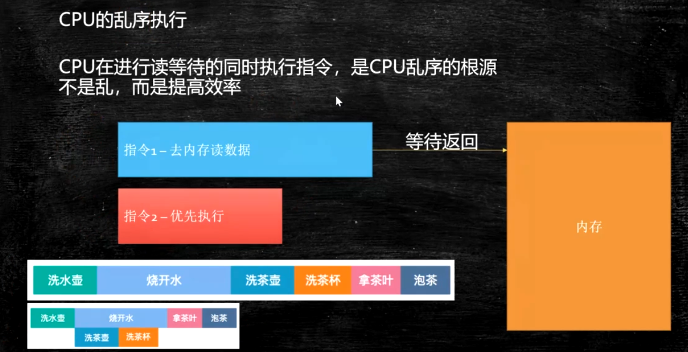
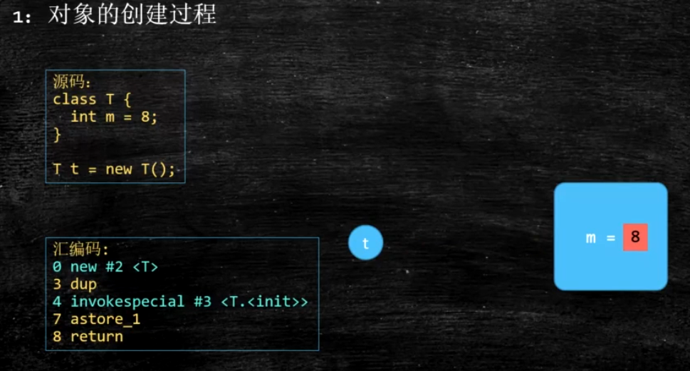
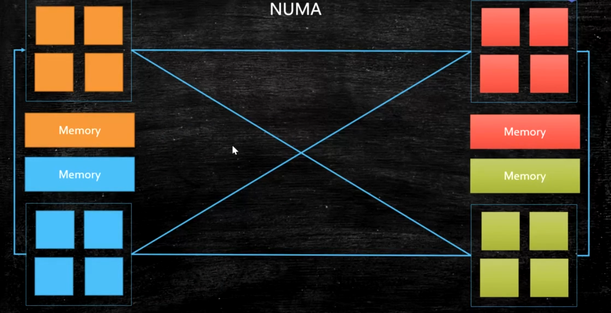

create by 胡恩会   
create time 2020-05-11   

## 硬件基本知识
cpu和内存是计算机的核心。  
 
### cpu的原理
计算机需要解决的最根本问题，就是如何代表数字  
CPU是现代计算机的核心部件，又称为“微处理器”。CPU里面最重要的东西就是晶体管。
提高CPU的速度，最重要的一点说白了就是如何在相同的CPU面积里面放进去更加多的晶体管，
晶体管其实就是一个双位的开关：即开和关，对于机器来说即0和1。

### cpu的基本组成
 
PC -> Program Counter 程序计数器 （记录当前指令地址）   
Registers -> 寄存器 暂时存储CPU计算需要用到的数据   
ALU -> Arithmetic & Logic Unit 运算单元   
CU -> Control Unit 控制单元   
MMU -> Memory Management Unit 内存管理单元   
cache -> 缓存，一般分三级：一级缓存（L1），二级缓存（L2），三级缓存（L3）    

超线程cpu，其实就是一个ALU对应多个PC和Registers，减小了线程切换之间的开销

### 缓存
缓存的物理结构见下图，主要了解L1，L2，L3的位置   
     
    
按块读取：根据程序局部性原理，当读到一个数据的时候，有很大概率会用到他相邻数据，
可以提高效率，所以在缓存中引入缓存行（Cache Line）的概念   
缓存行：   
缓存行越大，局部性空间效率越高，但读取时间慢   
缓存行越小，局部性空间效率越低，但读取时间快   
取一个折中值，因特尔cpu为：64字节     
 
缓存一致性：    
以上图为例，假设两个cpu间的数据要保持一致性，
当两个cpu同时读取 `x y` 所在的cache line且分别操作 `x y`时，底层会遵循 缓存一致性协议    
intel（因特尔）的cpu使用MESI cache一致性协议   
MESI cache一致性协议简单来说就是当一个cpu改变缓存行中某数据后，其他cpu需要重新读取该缓存行数据   
MESI cache一致性协议（可了解，不重要）：https://www.cnblogs.com/z00377750/p/9180644.html    
MESI cache一致性协议是缓存锁实现之一，有些无法被缓存的数据或者跨越多个缓存行的数据，则必须使用总线锁

伪共享问题：   
对于一些多线程竞争激烈的资源，如果多个资源同时存在于一个缓存行中，会导致伪共享问题。    
伪共享：就是上面说的为了保证数据一致性，多个线程之间读取的数据频繁更新（重新从主存中读取）  
  
缓存行对齐：   
为了解决伪共享问题出现的一种编程方式，    
jdk7中常用long padding。即前面7个long，后面7个long（仅适用于cache line为64字节的cpu）   
    
jdk8中加入了@Contended注解，会根据cpu的cache line长度补齐。执行时VM options需要加上：-XX:-RestrictContended        
     

### cpu的乱序执行
    
乱序可能出现的问题：DCL单例为什么加volatile   
首先从对象的创建过程开始分析： 
   
1.首先在内存中开辟一块空间，当前成员变量的值为默认值0（半初始化状态）   
2.执行构造方法，将成员变量赋值为8   
3.建立t与内存的关联   
    
4.当第一个线程开辟一块空间，且发生指令重排序，指向了半初始化状态的对象（未执行构造函数）      
5.第二个线程进来执行，判断对象不为null，直接使用了半初始化对象    
6.这种情况导致DCL单例模式出现问题，所以DCL单例模式需要加volatile关键字    
   
### 如何禁止乱序
CPU层面：Intel -> 原语，即汇编指令(mfence lfence sfence) 或者锁总线  
JVM层面：重排序必须遵循的8条规则（hanppens-before原则） 4个内存屏障 （LoadLoad屏障 LoadStore屏障 StoreLoad屏障 StoreStore屏障）   
   
as-if-serial : 不管硬件什么顺序，单线程执行的结果不变，看上去像是serial    

### UMA 和 NUMA
UMA（Uniform Memory Access）统一访问内存       
   
NUMA（Non Uniform Memory Access）非统一访问内存   
分配内存会优先分配该线程所在CPU的最近内存       
   

## 操作系统（OS）

### 用户态和内核态
   
cpu分不同的指令级别   
linux内核跑在ring0级，用户程序跑在ring3级，
对于系统的关键访问，需要经过kernel（内核）的同意，保证系统健壮性   

### 进程 线程 纤程 中断