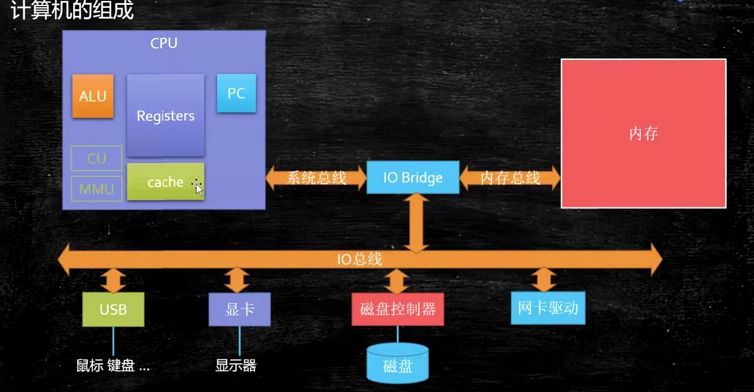
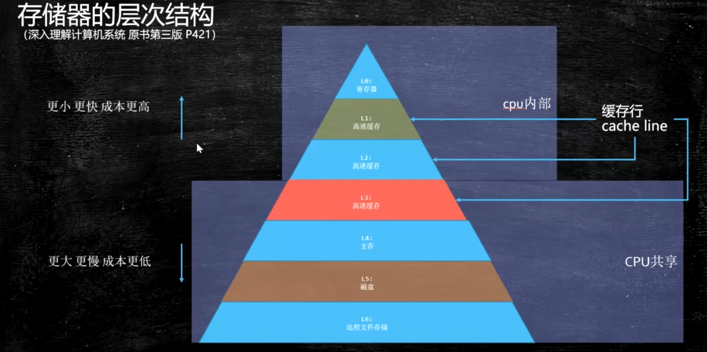

# Java程序员需要了解的底层知识
create by 胡恩会   
create time 2020-05-11   

# 硬件基本知识
## cpu的原理
计算机需要解决的最根本问题，就是如何代表数字  
CPU是现代计算机的核心部件，又称为“微处理器”。CPU里面最重要的东西就是晶体管。
提高CPU的速度，最重要的一点说白了就是如何在相同的CPU面积里面放进去更加多的晶体管，
晶体管其实就是一个双位的开关：即开和关，对于机器来说即0和1。

## cpu的基本组成
 
PC -> Program Counter 程序计数器 （记录当前指令地址）   
Registers -> 寄存器 暂时存储CPU计算需要用到的数据   
ALU -> Arithmetic & Logic Unit 运算单元   
CU -> Control Unit 控制单元   
MMU -> Memory Management Unit 内存管理单元   
cache -> 缓存，一般分三级：一级缓存（L1），二级缓存（L2），三级缓存（L3）    

超线程cpu，其实就是一个ALU对应多个PC和Registers，减小了线程切换之间的开销
## 缓存

缓存的物理结构，主要了解L1，L2，L3的位置   
     

   

按块读取：根据程序局部性原理，当读到一个数据的时候，有很大概率会用到他相邻数据，
可以提高效率，所以在缓存中引入缓存行（Cache Line）的概念   
 
以上图为例，假设两个cpu间的数据要保持一致性，这里称两个cpu分别为c1，c2.
当两个cpu同时读取 `x y` 所在的cache line且分别操作 `x y`时，
底层会遵循 缓存一致性协议
 
intel（因特尔）的cpu使用MESI cache一致性协议   
MESI cache一致性协议简单来说就是当一个cpu改变某缓存行数据后，其他cpu需要重新读取该缓存行数据   
MESI cache一致性协议：https://www.cnblogs.com/z00377750/p/9180644.html    
MESI cache一致性协议是缓存锁实现之一，有些无法被缓存的数据或者跨越多个缓存行的数据，则必须使用总线锁

缓存行：   
缓存行越大，局部性空间效率越高，但读取时间慢   
缓存行越小，局部性空间效率越低，但读取时间快   
取一个折中值，目前多用：64字节 （intel cpu）  

