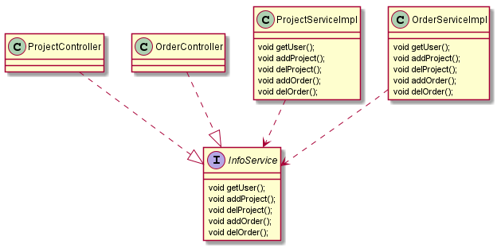
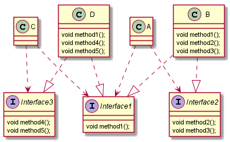

# 七大设计原则
设计原则是程序员在编程时应当遵守的原则，也是各种设计模式的基础（即设计模式为什么这样设计的依据）

设计原则的核心思想：
1. 找出应用中可能需要变化之处，把他们独立出来，不要和那些不需要变化的代码混在一起
2. 针对接口编程，而不是针对实现类编程
3. 为了交互对象之间的松耦合设计而努力

## 单一职责原则      
这个原则是对类来说的，一个类应该只负责一项职责。比如订单类只负责订单相关的操作，用户类只负责用户相关的操作       

## 接口隔离原则
客户端不应该依赖他不需要的接口，即一个类对另一个类的依赖应该建立在最小的接口上     

**示例：**     
类 ProjectController 通过接口 InfoService 依赖类 ProjectServiceImpl ，     
类 OrderController 通过接口 InfoService 依赖类 OrderServiceImpl ,       
如果接口 InfoService 对于类 ProjectController 和类 OrderController 来说不是最小接口，        
那么类 ProjectServiceImpl 和类 OrderServiceImpl 必须去实现他们不需要的方法。               
类 ProjectController 要使用 getUser() addProject() delProject() 方法       
类 OrderController 要使用 getUser() addOrder() delOrder()  方法        
1.所有的方法都在接口 InfoService 中定义，类 ProjectServiceImpl 和类 OrderServiceImpl 重写全部的方法。          
     
2.按照隔离原则处理：将接口 InfoService 拆分为独立的几个接口，类 ProjectController 和类 OrderController 分别与他们需要的接口建立依赖关系        
  
[如果不能理解上面的类图，可以参考百度百科](https://baike.baidu.com/item/%E6%8E%A5%E5%8F%A3%E9%9A%94%E7%A6%BB%E5%8E%9F%E5%88%99)

## 依赖倒转原则        
依赖倒置原则（Dependence Inversion Principle）是程序要依赖于抽象接口，不要依赖于具体实现。
简单的说就是要求对抽象进行编程，不要对实现进行编程，这样就降低了客户与实现模块间的耦合。
1. 高层模块不应该依赖低层模块，二者都应该依赖其抽象
2. 抽象不应该依赖细节，细节应该依赖抽象
3. 依赖倒转的中心思想是面向接口编程
4. 依赖倒转原则是基于这样的设计理念：相对于细节的多变性，抽象的东西要稳定的多，
以抽象为基础搭建的结构比以细节为基础搭建的架构要稳定的多。
在java中，抽象指的是接口或抽象类，细节就是具体的实现类
5. 使用接口或抽象类的目的是制定好规范，而不涉及任何具体的操作，把展现细节的任务交给他们的实现类去完成        

## 里氏替换原则
使用继承时需要注意哪些==>里氏替换原则
1. 所有使用基类的地方必须能透明的使用其子类的对象
2. 里氏替换原则要求在子类中尽量不要重写父类的方法
3. 继承实际让两个类耦合性增强了，在适当的情况下，可以通过**聚合、组合、依赖**来解决问题

## 开闭原则
开闭原则（Open Closed Principle）是编程中 **最基础、最重要** 的设计原则     
一个软件实体，如类、模块和函数应该 **对扩展开放（对提供方），对修改关闭（对使用方）**

### 迪米特法则
1. 迪米特法则又叫最少知道法则，就是一个类对自己依赖的类知道的越少越好。对于被依赖的类不管多复杂，都尽量将逻辑封装在类的内部，对外除了提供的public方法，不对外泄露任何信息
2. 迪米特法则还有个更简单的定义： 只与直接的朋友通信
3. 直接的朋友：我们称 **出现在成员变量、方法参数、方法返回值中的类** 为直接朋友，而出现在局部变量中的类不是直接的朋友        
迪米特法则的核心是降低类之间的耦合       
**注意：** 迪米特法则只是要求降低类之间的耦合关系，并不是要求完全没有依赖关系

### 合成复用原则
合成复用原则就是 尽量使用合成/聚合的方式，而不是使用继承
