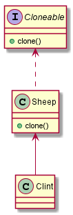

# 原型模式
基本介绍：       
1. 原型模式是指：有一个原型实例（即一个对象），我们 **通过拷贝这个原型实例来创建新的对象**
2. 原型模式是一种创建型模式，允许一个对象在创建另一个可定制对象时，无需知道创建的细节
3. 原理：利用重写 Object 中的 clone() 方法，来完成对象的拷贝    

--- 
克隆羊案例：      
> 有一只羊（Sheep）的类，我们需要3个一样的对象

## 传统方案      
先new出一个对象，然后根据第一个对象的属性来创建其他两个对象     

```
public class Client {
    public static void main(String[] args) {
        Sheep sheep = new Sheep("小红",2,"red");
        Sheep sheep1 = new Sheep(sheep.getName(),sheep.getAge(),sheep.getColor());
        Sheep sheep2 = new Sheep(sheep.getName(),sheep.getAge(),sheep.getColor());

        System.out.println(sheep);
        System.out.println(sheep1);
        System.out.println(sheep2);
    }
}

@Data
@AllArgsConstructor
public class Sheep {
    private String name;
    private int age;
    private String color;
}
```

> 优点：       
1.比较好理解，简单易操作       
缺点：     
1.在创建新对象时，总是需要重新获取原始对象的属性，如果要创建的对象比较复杂，则效率很低        
2.当对象属性值有变化时，总是需要重新初始化对象，而不是动态获得对象运行时的状态，不够灵活      
改进思路：       
Java中 Object 类是所有的类的基类，他提供了一个 clone() 方法，该方法可以将一个 Java 对象复制一份，
但是重写 clone() 方法这个 Java 类必须要实现一个接口 Cloneable ，该接口表示该类能够复制且具有复制的能力——》原型模式

## 使用原型模式        
      

1. 实现 Cloneable 接口
2. 重写 clone() 方法

```puml
public class Client {
    public static void main(String[] args) {
        Sheep sheep = new Sheep("小红",2,"red");
        Sheep sheep1 = new Sheep(sheep.getName(),sheep.getAge(),sheep.getColor());
        Sheep sheep2 = new Sheep(sheep.getName(),sheep.getAge(),sheep.getColor());

        System.out.println(sheep);
        System.out.println(sheep1);
        System.out.println(sheep2);
    }
}

@Data
@AllArgsConstructor
public class Sheep implements Cloneable{
    private String name;
    private int age;
    private String color;

    /**
     * 重写clone
     * @author: HuEnhui
     * @date: 2019/12/22 18:46
     */
    @Override
    protected Object clone(){
        Sheep sheep = null;
        try {
            sheep = (Sheep) super.clone();
        } catch (CloneNotSupportedException e) {
            e.printStackTrace();
        }
        return sheep;
    }
}
```

## Spring 中使用原型模式

在Spring的配置文件中，可以配置bean的创建方式为单例还是原型
```
    <bean id="" class="" scope="prototype"/>
```

## 浅拷贝

1. 对于数据类型是基本数据类型的成员变量，浅拷贝会直接进行值传递，也就是将该属性值复制一份给新的对象
2. 对于数据类型是引用数据类型的成员变量，浅拷贝会进行引用传递，也就是将该成员变量的引用值（内存地址）复制一份给新的对象。
因为两个对象都指向同一实例，所以一个对象修改该成员变量的值会影响另一对象的该成员变量值
3. 浅拷贝是使用默认的 clone() 方法来实现 sheep = （Sheep）super.clone();

## 深拷贝

1. 复制对象的所有基本数据类型的成员变量值
2. 为所有引用数据类型的成员变量申请存储空间，并复制每个引用数据类型成员变量所引用的对象，直到该对象可达的所有对象

> 深拷贝的两种方式：1.重写 clone 方法 2.通过对象序列化
### 重写clone实现深拷贝

```puml
/**
 * 通过重写clone实现深拷贝
 * @author: HuEnhui
 * @date: 2019/12/23 9:25
 */
public class DeepCopyByClone {
    public static void main(String[] args) {
        SheepTarget sheepTarget = new SheepTarget("内对象",2);
        Sheep sheep = new Sheep("外对象",sheepTarget);
        Sheep sheep1 = (Sheep) sheep.clone();

        System.out.println(sheep);
        System.out.println(sheep1);
    }
}


/**
 * 重写clone实现深拷贝
 * （外部对象，包含一个引用类型成员变量）
 * @author: HuEnhui
 * @date: 2019/12/23 9:25
 */
@ToString
@Setter
@Getter
@AllArgsConstructor
class Sheep implements Cloneable{
    private String name;
    private SheepTarget sheepTarget;

    @Override
    protected Object clone() {
        Object deep = null;
        Sheep sheep = null;
        try {
            deep = super.clone();
            // 对引用类型单独处理
            sheep = (Sheep)deep;
            sheep.sheepTarget = (SheepTarget) sheepTarget.clone();
        } catch (CloneNotSupportedException e) {
            e.printStackTrace();
        }
        return sheep;
    }
}

/**
 * 使用默认clone实现浅拷贝
 * （内部对象）
 * @author: HuEnhui
 * @date: 2019/12/23 9:56
 */
@Setter
@Getter
@AllArgsConstructor
class SheepTarget implements Cloneable{
    private String name;
    private int age;

    @Override
    protected Object clone() throws CloneNotSupportedException {
        return super.clone();
    }
}

```

### 通过对象序列化实现深拷贝

```puml
/**
 * 通过对象序列化实现深拷贝
 * @author: HuEnhui
 * @date: 2019/12/23 10:00
 */
public class DeepCopyBySerializable {
    public static void main(String[] args) {
        SheepTarget1 sheepTarget = new SheepTarget1("内对象",2);
        Sheep1 sheep = new Sheep1("外对象",sheepTarget);
        Sheep1 sheep1 = (Sheep1) sheep.deepClone();

        System.out.println(sheep);
        System.out.println(sheep1);
    }
}
/**
 * 提供一个克隆方法，使用序列化实现深拷贝
 * @author: HuEnhui
 * @date: 2019/12/23 9:25
 */
@Setter
@Getter
@ToString
@AllArgsConstructor
class Sheep1 implements Serializable {
    private String name;
    private SheepTarget1 sheepTarget;

    public Object deepClone() {
        ByteArrayOutputStream bos = null;
        ObjectOutputStream oos = null;
        ByteArrayInputStream bis = null;
        ObjectInputStream ois = null;

        try {
            // 序列化
            bos = new ByteArrayOutputStream();
            oos = new ObjectOutputStream(bos);
            // 当前对象以对象流的方式输出
            oos.writeObject(this);

            // 反序列化
            bis = new ByteArrayInputStream(bos.toByteArray());
            ois = new ObjectInputStream(bis);
            Sheep1 sheep1 = (Sheep1) ois.readObject();

            return sheep1;
        }catch (Exception e){
            e.printStackTrace();
            return null;
        }finally {
            // 关闭流
            try{
                bos.close();
                oos.close();
                bis.close();
                ois.close();
            }catch (Exception e1){
                System.out.println(e1.getMessage());
            }
        }
    }
}

@Setter
@Getter
@AllArgsConstructor
class SheepTarget1 implements Serializable{
    private String name;
    private int age;
}
```

## 原型模式的注意事项和细节
1. 创建新的对象比较复杂时，可以利用原型模式简化对象的创建过程，同时也能提高效率
2. 当原始对象发生变化时（增加或减少属性），无需修改代码
3. 在实现深拷贝时可能需要比较复杂的代码（有很多引用类型成员变量）
4. **缺点：** 需要为每个类配备一个 clone() 方法，对新的类来说没有影响，但是对已有的类进行改造，违反了ocp原则