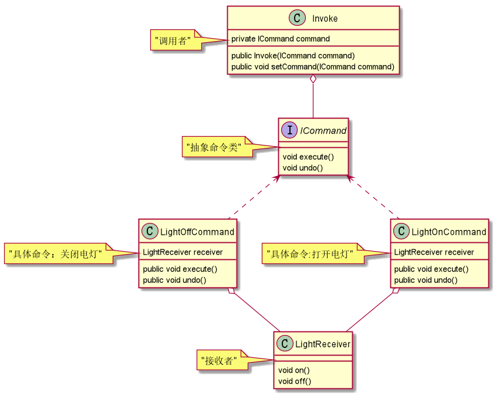

# 命令模式

命令模式的角色：     
1.抽象命令类：声明执行命令的接口，拥有执行命令的抽象方法 execute()。      
2.具体命令：是抽象命令类的具体实现类，它拥有接收者对象，并通过调用接收者的功能来完成命令要执行的操作。       
3.接收者：执行命令功能的相关操作，是具体命令对象业务的真正实现者。      
4.请求者：是请求的发送者，它通常拥有很多的命令对象，并通过访问命令对象来执行相关请求，它不直接访问接收者。      

请求者：     
```java
/**
 * 请求者
 *
 * @Author 胡恩会
 * @Date 2020/6/26 22:50
 **/
public class Invoke {
    private ICommand command;
    public Invoke(ICommand command) {
        this.command = command;
    }
    public void setCommand(ICommand command) {
        this.command = command;
    }
    public void executeCommand() {
        command.execute();
    }
}
```
抽象命令类：    
```java
/**
 * 抽象命令角色
 *
 * @Author 胡恩会
 * @Date 2020/6/26 21:38
 **/
public interface ICommand {
    void execute();
    void undo();
}
```   
具体命令:    
```java
/**
 * 具体命令-关灯
 *
 * @Author 胡恩会
 * @Date 2020/6/26 21:50
 **/
public class LightOffCommand implements ICommand {
    LightReceiver receiver = new LightReceiver();
    @Override
    public void execute() {
        receiver.off();
    }
    @Override
    public void undo() {
        receiver.on();
    }
}

/**
 * 具体命令-开灯
 *
 * @Author 胡恩会
 * @Date 2020/6/26 21:43
 **/
public class LightOnCommand implements ICommand {
    LightReceiver receiver = new LightReceiver();
    @Override
    public void execute() {
        receiver.on();
    }
    @Override
    public void undo() {
        receiver.off();
    }
}
```  
接收者：     
```java
/**
 * 接收者
 *
 * @Author 胡恩会
 * @Date 2020/6/26 21:59
 **/
public class LightReceiver {
    void on() {
        System.out.println("打开电灯");
    }
    void off() {
        System.out.println("关闭电灯");
    }
}
```
程序入口：    
```java
public class Main {
    public static void main(String[] args) {
        Invoke invoke = new Invoke(new LightOnCommand());
        invoke.executeCommand();
        invoke.setCommand(new LightOffCommand());
        invoke.executeCommand();
    }
}
```

 

与其他模式的结合应用：     
1.与 **组合模式** 可以实现宏命令     
2.与 **责任链模式** 可以实现多次undo（回退）    
3.与 **备忘录模式** 可以实现回滚