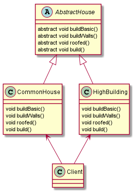
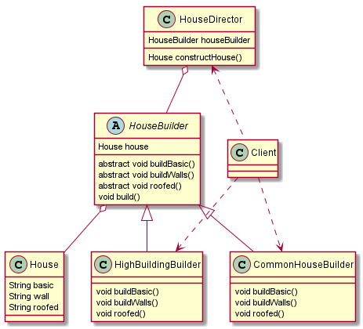

# 建造者模式
基本介绍：       
1. 建造者模式又叫生成器模式，是一种对象构建模式。
他可以将复杂对象的建造过程抽象出来（抽象类别），使这个抽象过程的不同实现方法可以构造出不同表现（属性）的对象
2. 建造者模式是一步一步创建一个复杂的对象，它允许用户只通过指定复杂对象的类型和内容就可以构建他们，用户不需要知道内部的具体构建细节

> 盖房子案例：    
1.建造房子的过程：打桩、砌墙、封顶          
2.房子有各种各样的，比如普通房、高楼、别墅。建造各种房子的过程虽然一样，但要求不同      

## 传统方式（不使用设计模式）

 

> 解析：       
一个抽象的盖房子类       
普通房和高楼继承该抽象类，并重写盖楼的方法       
客户端程序使用盖房类盖房            
优点：     
比较好理解，简单易操作         
缺点：
设计的程序结构过于简单，没有设计缓存层对象，
程序的扩展和维护不好，这种设计方案，把产品（房子）和创建产品的过程（建造房子的流程）封装在了一起，耦合性增强              
解决方案：           
将产品和产品的建造过程解耦==》建造者模式

## 建造者模式

模式结构：       
1. Product（产品角色）：一个具体的产品对象
2. Builder（抽象建造者）：创建一个Product对象的各个部件指定的 接口/抽象类
3. ConcreteBuilder（具体建造者）：实现接口，构建和装配各个部件
4. Director（指挥者）：构建一个使用Builder接口的对象。他主要是用于创建一个复杂的对象。
他主要有两个作用，一是：隔离了客户与对象的生产过程；二是：负责控制产品对象的生产过程

         
完整代码地址：https://github.com/Hu-enhui/study-code/tree/master/src/main/java/fun/enhui/design/builder/

> 该模式的主要优点如下：       
1.各个具体的建造者相互独立，有利于系统的扩展。      
2.客户端不必知道产品内部组成的细节，便于控制细节风险     
其缺点如下：      
1.产品的组成部分必须相同，这限制了其使用范围。        
2.如果产品的内部变化复杂，该模式会增加很多的建造者类。

  
## JDK中StringBuilder使用建造者模式
表现形式不尽相同，但思想是一样的        

      

- StringBuilder.java      
```puml
    @Override
    public StringBuilder append(boolean b) {
        super.append(b);
        return this;
    }

    @Override
    public StringBuilder append(char c) {
        super.append(c);
        return this;
    }

    @Override
    public StringBuilder append(int i) {
        super.append(i);
        return this;
    }

    @Override
    public StringBuilder append(long lng) {
        super.append(lng);
        return this;
    }

    @Override
    public StringBuilder append(float f) {
        super.append(f);
        return this;
    }

    @Override
    public StringBuilder append(double d) {
        super.append(d);
        return this;
    }

```