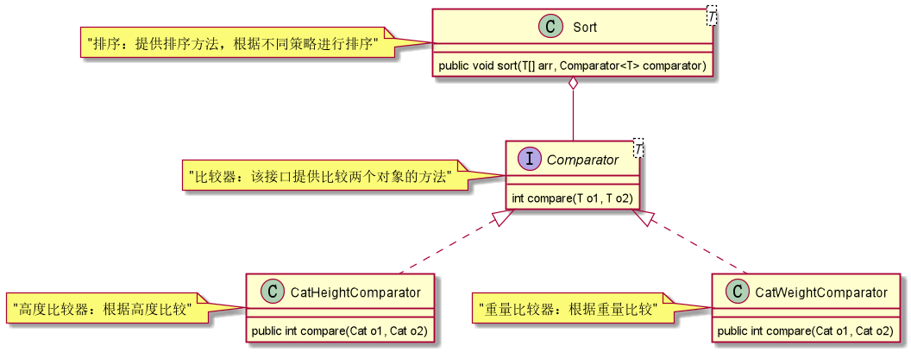

# 策略模式

在有多种算法可以实现某一功能时，对多种算法可以有不同设计
1. 在一个算法类中提供多种方法，每种方法提供一种算法支持。
2. 在一个算法类中有一个方法，根据传参动态判断，选择算法支持。
3. 抽象一个算法接口，每种算法都实现此接口，并使用不同算法提供支持。

第三种则为策略模式：将不同算法封装进独立的类中，实现不同算法的类可以称为不同策略。
为了保证这些策略的一致性，用一个抽象的策略类来做算法的定义，而具体每种算法则对应于一个具体策略类。

> 不同算法生成id案例：   
现在有两种生成id的策略，一种是雪花算法，一种是递增数字。   
为了方便策略的扩展，可以使用策略模式，UML类图如下   

    

> 仿照jdk中Comparator案例：    
对于一个实体类Cat，有两个属性，Height高度和Weight重量    
现有两种需求，根据高度和重量对猫进行排序    
解决方案：    
1.有一个比较器接口，提供比较方法   
2.分别使用两个比较策略实现比较器接口    
3.一个排序类，根据传入的比较策略进行排序    
程序见study-code\src\main\java\fun\enhui\design\strategy下   
UML类图如下：   

