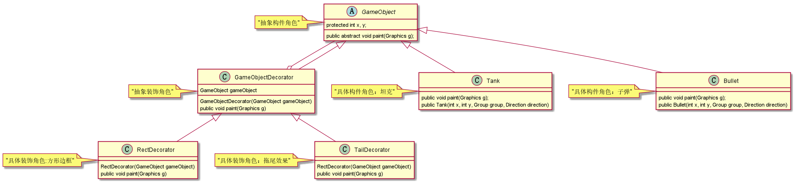

# 装饰模式

> 装饰模式主要包含以下角色。    
1.抽象构件角色：定义一个抽象接口以规范准备接收附加责任的对象。     
2.具体构件角色：实现抽象构件，通过装饰角色为其添加一些职责。    
3.抽象装饰角色：继承抽象构件，并包含具体构件的实例，可以通过其子类扩展具体构件的功能。     
4.具体装饰角色：实现抽象装饰的相关方法，并给具体构件对象添加附加的责任。    

> 以Tank项目为例    
GameObject是一个抽象类     
Tank，Bullet等物体继承GameObject     
现希望给Tank加边框，给Tank加拖尾效果，给Bullet加边框等    
可以将拖尾，边框作为装饰器，分别与需要的物体进行组合     
简易代码如下：
    
抽象构件：     
```java
public abstract class GameObject {
    public abstract void pagit();
}
```
具体构件：    
```java
// 坦克类
public class Tank extends GameObject {
    @Override
    public void pagit() {
        System.out.println("坦克描绘自己方法");
    }
}
// 子弹类
public class Bullet extends GameObject {
    @Override
    public void pagit() {
        System.out.println("子弹描绘自己的方法");
    }
}
```
抽象装饰：     
```java
/**
 * 抽象装饰者
 *
 * @Author 胡恩会
 * @Date 2020/6/25 10:44
 **/
public class GameObjectDecorator extends GameObject {
    GameObject gameObject;
    public GameObjectDecorator(GameObject gameObject) {
        this.gameObject = gameObject;
    }
    @Override
    public void pagit() {
        gameObject.pagit();
    }
}
```
具体装饰：    
```java
/**
 * 拖尾装饰
 *
 * @Author 胡恩会
 * @Date 2020/6/25 10:33
 **/
public class TailDecorator extends GameObjectDecorator {
    public TailDecorator(GameObject gameObject) {
        super(gameObject);
    }
    @Override
    public void pagit() {
        super.pagit();
        System.out.println("拖尾装饰加在后面");
    }
}

/**
 * 边框装饰
 *
 * @Author 胡恩会
 * @Date 2020/6/25 10:33
 **/
public class RectDecorator extends GameObjectDecorator{
    public RectDecorator(GameObject gameObject) {
        super(gameObject);
    }
    @Override
    public void pagit() {
        System.out.println("边框装饰加在前");
        super.pagit();
        System.out.println("边框装饰加在后");
    }
}
```
程序入口：    
```java
public class Main {
    public static void main(String[] args) {
        TailDecorator tailDecorator = new TailDecorator(new Bullet());
        TailDecorator rectDecorator = new TailDecorator(new RectDecorator(new Tank()));
        rectDecorator.pagit();
        System.out.println();
        tailDecorator.pagit();
    }
}
```


 
