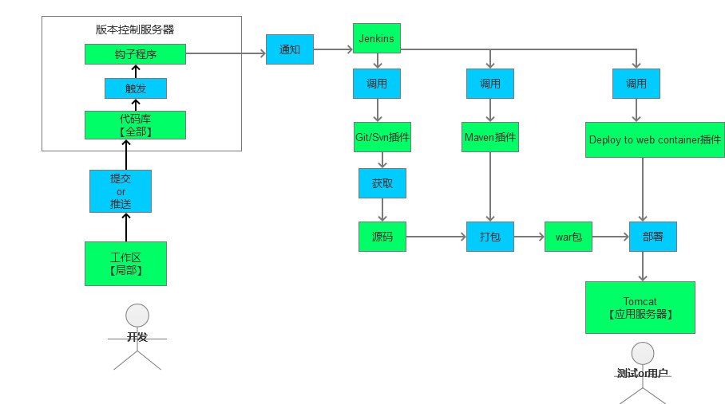
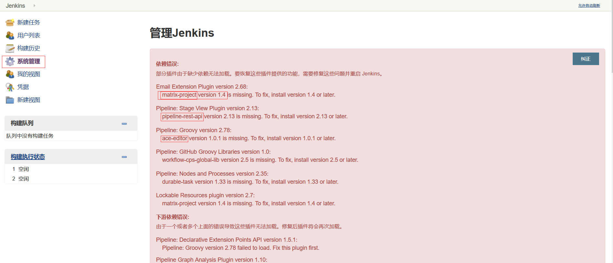

# 持续集成的学习
jenkins 和 hudson 都是持续集成及自动化部署工具，此处主要学习 jenkins 的使用

- 手动部署的过程       
  

- 自动化部署
  

## Jenkins + GitHub 持续集成环境搭建        

准备工作：       
此教程使用一台阿里云服务器，所以所有应用都装在一台服务器上，需要安装的应用如下
1. [centOS安装java](运维/jdk/README.md)     
2. [centOS安装tomcat](运维/tomcat/README.md)        
3. [centOS安装maven](运维/maven/README.md)      
4. [centOS安装git](运维/git/README.md)          
5. [centOS安装jenkins](运维/jenkins/README.md)          

### 部署最终项目的 tomcat（项目打war包的方式）
复制一份tomcat压缩包，同样解压放在/usr/local/tomcat/目录下，改名为 manage-tomcat9

为tomcat设置 用户权限和用户
打开 /usr/local/tomcat/manage-tomcat9/conf/tomcat-users.xml ,写入以下内容      
``` 
<role rolename="manager-hui"/>
<role rolename="manager-script"/>
<role rolename="manager-jmx"/>
<role rolename="manager-status"/>
<user  username="tomcat_user"  password="123456"
roles="manager-hui,manager-script,manager-jmx,manager-status"/>
```

### Jenkins 配置

#### 登陆后选择 推荐方式安装插件        
插件可能会安装的很慢，耐心等待，可能还会出现安装插件失败的情况，可以进入系统后在解决。     
进入系统后，点击 系统管理 情况如下：        
       
解决办法：       
对所有丢失的插件，进入 插件管理 - 可选插件 - 搜索需要的插件 - 直接安装
         
安装后在服务器端重启tomcat，再次登陆即可发现问题已经解决了        
可能有提示 反向代理设置有误 ，暂不处理

#### 全局安全配置            
勾选用户注册（防止忘记密码的情况）                    

#### 全局工具配置    
可以在服务器使用 ``` echo $MAVEN_HOME``` 来查看环境变量             
1.maven配置。两个位置均选择maven的settings路径。例如：/usr/local/maven/maven3.6/conf/settings.xml          
2.JDK。随便起个名字，取消自动安装并填写jdk的JAVA_HOME     
3.maven。随便起个名字，取消自动安装并填写maven的MAVEN_HOME
4.git。随便起个名字，取消自动安装并填写git的安装路径。例如：/usr/local/git/bin

### 新建Jenkins任务
1. 随便起个任务名称，例如：manage      
选择 构建一个自由风格的软件项目。点击确定

2. 源码管理 部分设置     
选择Git       
填写Repository URL为gitee仓库的链接，例如https://gitee.com/huenhui/manage-template       
添加gitee的登陆账号及密码，并选择此账号

3. 构建 部分设置          
增加构建步骤，选择 调用顶层Maven目标       
Maven版本,选择我们自己添加的 Maven3.6         
目标,填写 clean install

4. 设置完成后，选择保存，并立即构建此任务。

5. 再次进入配置，构建后操作 部分设置        
(项目打war包的方式)增加构建后操作步骤，选择deploy war/ear to a container。如果没有此选项，安装插件Deploy to container并重启        
WAR/EAR files(war包的路径)，例如填写 target/manage-0.0.1-SNAPSHOT.war          
Context path(浏览器访问项目名)，例如填写 manage          
Containers(配置tomcat)，选择tomcat9.x，       
-Credentials，添加 tomcat-users.xml 配置中的用户，例如：tomcat_user,123456       
-Tomcat URL,填写部署项目的tomcat访问链接，例如：http://123.57.241.89:8091       

(springboot,打jar包)	    
1.安装插件 publish over ssh       
2.进入系统管理 - 系统配置，配置Publish over SSH部分      
Passphrase(填写远程服务器的登陆密码)：***                  
SSH Servers.Name(随便起一个名字)：阿里云        
SSH Servers.Hostname(远程服务器的ip)：123.57.241.89       
SSH Servers.Username(远程服务器的登陆用户名)：root        
SSH Servers.Remote Directory(设置远程服务器的文件路径)：/usr/local/tomcat                   
3.构建后操作，选择send build artifacts over SSH     
SSH Server.name(选择刚添加的服务器)：              
Transfers.Source files(jenkins工作空间中，构件的路径):例如 target/manage-0.0.1-SNAPSHOT.jar     
Transfers.Remove prefix(要去掉的构件前缀):例如 target/        
Transfers.Remote directory(远程服务器文件路径下的路径): manage-jar 
Transfers.Exec command(ssh传输完成后要执行的命令):             
```
cd /usr/local/tomcat/manage-jar         
chomd 777 *.sh      
./stop.sh       
./start.sh     
```        
4.创建stop.sh脚本       
``` 
#!/bin/bash     
echo "stop SpringBoot manage"       
pid=`ps -ef | grep manage-0.0.1-SNAPSHOT.jar | grep -v grep | awk '{print $2}'`     
echo "旧应用进程id：$pid"     
if [ -n "$pid" ]        
then        
kill -9 $pid        
fi      
```     
5.创建start.sh脚本           
```         
#!/bin/bash     
echo ${JAVA_HOME}       
chmod 777 /usr/local/tomcat/manage-jar/manage-0.0.1-SNAPSHOT.jar        
echo "执行...."       
cd /usr/local/tomcat/manage-jar/        
nohup ${JAVA_HOME}/bin/java -jar manage-0.0.1-SNAPSHOT.jar > /dev/null &        
echo "启动成功"     
```    

6. 配置钩子函数，以达到git的push操作触发构建         
此处不做，想用的可以百度下，很简单

7. 关闭跨站请求伪造保护           
进入Jenkins的全局安全配置，取消勾选 防止跨站点请求伪造
