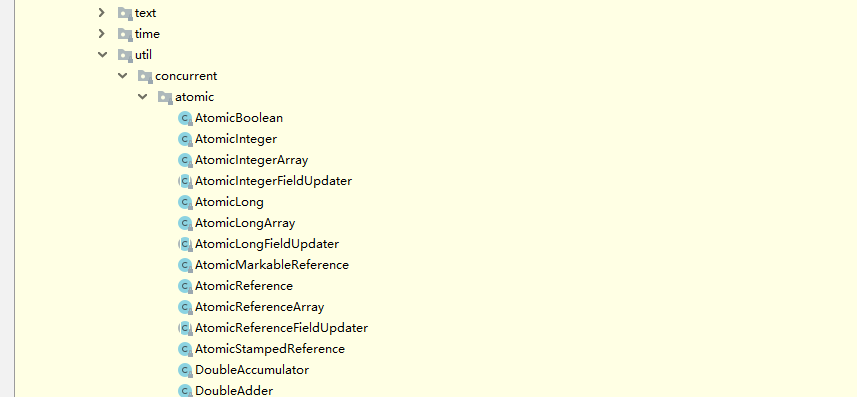

# CAS(Compare And Swap)
# CAS(Compare And Swap)简介
 > 在计算机科学中，比较和交换（Compare And Swap）是用于实现多线程同步的原子指令。 
 它将内存位置的内容与给定值进行比较，只有在相同的情况下，将该内存位置的内容修改为新的给定值。 
 这是作为单个原子操作完成的。 原子性保证新值基于最新信息计算; 如果该值在同一时间被另一个线程更新，则写入将失败。 
 操作结果必须说明是否进行替换; 这可以通过一个简单的布尔响应（这个变体通常称为比较和设置），或通过返回从内存位置读取的值来完成（摘自维基本科）

**Java1.5开始引入了CAS，主要代码都放在JUC的atomic包下，如下图：**
     
   
# CAS在java.util.concurrent.atomic包下的应用
**以AtomicInteger为例**    
使用AtomicInteger做改值操作++时，调用getAndIncrement方法
``` 
 // 方法在包 package java.util.concurrent.atomic;  类 AtomicInteger
 // 相当于i++
public final int getAndIncrement() {
// 第一个参数是当前对象，第二个参数是内存偏移量，第三个值是修改量
    return unsafe.getAndAddInt(this, valueOffset, 1);
}

// 方法在包 package sun.misc;   类 Unsafe  
public final int getAndAddInt(Object var1, long var2, int var4) {
    int var5;
    do {
        var5 = this.getIntVolatile(var1, var2);
// var1：当前对象  var2：内存偏移量（内存地址）  var5：当前主物理内存的值   最后一个参数：要修改的值
    } while(!this.compareAndSwapInt(var1, var2, var5, var5 + var4));

    return var5;
}

// 本地方法在包 package sun.misc;  类 Unsafe
public native int getIntVolatile(Object var1, long var2);

// 本地方法在包 package sun.misc;  类 Unsafe  
public final native boolean compareAndSwapInt(Object var1, long var2, int var4, int var5);
```

根据JMM模型理解   
 
- 假设线程A和线程B两个线程同时执行getAndAddInt操作(分别在不同的CPU上):
   
1. AtomicInteger里面的value原始值为3,即主内存中AtomicInteger的value为3,根据JMM模型,
线程A和线程B各自持有一份值为3的value的副本分别到各自的工作内存.

2. 线程A通过getIntVolatile(var1,var2) 拿到value值3,这时线程A被挂起.

3. 线程B也通过getIntVolatile(var1,var2) 拿到value值3,
此时刚好线程B没有被挂起并执行compareAndSwapInt方法比较内存中的值也是3 成功修改内存的值为4 线程B打完收工 一切OK.

4. 这时线程A恢复,执行compareAndSwapInt方法比较,发现自己手里的数值和内存中的数字4不一致,
说明该值已经被其他线程抢先一步修改了,那A线程修改失败,只能重新来一遍了.

5. 线程A重新获取value值,因为变量value是volatile修饰,所以其他线程对他的修改,线程A总是能够看到,
线程A继续执行compareAndSwapInt方法进行比较替换,直到成功.

# CAS缺点
1. 循环时间长，开销大
2. 只能保证一个共享变量的原子操作
3. 引出ABA问题

# ABA问题
CAS算法实现的一个重要前提是需要取出内存中某时刻的数据并在当下时刻进行比较并替换，
那么在这个时间差可能会有操作导致数据的变化。

> 比如说一个线程one从内存位置V中取出A，这时候另一个线程two也从内存中取出A，
并且线程two进行了一些操作将值改为了B，然后线程two又将V位置的数据变回A，这时候线程one进行CAS操作发现内存中的值没变还是A，然后线程one操作成功             
**虽然线程one的CAS操作成功了，但是不代表这个过程就是没有问题的**

## 原子引用 AtomicReference
jdk中提供了基本数据类型的原子包装类，但是如果想将自己定义的类使用原子包装，就需要使用AtomicReference来操作      
代码示例：[使用AtomicReference包装你的类](https://github.com/Hu-enhui/study-code/blob/master/src/main/java/fun/enhui/interview/AtomicReferenceDemo.java)

## ABA问题解决    原子+时间戳（类似版本号）
java.util.concurrent.atomic包下提供了  AtomicStampedReference类       
在存储的时候，指定版本号，在每次修改都将版本号一并修改。
修改操作时，即使值相等，但版本号不同，仍不能修改成功，避免了ABA问题
代码示例：[使用AtomicReference包装你的类](https://github.com/Hu-enhui/study-code/blob/master/src/main/java/fun/enhui/interview/ABADemo.java)
